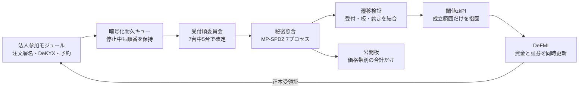
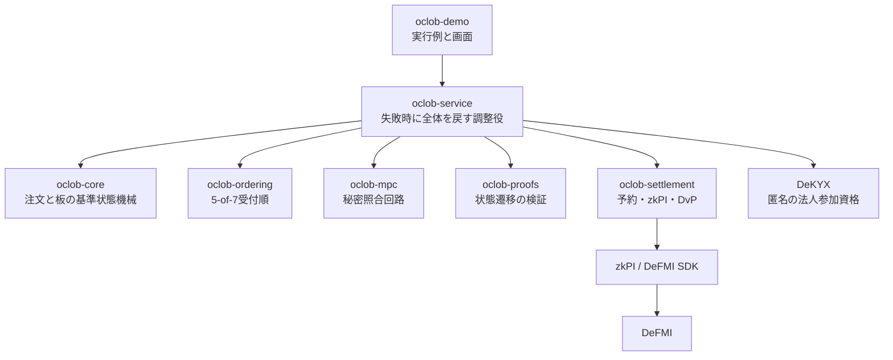

# OCLOB — 注文内容を見せずに順番を確定する連続指値市場

OCLOB は **Oblivious Continuous Limit Order Book** の略です。注文を受け付けた順番が確定し、照合が終わるまで、売買方向・指値・数量・注文者を市場運営者へ見せないことを目指す、非バッチ型の指値市場です。

公開する板は価格帯ごとの合計数量だけです。本番設計では、新しい注文を法人側で7計算ノード向けに秘密分散し、5台以上が署名した受付順に沿ってMPC（複数者で秘密のまま行う計算）で照合します。成立した取引は、利用者に再署名を求めず、事前承認されたzkPI（ゼロ知識証明付き決済指図）としてDeFMIへ渡し、資金と証券を同時に更新します。現在のMVPは、同一サーバープロセスが注文を受け取った後に7入力を作る段階です。

> **現在の到達点**
> 研究用MVPです。価格・時間優先、部分約定、複数約定、GTC、IOC、取消、期限切れ、法人単位の資金・在庫予約、DeKYX参加資格、7プロセスのMP-SPDZ実行、閾値zkPI、原子的DvP、暗号化耐久キュー、React Flowデモまで実装しています。現在の標準ランナーは1台のLinuxホスト上で7プロセスを起動し、DeFMIも同一プロセス内の正本状態機械を使います。7社が別々に運用する構成と実Avalanche L1接続は、まだ本番受入済みではありません。

## 何を解決するか

通常の分散型CLOBでは、注文が照合される前にバリデータ、シーケンサ、メモリプール監視者へ見えます。内容を見た者は、より有利な注文を直前へ差し込んだり、不利な注文だけを遅らせたりできます。

OCLOBは次の順番を固定します。

1. 注文者が資金または証券を予約し、許容範囲内の約定を事前承認する。
2. 注文内容を秘密分散し、公開するのは注文の要約値だけにする。
3. 7台中5台の署名で受付番号を確定する。
4. 受付番号を変えずに、7台のMPCで価格・時間優先照合を行う。
5. 約定と公開板の更新が同じ遷移であることを検証する。
6. 閾値zkPIを作り、資金と証券をDeFMIで同時決済する。
7. DeFMIの正本受領証を確認してから、画面を「決済済み」にする。

これにより防ぐ対象は、**未処理注文の内容を見てから、その注文より前へ自分の注文を差し込む行為**です。公開板から相場を予測する通常の取引、約定後の板差分からの推測、通信時刻や送信元の観測、3台以上のMPCノード結託、ネットワーク妨害による停止までは防ぎません。

## 全体像



依存関係は役割ごとに分離しています。



## 実装済みの経路

- 注文: 整数tick/lot、GTC、IOC、Ed25519事前署名、salt付きcommitment、厳格な秘密wire形式。
- 板: 価格優先、同価格内の受付順、部分約定、最大8件の複数約定、取消、期限切れ、公開価格帯合計。
- 順序: 7ノード、最大2不正を想定した5-of-7連鎖証明、同一番号への二重投票拒否。
- MPC: 公式MP-SPDZコンパイラと `malicious-shamir-party.x` を実行し、平文照合への代替を禁止。
- 参加資格: DeKYXによる匿名法人資格と用途別無効化値。
- 予約: 買い注文は最大資金、売り注文は最大在庫を正本上で予約。同一法人の同時注文合計を一つの枠で制限。
- 決済: 3-of-7の閾値範囲証明を含むzkPI、到着注文の複数約定を一つの原子的DeFMI DvPとして処理、再実行を拒否。
- 障害時: 暗号化した法人側送信キュー、同じ要求の重複排除、MPC停止時の順序保持、固定間隔のダミー処理。
- 画面: 運営者・売り手・買い手を切り替え、公開板、自社の資金・在庫・予約、注文、7 MPC処理、zkPI、DeFMI更新をReact Flowで確認。障害ボタンは実ノード停止ではなく待機条件の模擬です。

## まだ本番保証ではないもの

- 現在の標準MPCランナーは7プロセスを同一ホストで起動します。独立運営者間WANの機密性・可用性は未受入です。
- 現在の調整サービスは注文の平文オブジェクトを受け取ってから秘密分散入力を作ります。運営者メモリからも注文を隠す本番経路は、法人端末から各MPCノードへ直接shareを送る方式へ切り替える必要があります。
- DeFMI処理は正本状態機械を実行しますが、Avalancheの5検証者L1へデプロイしての最終受入は未完了です。
- デモ用の委員会鍵、参加者、残高は起動時生成です。外部KMS/HSM、鍵交代、バックアップ復旧は未受入です。
- 性能値は一件の粗い実行結果であり、スループット保証ではありません。
- 安全性定義、通信漏洩、選択的停止を含む形式証明は論文作業として残っています。

## 再現方法

開発用Macではビルドやテストを行いません。リポジトリのソースを一時領域へ転送し、OmenXまたはSoftBank上のLinuxコンテナだけで実行します。

```bash
make release-gate \
  REMOTE_TEST_HOST=omenx_ubuntu_zerotier \
  REMOTE_TEST_REUSE_IMAGE=0
```

2回目以降、同じ固定イメージを再利用する場合:

```bash
make release-gate \
  REMOTE_TEST_HOST=omenx_ubuntu_zerotier \
  REMOTE_TEST_REUSE_IMAGE=1
```

このゲートはRust整形、Clippy、全crateテスト、React Flow型検査・ビルド、実MP-SPDZ、zkPI、DeFMI DvP、正本読戻し、二重決済拒否を一続きで実行します。結果は `artifacts/oclob_rough_e2e.json` に保存します。

Linux上で画面だけを起動する場合:

```bash
docker build -f docker/Dockerfile --target oclob-server -t oclob-server:local .
docker run --rm -p 18800:18800 \
  -e OCLOB_QUEUE_PASSPHRASE='replace-with-a-secret' \
  -v oclob-state:/var/lib/oclob \
  oclob-server:local
```

ブラウザで `http://127.0.0.1:18800/` を開きます。これは研究デモであり、実資産を入れないでください。

## 文書

- [設計と処理の流れ](docs/ARCHITECTURE.md)
- [守るもの・守らないもの](docs/THREAT_MODEL.md)
- [既存研究・既存プロダクトとの差分](docs/RELATED_WORK.md)
- [企業PoC導入手順](docs/POC_GUIDE_JA.md)
- [APIと状態の意味](docs/API.md)
- [実装状況と受入条件](docs/STATUS.md)
- [詳細な実装計画](doc/ja/OCLOB_IMPLEMENTATION_PLAN.md)

## ライセンス

MIT。MP-SPDZ、DeKYX、QOMM/zkPI/DeFMIおよび各Rust依存には、それぞれのライセンスが適用されます。
