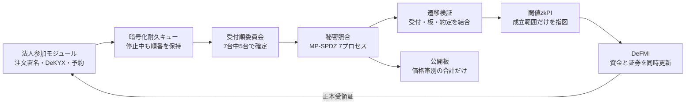
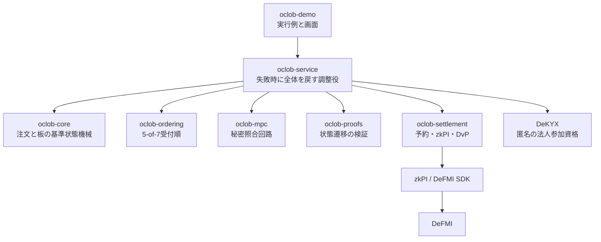

# OCLOB — 注文内容を見せずに順番を確定する連続指値市場

OCLOB は **Oblivious Continuous Limit Order Book** の略です。注文を受け付けた順番が確定し、照合が終わるまで、売買方向・指値・数量・注文者を市場運営者へ見せないことを目指す、非バッチ型の指値市場です。

公開する板は価格帯ごとの合計数量だけです。新しい注文は法人側で7計算ノード向けに分割し、各ノードへ別々に暗号化して送ります。市場の調整役には注文内容を渡しません。7台中5台が署名した受付順に沿って、MPC（複数者で秘密のまま行う計算）で照合します。成立した取引は、利用者に再署名を求めず、事前承認されたzkPI（ゼロ知識証明付き決済指図）としてDeFMIへ渡し、資金と証券を同時に更新する設計です。

> **現在の到達点**
> 研究用MVPです。価格・時間優先、部分約定、複数約定、GTC、IOC、取消、期限切れ、法人単位の資金・在庫予約、DeKYX参加資格、共同zkPI、原子的DvP、暗号化耐久キュー、React Flowデモまで実装しています。一続きの受入経路では、法人側で作った注文分割を相互TLSで7 MPCノードへ直接届け、7ノードが各自の秘密共有から金額・価格・積・決済後残高を証明し、3ノードの共同署名でzkPIを完成させます。証明依頼は、ノードが署名した正しい照合結果、ラウンド、約定枠、秘密共有ファイルに固定されます。OCLOB決済アプリは、起動時に固定した委員会公開鍵と注文時の正確な予約commitmentに対して共同証明を再検証し、共同zkPI、一回限りの番号、DvP packageを作り直さずDeFMI正本命令へ含めます。5検証者の非EVM DeFMI Avalanche L1で、全検証者のroot一致、同一遷移の再送拒否、1検証者再起動後の復旧まで確認しています。ただし到着注文の事前予約を認可するため、MPC結果を各ノードが保存した後に注文別の決済権限を開く処理は残っています。また、現在のAvalanche VMが検証するのは承認委員会の署名、証明要約、正確な口座差分であり、共同証明全文の検証はVM投入前のOCLOB決済アプリで行います。これは一台のLinuxホスト上の研究構成であり、7社の独立運用、WAN、HSMを受入れたものではありません。

## 何を解決するか

通常の分散型CLOBでは、注文が照合される前にバリデータ、シーケンサ、メモリプール監視者へ見えます。内容を見た者は、より有利な注文を直前へ差し込んだり、不利な注文だけを遅らせたりできます。

OCLOBは次の順番を固定します。

1. Makerは板へ載せる前に最大在庫・資金を予約し、Takerは注文時に許容範囲内の予約と約定を事前承認する。
2. 注文内容を秘密分散し、公開するのは注文の要約値だけにする。
3. 7台中5台の署名で受付番号を確定する。
4. 受付番号を変えずに、7台のMPCで価格・時間優先照合を行う。
5. 約定と公開板の更新が同じ遷移であることを検証する。
6. 閾値zkPIを作り、資金と証券をDeFMIで同時決済する。
7. DeFMIの正本受領証を確認してから、画面を「決済済み」にする。

これにより防ぐ対象は、**未処理注文の内容を見てから、その注文より前へ自分の注文を差し込む行為**です。公開板から相場を予測する通常の取引、約定後の板差分からの推測、通信時刻や送信元の観測、3台以上のMPCノード結託、ネットワーク妨害による停止までは防ぎません。

## 全体像



依存関係は役割ごとに分離しています。



## 実装済みの経路

- 注文: 整数tick/lot、GTC、IOC、Ed25519事前署名、salt付きcommitment、厳格な秘密wire形式。
- 板: 価格優先、同価格内の受付順、部分約定、最大8件の複数約定、取消、期限切れ、公開価格帯合計。
- 順序: 7ノード、最大2不正を想定した5-of-7連鎖証明、署名前の投票永続化、各MPCノードによる証明本体の再検証、同一番号への二重投票拒否。
- 端末からMPCへ: 法人側で検証可能な7分割を作り、各ノードの公開鍵で固定長暗号化し、相互TLSで直接配送。調整役は注文内容を受け取らない。
- 決済権限: 注文ごとに別の暗号鍵を作り、その鍵を署名付き3-of-7分割として7ノードへ暗号配送。各ノードは正しいMPC結果を永続化した後だけ、決済専用の相互TLS接続へ自分の一片を返す。約定前の単一復号鍵は存在しない。
- MPC: 公式MP-SPDZコンパイラと `malicious-shamir-party.x` を実行し、1ノードが自分の1分割だけを開いて入力する。平文照合への代替は禁止。
- 共同証明: 各約定について7ノードが自分の616個の秘密共有だけを読み、金額・価格の範囲、数量×価格、資金・証券・Maker予約の残りが負でないことを共同証明する。証明処理用の相互TLS口は通常の注文受付口と分離する。
- 参加資格: DeKYXによる匿名法人資格と用途別無効化値。
- 予約: 買い注文は最大資金、売り注文は最大在庫を正本上で予約。同一法人の同時注文合計を一つの枠で制限。MakerはAvalanche確定後にだけ板へ載せ、Takerの予約は約定DvPと同じ正本遷移に含める。
- 決済: 3-of-7共同署名と共同範囲証明を含むzkPI、受取人ごとに暗号化した開示情報、到着注文の予約と複数約定を一つの原子的DeFMI DvPとして処理、再実行を拒否。
- 障害時: 暗号化した法人側送信キュー、同じ要求の重複排除、MPC停止時の順序保持、固定間隔のダミー処理。
- 画面: 運営者・売り手・買い手を切り替え、公開板、自社の資金・在庫・予約、注文、7 MPC処理、zkPI、DeFMI更新をReact Flowで確認。障害ボタンは実ノード停止ではなく待機条件の模擬です。

## まだ本番保証ではないもの

- 分散受入経路は1台のホスト上の7コンテナです。7つの運営会社、別々の管理者・鍵保管・障害領域、WANでの機密性と可用性は未受入です。
- ブラウザ用の単体デモは互換性のため従来の中央調整経路を使い、調整サービスが注文を一時的にメモリへ持ちます。CLI/Dockerの統合受入経路は調整役へ平文注文を渡しませんが、ブラウザと本番APIの切替は未完了です。
- CLI/Docker統合経路では、共同zkPI/DvP証明の生成からDeFMIの残高commitment更新まで、価格・数量・予約額・暗号用乱数を一か所へ復元しません。共同zkPI、一回限りの番号、DvP packageがMPC出力と正本入力で同一であることも受入時に照合します。一方、到着注文の予約資格と上限を確認する事前予約zkPIは現在もDeFMI側で組み立て、その入力となる注文別の決済権限は照合結果保存後に3-of-7で開きます。そのため「注文受付から予約まで一切中央復元なし」とはまだ主張しません。
- Avalanche受入は1ホスト上の5検証者です。分散MPC経路との一続きの実行は確認済みですが、独立運営、WAN、再編、HSM保管の承認鍵は未受入です。現在の正本は匿名commitment口座と予約状態rootを使い、口座を持たないnote方式への移行は残っています。
- 現在のOCLOB決済アプリは共同証明を全文検証してから証明要約と口座差分を作りますが、Avalanche VMはその全文を再検証せず、DeFMI承認委員会の署名を検証します。受入環境では承認鍵も一プロセス内の実験鍵です。本番では、各承認者が証明を独立検証してから署名するサービス、またはRust VM内の証明検証が必要です。
- デモ用の委員会鍵、参加者、残高は起動時生成です。外部KMS/HSM、鍵交代、バックアップ復旧は未受入です。
- 性能値は一件の粗い実行結果であり、スループット保証ではありません。
- 安全性定義、通信漏洩、選択的停止を含む形式証明は論文作業として残っています。

## 再現方法

開発用Macではビルドやテストを行いません。リポジトリのソースを一時領域へ転送し、OmenXまたはSoftBank上のLinuxコンテナだけで実行します。

```bash
make release-gate \
  REMOTE_TEST_HOST=omenx_ubuntu_zerotier \
  REMOTE_TEST_REUSE_IMAGE=0
```

2回目以降、同じ固定イメージを再利用する場合:

```bash
make release-gate \
  REMOTE_TEST_HOST=omenx_ubuntu_zerotier \
  REMOTE_TEST_REUSE_IMAGE=1
```

このゲートはRust整形、Clippy、全crateテスト、React Flow型検査・ビルド、実MP-SPDZ、zkPI、DeFMI DvP、正本読戻し、二重決済拒否を一続きで実行します。結果は `artifacts/oclob_rough_e2e.json` に保存します。

法人側で注文を分割し、7つの独立コンテナへ直接送る経路は次で確認します。

```bash
make remote-distributed-e2e \
  REMOTE_TEST_HOST=omenx_ubuntu_zerotier
```

結果は `artifacts/oclob_distributed_e2e.json` に保存されます。この成果物は1ホスト上のコンテナ分離を示すもので、7社の独立運用や実Avalanche決済を示すものではありません。

法人側の分割から7 MPCノード、Maker予約、Taker予約とDvP、5検証者の確定、再送拒否、再起動復旧までを同じ注文要約値で一続きに確認する経路は次です。

```bash
make remote-integrated-e2e \
  REMOTE_TEST_HOST=omenx_ubuntu_zerotier
```

結果は `artifacts/oclob_distributed_avalanche_acceptance.json` に保存されます。この成果物は、注文別3-of-7鍵解放を含む一続きの機能確認です。ただし、1ホスト構成、約定後に一つの研究用決済プロセスへ復元する構成、デモ鍵という制限を明記しています。

非EVMのDeFMI Avalanche L1で、Maker予約、Taker予約とDvP、全検証者readback、再送拒否、再起動復旧を確認する経路は次です。

```bash
make remote-avalanche-e2e \
  REMOTE_TEST_HOST=omenx_ubuntu_zerotier
```

結果は `artifacts/oclob_avalanche_acceptance.json` に保存されます。この成果物も1ホスト上の5検証者であり、独立validator運営や、分散MPCとL1を一つに結んだ受入ではありません。

Linux上で画面だけを起動する場合:

```bash
docker build -f docker/Dockerfile --target oclob-server -t oclob-server:local .
docker run --rm -p 18800:18800 \
  -e OCLOB_QUEUE_PASSPHRASE='replace-with-a-secret' \
  -v oclob-state:/var/lib/oclob \
  oclob-server:local
```

ブラウザで `http://127.0.0.1:18800/` を開きます。これは研究デモであり、実資産を入れないでください。

## 文書

- [設計と処理の流れ](docs/ARCHITECTURE.md)
- [守るもの・守らないもの](docs/THREAT_MODEL.md)
- [既存研究・既存プロダクトとの差分](docs/RELATED_WORK.md)
- [企業PoC導入手順](docs/POC_GUIDE_JA.md)
- [APIと状態の意味](docs/API.md)
- [実装状況と受入条件](docs/STATUS.md)
- [詳細な実装計画](doc/ja/OCLOB_IMPLEMENTATION_PLAN.md)

## ライセンス

MIT。MP-SPDZ、DeKYX、QOMM/zkPI/DeFMIおよび各Rust依存には、それぞれのライセンスが適用されます。
