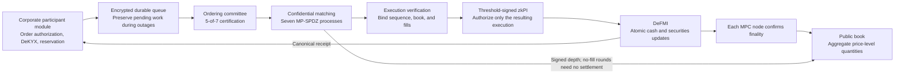
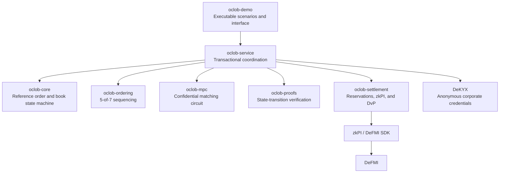

# OCLOB — Sequence orders before revealing their contents

OCLOB stands for **Oblivious Continuous Limit Order Book**. It is a non-batch limit-order market designed to keep an order's side, limit price, quantity, and participant hidden from the market coordinator until sequencing and matching are complete.

The public book contains aggregate quantities at each price level. Corporate clients split each order into shares for seven computation nodes and encrypt each node's share separately. The coordinator does not receive the plaintext order. Matching runs through multi-party computation (MPC), following an admission sequence certified by five of seven nodes. Executed trades are submitted to DeFMI as preauthorized zkPI instructions—payment instructions accompanied by zero-knowledge proofs—to update cash and securities atomically, without asking participants to sign again after matching.

> **Current status**
>
> This is a research MVP. In the native CLI/Docker path, two corporate clients reserve cash or securities on DeFMI before submitting orders. Seven resident MPC nodes match confidential orders and jointly produce the proof and threshold-signed zkPI. Reservation witnesses and other private funding information remain on the corporate side; the coordinator does not receive the original order. No additional participant signature is required after matching. Five Avalanche validators running DeFMI verify the complete proofs and reservation state before updating confidential holdings. Acceptance runs check idempotent resubmission and ledger agreement after a validator restart.
>
> Start with the [pretrade reservation-to-settlement walkthrough](docs/NATIVE_PRETRADE_DEMO.md), then the [two-trade continuation scenario](docs/NATIVE_CYCLE_JA.md). The native path also includes [cancellation, expiry, and asset recovery](docs/NATIVE_LIFECYCLE_JA.md), [corporate queues and resident delivery](docs/CORPORATE_WORKER_JA.md), and [recovery of expired, unadmitted orders while all MPC nodes are offline](docs/QUEUED_EXPIRY_JA.md). The [resident market service](docs/NATIVE_MARKET_JA.md) receives admission receipts from corporate queues over authenticated connections and performs sequencing, confidential matching, collaborative proving, and actual settlement without manually selecting counterparties.
>
> These are small, single-host functional acceptance runs—not evidence of independent operators or production performance. Recovery without sufficient reservation evidence, concurrent updates from independent corporate journals, unattended cancellation and expiry in the resident market, and product-level acceptance of the React Flow interface remain incomplete.

The [corporate wallet path](docs/CORPORATE_WALLET_JA.md) reconstructs settlement receipts, refunds, and facility capacity, then uses a returned holding as funding for the next order. The continuation scenario atomically settles two initial fills, consumes the same returned holding in a subsequent reservation, and matches and settles against the remaining original sell order. It reconstructs eight cumulative claims and both corporate facilities. Migration from the old proof format following the [spend-proof security correction](https://github.com/zkFMI/defmi/blob/3aadc4577129ce74347082347915484764157715/docs/NOTE_PROOF_SECURITY_REVIEW_20260905.md), and independent cryptographic review, have not passed acceptance. **Do not use real assets.**

Each MPC node also performs its own [settlement-finality check before advancing the private book](docs/NATIVE_FINALITY_JA.md). It checks its execution record and the exact settlement instruction against DeFMI's canonical record rather than relying solely on the coordinator's notification. This currently trusts the configured DeFMI access service; it does not directly verify a validator consensus proof.

## What OCLOB addresses

In a transparent decentralized CLOB, pending orders can become visible to validators, sequencers, or mempool observers before matching. An observer may use that information to insert an advantageous order ahead of another participant or selectively delay an unfavorable order.

OCLOB fixes the sequence before confidential matching:

1. Makers reserve inventory or cash before placing an order. Takers preauthorize reservation and execution within their chosen limits when submitting an order.
2. Clients secret-share order contents and expose an order commitment rather than the original order.
3. Five of seven ordering nodes certify its sequence number.
4. Seven MPC nodes perform price-time-priority matching without changing that certified sequence.
5. Verification binds the execution result to the corresponding book transition.
6. A threshold-signed zkPI instructs DeFMI to settle cash and securities atomically.
7. Settlement is treated as final only after checking DeFMI's canonical receipt.

The target is **content-informed insertion ahead of an order that has not yet been processed**. This does not prevent ordinary trading based on the public book, inference from post-trade book changes, observation of connection sources or timing, collusion by three or more MPC nodes, or denial of service.

### Funding and multiple fills

[Deferred funding against shared facility capacity](docs/DEFERRED_FUNDING_JA.md) lets clients sign order terms at intake and construct funding proofs from fresh capacity when the request reaches the front of the queue. Multiple processes can submit to one shared corporate queue. An order with insufficient capacity terminates before assets are reserved. This is distinct from concurrent updates across independent corporate journals or integration with a production API.

[Atomic settlement of multiple fills](docs/NATIVE_MULTIFILL_JA.md) is connected to the confidential-holdings path. Two sell orders from one corporate client and one buy order can produce two fills settled together in one transaction. Extracting and submitting only part of the signed instruction set is rejected. The private book does not advance until all seven nodes confirm both fills. A separate continuation test also exercises a later trade, cancellation of 29 remaining units, a new five-unit order funded with returned assets, actual expiry, and asset recovery. These checks do not establish unrestricted concurrency or independent operation.

### Native public depth

The [native public-depth path](docs/PUBLIC_DEPTH_JA.md) aggregates remaining quantities at equal prices inside the MPC and exports a node-signed, price-level-only snapshot. A separate read-only TLS service serves the snapshot without requiring corporate keys or access to the market journal. A matched round is published only after canonical settlement and all node finality confirmations.

The final-source native browser run verified four network-fetched snapshots, two fills totaling 7,500, recovery after an actual post-settlement process exit, and validator restart. All 129 Rust tests, formatting and all-target Clippy checks, frontend type checks, and five frontend unit/component tests passed on Softbank. The earlier corporate-worker, wallet, cancellation, and expiry regression also passed, including actual process failures and node restarts.

The [native React Flow browser](docs/NATIVE_BROWSER.md) now reads the verified [HTTP feed](docs/PUBLIC_BOOK_HTTP.md). It shows aggregate prices, remaining quantities, seven node signatures and the matching settlement record. Desktop and narrow-screen checks used actual MPC/DeFMI results, not mocked responses; see the [visual verification record](docs/NATIVE_BROWSER_AUDIT_20260906.md). This is a **read-only** interface. Native corporate authentication, order actions and private balances remain incomplete. The existing legacy financial demo is a separate path.

### Corporate service API

The [corporate API](docs/CORPORATE_API.md) runs separately for each company. Registered corporate clients use certificate-pinned mutual TLS to queue already-signed orders, inspect their own dispatch state, and read holdings and facility capacity against a consistent DeFMI state. The market coordinator and public-book reader receive no corporate credentials or private wallet snapshots.

Locked quantities follow current reservation remainders rather than the original escrow note values; unredeemed claims are explicitly excluded from spendable balances. The native scenario checks four orders through the API, two actual fills, cross-company queue-access rejection and exact-request retry after API restart. Signing clients have separate encrypted retry outboxes and do not mount the service journal or dispatch queue. This is an internal-system RPC, not browser user authentication: the corporate browser gateway, user roles, browser-owned signing credentials and complete claim-handling interface remain unfinished.

## Architecture



Dependencies are separated by responsibility. The following diagram describes the crate-level service/demo composition; the native resident binaries also connect these components directly.



## Implemented paths

Capabilities below span the reference state machine, native acceptance scenarios, resident services, and legacy browser demo. They are not all connected to one production-ready interface.

- **Orders:** integer ticks and lots, good-till-cancelled (GTC) and immediate-or-cancel (IOC) orders, mandatory Ed25519 + ML-DSA-65 preauthorization, salted commitments, and a strict confidential wire format. See [application authentication and migration](docs/crypto/application-signatures-v2.md).
- **Book:** price priority, certified admission order within a price, partial fills, matching against up to eight resting orders, cancellation, expiry, and aggregate public price levels. Resident lifecycle automation remains incomplete.
- **Sequencing:** seven nodes, a five-of-seven chained certificate under an assumption of at most two corrupt nodes, durable votes before signing, full certificate verification by every MPC node, and rejection of conflicting votes for the same sequence number.
- **Client-to-MPC delivery:** corporate clients construct seven verifiable shares, encrypt fixed-size payloads under each node's public key, and deliver them directly over mutual TLS. The coordinator does not receive order contents.
- **Settlement authority:** each order uses a separate encryption key, distributed as signed three-of-seven shares and encrypted for the seven nodes. A node releases its share only to the settlement-specific mutual-TLS connection after persisting a valid MPC result. There is no single pre-match decryption key held by the coordinator.
- **MPC:** the official MP-SPDZ compiler and `malicious-shamir-party.x`. Each resident node opens only its own share for input. Falling back to plaintext matching is prohibited.
- **Collaborative proofs:** for each fill, seven nodes use their respective 616 secret-shared proof wires to jointly prove quantity and price ranges, quantity-times-price consistency, and nonnegative cash, securities, and maker-reservation remainders. The proof endpoint is separate from ordinary order intake.
- **Eligibility:** anonymous corporate credentials and domain-specific nullifiers supplied by DeKYX.
- **Reservations:** both maker and taker reserve funds or inventory before native order delivery. The corporate client proves ownership and available capacity, then reads back canonical DeFMI confirmation before distributing order shares. The reservation identifier is threshold-encrypted and separated from the eligibility presentation sent to MPC intake.
- **Settlement:** zkPI carries a three-of-seven signature, collaborative proofs, and recipient-encrypted disclosures. Each native validator verifies the complete proofs and current reservation state, then updates both legs atomically. Retrying the same settlement returns the same canonical outcome without applying it twice.
- **Recovery:** encrypted corporate delivery queues, exact-request deduplication, retention of queue order during MPC outages, and fixed-interval dummy-processing support.
- **Interface:** the legacy React Flow demo provides operator, maker, and taker views of the public book, corporate cash, inventory, reservations, orders, seven MPC processing steps, zkPI, and DeFMI updates. Its outage button simulates a waiting condition; it does not stop real nodes. Native service integration into this interface is not complete.

## Limits and non-production guarantees

- The native confidential-holdings path connects real pretrade reservation, confidential matching, collaborative proofs, and DeFMI settlement. Corporate workers resume using the same saved signed reservation and node-specific ciphertexts. Acceptance scenarios cover actual node outages, process termination after reservation confirmation and node admission, worker restart, multiple fills, cancellation, expiry, and recovery. An unadmitted request can terminate automatically when there is evidence that it was never sent or sufficient canonical reservation/release receipts. Ambiguous outcomes without evidence, independent corporate-journal writers, partial-delivery cleanup, and unattended resident-market lifecycle handling remain open. **Queue admission is not settlement.** See [reservation information separation](docs/RESERVATION_PRIVACY.md).
- Distributed acceptance currently runs seven node containers on one host. It does not establish seven independent operators, separate administrators, independent key custody or failure domains, or WAN confidentiality and availability.
- The standalone browser demo retains the older centralized coordinator for compatibility and temporarily holds plaintext orders in that service's memory. The native CLI/Docker path does not send plaintext orders to the coordinator. Browser and production-API cutover remains incomplete.
- Corporate clients create native reservation proofs. Settlement opens authority identifying the reservation, not the original order or private balance witnesses. Connection metadata, public-book inference, and the MPC corruption threshold remain relevant.
- Avalanche acceptance uses five validators on one host. The native path updates confidential holdings and reservations without specifying account numbers. Independent operation, WAN behavior, reorganizations, and HSM-backed key custody have not passed acceptance.
- The Rust VM verifies the complete collaborative proofs. MPC nodes confirm every fill through the configured DeFMI service before advancing private state. Trust in that read service, validation of encrypted fragments from malicious nodes, and claim recovery under complex failures require further work. The spend-proof dependency is a pinned experimental implementation, not an independently audited production system. The older account-delta path remains for compatibility tests and must not be confused with the native proof path.
- Demo committee keys, participants, and balances are generated at startup. External KMS/HSM integration, key rotation, and backup recovery have not passed acceptance.
- Reported measurements are individual rough runs, not throughput guarantees.
- Formal security definitions and proofs covering communication leakage and selective abort remain research work.

## Reproduce the results

**Do not build or test on the development Mac.** The Make targets transfer source to a temporary directory and run only in Linux containers on the approved OmenX or Softbank hosts.

```bash
make release-gate \
  REMOTE_TEST_HOST=omenx_ubuntu_zerotier \
  REMOTE_TEST_REUSE_IMAGE=0
```

Reuse the same pinned test image on subsequent runs:

```bash
make release-gate \
  REMOTE_TEST_HOST=omenx_ubuntu_zerotier \
  REMOTE_TEST_REUSE_IMAGE=1
```

This gate runs Rust formatting, Clippy, workspace tests, React Flow type checking/build, and an end-to-end path through real MP-SPDZ, zkPI, DeFMI DvP, canonical readback, and duplicate-settlement rejection. Its result is written to `artifacts/oclob_rough_e2e.json`. It does not replace acceptance of the separate native resident path.

### Native pretrade reservation and settlement

```bash
make remote-native-e2e \
  REMOTE_TEST_HOST=softbank-l40s \
  REMOTE_TEST_SSH_OPTIONS='-o BatchMode=yes -o ProxyJump=none'
```

The result is `artifacts/oclob_native_notes.json`. This scenario covers DeFMI startup, distributed committee-key generation, corporate pretrade reservations, confidential matching and collaborative proving, agreement across five validators, idempotent resubmission, and restart of a validator. See the [native walkthrough](docs/NATIVE_PRETRADE_DEMO.md) for key placement and limitations.

### Resident market and native public depth

```bash
make remote-native-depth-e2e \
  REMOTE_TEST_HOST=softbank-l40s \
  REMOTE_TEST_SSH_OPTIONS='-o BatchMode=yes -o ProxyJump=none'
```

The result is `artifacts/oclob_native_depth.json`. This scenario uses the resident market rather than a coordinator that manually selects orders. It retrieves public depth over the read-only network feed and tests the publication boundary around canonical settlement and process recovery. See [public depth](docs/PUBLIC_DEPTH_JA.md) and the [resident market service](docs/NATIVE_MARKET_JA.md).

### Component and compatibility scenarios

These paths remain useful, but are not substitutes for native acceptance.

Direct delivery of corporate-generated shares to seven separate MPC containers:

```bash
make remote-distributed-e2e \
  REMOTE_TEST_HOST=omenx_ubuntu_zerotier
```

Result: `artifacts/oclob_distributed_e2e.json`. It demonstrates container separation on one host, not independent corporate operation or actual Avalanche settlement.

A continuous compatibility scenario binding corporate sharing, seven MPC nodes, maker and taker reservations, DvP, five-validator confirmation, duplicate rejection, and restart recovery to the same order commitment:

```bash
make remote-integrated-e2e \
  REMOTE_TEST_HOST=omenx_ubuntu_zerotier
```

Result: `artifacts/oclob_distributed_avalanche_acceptance.json`. This includes per-order three-of-seven key release, with explicit limits: a single host, post-match reconstruction in one research settlement process, and demo keys.

Maker reservation, taker reservation and DvP, validator readback, duplicate rejection, and restart recovery on the non-EVM DeFMI Avalanche L1:

```bash
make remote-avalanche-e2e \
  REMOTE_TEST_HOST=omenx_ubuntu_zerotier
```

Result: `artifacts/oclob_avalanche_acceptance.json`. This also uses five validators on one host; it is not evidence of independent validator operation or a combined distributed-MPC-to-L1 acceptance path.

### Start the standalone browser demo

Run these commands on an approved Linux host:

```bash
docker build -f docker/Dockerfile --target oclob-server -t oclob-server:local .
docker run --rm -p 18800:18800 \
  -e OCLOB_QUEUE_PASSPHRASE='replace-with-a-secret' \
  -v oclob-state:/var/lib/oclob \
  oclob-server:local
```

Open `http://127.0.0.1:18800/` through an appropriate local connection or port forward. This is a research demo. Do not deposit real assets.

## Documentation

The README is in English. Several detailed operational guides below are currently in Japanese.

- [Corporate pretrade reservation through native DeFMI settlement](docs/NATIVE_PRETRADE_DEMO.md)
- [Corporate order persistence and restart recovery](docs/CORPORATE_RECOVERY_JA.md)
- [Reuse settlement receipts and refunds for the next order](docs/CORPORATE_WALLET_JA.md)
- [Continue trading against the remaining original book](docs/NATIVE_CYCLE_JA.md)
- [Cancel remaining orders and recover assets after expiry](docs/NATIVE_LIFECYCLE_JA.md)
- [Corporate queues, resident delivery, and automatic restart](docs/CORPORATE_WORKER_JA.md)
- [Offline intake and deferred funding against shared capacity](docs/DEFERRED_FUNDING_JA.md)
- [Recover expired orders while all MPC nodes are offline](docs/QUEUED_EXPIRY_JA.md)
- [Resident native market service](docs/NATIVE_MARKET_JA.md)
- [MPC-derived public price-level depth](docs/PUBLIC_DEPTH_JA.md)
- [Read-only public-book HTTP API](docs/PUBLIC_BOOK_HTTP.md)
- [Architecture and processing flow](docs/ARCHITECTURE.md)
- [Threat model](docs/THREAT_MODEL.md)
- [Related research and products](docs/RELATED_WORK.md)
- [Enterprise PoC setup guide](docs/POC_GUIDE_JA.md)
- [API and state semantics](docs/API.md)
- [Implementation status and acceptance criteria](docs/STATUS.md)
- [Detailed implementation plan](doc/ja/OCLOB_IMPLEMENTATION_PLAN.md)

## License

MIT. MP-SPDZ, DeKYX, QOMM/zkPI/DeFMI, and individual Rust dependencies retain their respective licenses.
