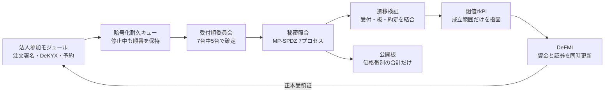
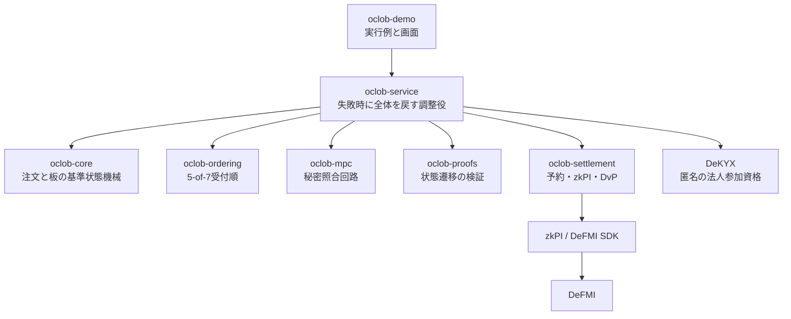

# OCLOB — 注文内容を見せずに順番を確定する連続指値市場

OCLOB は **Oblivious Continuous Limit Order Book** の略です。注文を受け付けた順番が確定し、照合が終わるまで、売買方向・指値・数量・注文者を市場運営者へ見せないことを目指す、非バッチ型の指値市場です。

公開する板は価格帯ごとの合計数量だけです。新しい注文は法人側で7計算ノード向けに分割し、各ノードへ別々に暗号化して送ります。市場の調整役には注文内容を渡しません。7台中5台が署名した受付順に沿って、MPC（複数者で秘密のまま行う計算）で照合します。成立した取引は、利用者に再署名を求めず、事前承認されたzkPI（ゼロ知識証明付き決済指図）としてDeFMIへ渡し、資金と証券を同時に更新する設計です。

> **現在の到達点**
> 研究用MVPです。新しいCLI/Docker経路では、法人2社が注文送信前にDeFMI上の資金・証券を予約し、7つの常駐MPCノードが秘密の注文を照合して共同zkPIを生成します。予約の確認や証明作成に必要な秘密情報は法人側に置き、注文の調整役には注文原文を渡しません。約定後の法人の追加署名は不要です。DeFMIの5つのAvalanche検証ノードが証明全文と予約状態を確認して匿名の保有記録を更新し、再送による二重適用がないことと、1ノードの再起動後も台帳が一致することを確認しました。
>
> この実行結果は[事前予約から決済までのデモ](docs/NATIVE_PRETRADE_DEMO.md)で再現できます。単一ホスト・1取引の機能確認であり、独立事業者による運用や本番性能の保証ではありません。板の複数約定・取消・期限切れ、暗号化キュー、React Flow画面の実装もありますが、すべてをこの新経路へつないだ製品としての受入れは未完了です。

> 決済後の受取り・返金と保証枠を法人側で復元し、返金された保有記録を次の注文の資金に使う[ウォレット経路](docs/CORPORATE_WALLET_JA.md)も追加しています。次の注文は7ノードでの受付までで、その後の約定は別の確認対象です。[支出証明の安全性修正](https://github.com/shukob/defmi/blob/153fe671e523ec573a6c6261f341423a49371f5d/docs/NOTE_PROOF_SECURITY_REVIEW_20260905.md)に伴う旧形式からの移行、独立した暗号監査は未受入です。実資産を投入しないでください。

> [秘密の板を進める前の決済確認](docs/NATIVE_FINALITY_JA.md)も、各MPCノード自身が行います。調整役の通知だけでは進めず、自分の照合記録と正しい決済指図をDeFMIの確定記録に照合します。現在は設定済みのDeFMI接続サービスを信頼する方式で、検証ノードの合意証明を直接検証する方式ではありません。

## 何を解決するか

通常の分散型CLOBでは、注文が照合される前にバリデータ、シーケンサ、メモリプール監視者へ見えます。内容を見た者は、より有利な注文を直前へ差し込んだり、不利な注文だけを遅らせたりできます。

OCLOBは次の順番を固定します。

1. Makerは板へ載せる前に最大在庫・資金を予約し、Takerは注文時に許容範囲内の予約と約定を事前承認する。
2. 注文内容を秘密分散し、公開するのは注文の要約値だけにする。
3. 7台中5台の署名で受付番号を確定する。
4. 受付番号を変えずに、7台のMPCで価格・時間優先照合を行う。
5. 約定と公開板の更新が同じ遷移であることを検証する。
6. 閾値zkPIを作り、資金と証券をDeFMIで同時決済する。
7. DeFMIの正本受領証を確認してから、画面を「決済済み」にする。

これにより防ぐ対象は、**未処理注文の内容を見てから、その注文より前へ自分の注文を差し込む行為**です。公開板から相場を予測する通常の取引、約定後の板差分からの推測、通信時刻や送信元の観測、3台以上のMPCノード結託、ネットワーク妨害による停止までは防ぎません。

## 全体像



依存関係は役割ごとに分離しています。



## 実装済みの経路

- 注文: 整数tick/lot、GTC、IOC、Ed25519事前署名、salt付きcommitment、厳格な秘密wire形式。
- 板: 価格優先、同価格内の受付順、部分約定、最大8件の複数約定、取消、期限切れ、公開価格帯合計。
- 順序: 7ノード、最大2不正を想定した5-of-7連鎖証明、署名前の投票永続化、各MPCノードによる証明本体の再検証、同一番号への二重投票拒否。
- 端末からMPCへ: 法人側で検証可能な7分割を作り、各ノードの公開鍵で固定長暗号化し、相互TLSで直接配送。調整役は注文内容を受け取らない。
- 決済権限: 注文ごとに別の暗号鍵を作り、その鍵を署名付き3-of-7分割として7ノードへ暗号配送。各ノードは正しいMPC結果を永続化した後だけ、決済専用の相互TLS接続へ自分の一片を返す。約定前の単一復号鍵は存在しない。
- MPC: 公式MP-SPDZコンパイラと `malicious-shamir-party.x` を実行し、1ノードが自分の1分割だけを開いて入力する。平文照合への代替は禁止。
- 共同証明: 各約定について7ノードが自分の616個の秘密共有だけを読み、金額・価格の範囲、数量×価格、資金・証券・Maker予約の残りが負でないことを共同証明する。証明処理用の相互TLS口は通常の注文受付口と分離する。
- 参加資格: DeKYXによる匿名法人資格と用途別無効化値。
- 予約: 新経路ではMaker・Takerの双方が注文送信前に資金・在庫を予約。法人が所有権と予約可能額を証明し、DeFMIでの確定を読み直してから注文を分割配送する。台帳の予約番号は閾値暗号化し、MPC受付へ渡す参加証明から分離する。
- 決済: 3-of-7共同署名と共同証明を含むzkPI、受取人ごとに暗号化した開示情報をDeFMIへ渡す。新経路では各検証ノードが証明全文と現在の予約状態を検証し、両側の資金・証券を原子的に更新する。同じ決済の再送は同じ確定結果を返し、二重適用しない。
- 障害時: 暗号化した法人側送信キュー、同じ要求の重複排除、MPC停止時の順序保持、固定間隔のダミー処理。
- 画面: 運営者・売り手・買い手を切り替え、公開板、自社の資金・在庫・予約、注文、7 MPC処理、zkPI、DeFMI更新をReact Flowで確認。障害ボタンは実ノード停止ではなく待機条件の模擬です。

## まだ本番保証ではないもの

- 新しい匿名保有記録の経路は、実際の事前予約・秘密照合・共同証明・DeFMI決済まで接続済みです。法人CLIの暗号化記録を使い、予約直後や一部ノードへの送信後の停止から同じ要求で再開できます。決済後の受取り・返金と秘密残高の復元も追加しています。ただし、常駐ワーカー、複数約定・取消・期限切れを含む全経路の統合確認は残っています。情報の分離は[予約証明の情報分離](docs/RESERVATION_PRIVACY.md)を参照してください。
- 分散受入経路は1台のホスト上の7コンテナです。7つの運営会社、別々の管理者・鍵保管・障害領域、WANでの機密性と可用性は未受入です。
- ブラウザ用の単体デモは互換性のため従来の中央調整経路を使い、調整サービスが注文を一時的にメモリへ持ちます。CLI/Dockerの統合受入経路は調整役へ平文注文を渡しませんが、ブラウザと本番APIの切替は未完了です。
- 新経路の事前予約証明は法人側で作ります。決済時に開くのは予約を特定する権限であり、注文原文や残高の秘密値ではありません。ただし、接続元・時刻の観測、公開板の差分からの推測、MPCノード間の結託に対する条件は残ります。
- Avalanche受入は1ホスト上の5検証ノードです。新経路では口座番号を指定せず、匿名の保有記録と予約状態を更新します。独立運営、WAN、再編、HSMでの鍵保管は未受入です。
- 新経路のRust VMは共同証明全文を検証します。MPC側も設定済みDeFMIへの読み取りで全約定の確定を確認してから秘密の板を進めます。ただし、この接続サービスへの信頼、悪意のあるノードが送る暗号化断片の検証、複雑な障害下での受取権回復には、別途確認・強化が必要です。支出証明には固定した外部の実験用実装を使っており、独立した暗号監査の合格を主張しません。従来の口座差分方式も互換性試験として残しており、新経路の証明と混同しません。
- デモ用の委員会鍵、参加者、残高は起動時生成です。外部KMS/HSM、鍵交代、バックアップ復旧は未受入です。
- 性能値は一件の粗い実行結果であり、スループット保証ではありません。
- 安全性定義、通信漏洩、選択的停止を含む形式証明は論文作業として残っています。

## 再現方法

開発用Macではビルドやテストを行いません。リポジトリのソースを一時領域へ転送し、OmenXまたはSoftBank上のLinuxコンテナだけで実行します。

```bash
make release-gate \
  REMOTE_TEST_HOST=omenx_ubuntu_zerotier \
  REMOTE_TEST_REUSE_IMAGE=0
```

2回目以降、同じ固定イメージを再利用する場合:

```bash
make release-gate \
  REMOTE_TEST_HOST=omenx_ubuntu_zerotier \
  REMOTE_TEST_REUSE_IMAGE=1
```

このゲートはRust整形、Clippy、全crateテスト、React Flow型検査・ビルド、実MP-SPDZ、zkPI、DeFMI DvP、正本読戻し、二重決済拒否を一続きで実行します。結果は `artifacts/oclob_rough_e2e.json` に保存します。

法人の事前予約から、7つの常駐MPCノード、匿名の保有記録を更新するDeFMI決済までを確認する新経路:

```bash
make remote-native-e2e \
  REMOTE_TEST_HOST=softbank-l40s \
  REMOTE_TEST_SSH_OPTIONS='-o BatchMode=yes -o ProxyJump=none'
```

結果は `artifacts/oclob_native_notes.json` です。DeFMIの起動、共同鍵の生成、法人の事前予約、秘密照合・共同証明、5検証ノードの台帳一致、再送、1検証ノードの再起動までを確認します。鍵の配置と制約は[実行手順](docs/NATIVE_PRETRADE_DEMO.md)を参照してください。以下の従来経路は互換性・部品ごとの確認用であり、新経路の受入れの代わりにはなりません。

法人側で注文を分割し、7つの独立コンテナへ直接送る経路は次で確認します。

```bash
make remote-distributed-e2e \
  REMOTE_TEST_HOST=omenx_ubuntu_zerotier
```

結果は `artifacts/oclob_distributed_e2e.json` に保存されます。この成果物は1ホスト上のコンテナ分離を示すもので、7社の独立運用や実Avalanche決済を示すものではありません。

法人側の分割から7 MPCノード、Maker予約、Taker予約とDvP、5検証者の確定、再送拒否、再起動復旧までを同じ注文要約値で一続きに確認する経路は次です。

```bash
make remote-integrated-e2e \
  REMOTE_TEST_HOST=omenx_ubuntu_zerotier
```

結果は `artifacts/oclob_distributed_avalanche_acceptance.json` に保存されます。この成果物は、注文別3-of-7鍵解放を含む一続きの機能確認です。ただし、1ホスト構成、約定後に一つの研究用決済プロセスへ復元する構成、デモ鍵という制限を明記しています。

非EVMのDeFMI Avalanche L1で、Maker予約、Taker予約とDvP、全検証者readback、再送拒否、再起動復旧を確認する経路は次です。

```bash
make remote-avalanche-e2e \
  REMOTE_TEST_HOST=omenx_ubuntu_zerotier
```

結果は `artifacts/oclob_avalanche_acceptance.json` に保存されます。この成果物も1ホスト上の5検証者であり、独立validator運営や、分散MPCとL1を一つに結んだ受入ではありません。

Linux上で画面だけを起動する場合:

```bash
docker build -f docker/Dockerfile --target oclob-server -t oclob-server:local .
docker run --rm -p 18800:18800 \
  -e OCLOB_QUEUE_PASSPHRASE='replace-with-a-secret' \
  -v oclob-state:/var/lib/oclob \
  oclob-server:local
```

ブラウザで `http://127.0.0.1:18800/` を開きます。これは研究デモであり、実資産を入れないでください。

## 文書

- [法人の事前予約からDeFMI決済までの実行手順](docs/NATIVE_PRETRADE_DEMO.md)
- [法人側の注文保存と停止後の再開](docs/CORPORATE_RECOVERY_JA.md)
- [決済後の受取り・返金を次の注文に使う](docs/CORPORATE_WALLET_JA.md)
- [設計と処理の流れ](docs/ARCHITECTURE.md)
- [守るもの・守らないもの](docs/THREAT_MODEL.md)
- [既存研究・既存プロダクトとの差分](docs/RELATED_WORK.md)
- [企業PoC導入手順](docs/POC_GUIDE_JA.md)
- [APIと状態の意味](docs/API.md)
- [実装状況と受入条件](docs/STATUS.md)
- [詳細な実装計画](doc/ja/OCLOB_IMPLEMENTATION_PLAN.md)

## ライセンス

MIT。MP-SPDZ、DeKYX、QOMM/zkPI/DeFMIおよび各Rust依存には、それぞれのライセンスが適用されます。
