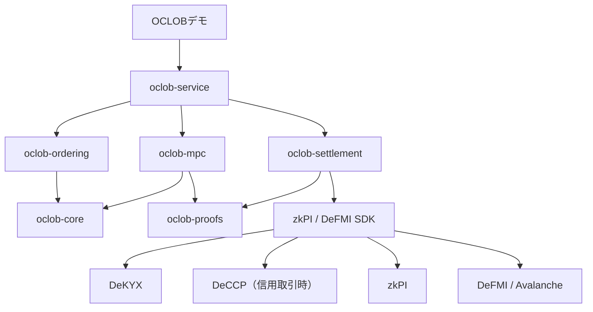

# OCLOB実装計画

## 1. 目的

OCLOBは、注文を受け付けた順番が確定し、照合結果が変更不能になるまで、
新しい注文の売買方向、価格、数量を市場運営者にも見せない即時CLOBである。
バッチオークションにはせず、注文を一件ずつ連続処理する。

利用者が値決めに使う板は公開する。ただし、公開するのは確定済みの
価格帯別合計数量、約定結果、状態の要約値であり、到着中の注文や注文者の
法人識別情報ではない。未約定残が板へ載る場合は、照合完了後にその数量を
価格帯の合計へ反映する。

最終目標は次の一連の処理を実ネットワークで成立させることである。

1. 注文者がDeKYXの参加資格とDeFMI上の資金・在庫予約を用意する。
2. 署名済み注文を7台のMPCノードへ秘密分散する。
3. 注文内容を復元せず、改ざん不能な受付順を確定する。
4. MPCが価格・時間優先で一件ずつ照合する。
5. 公開板の差分と、照合・状態更新が正しいことを検証できる証拠を作る。
6. 事前承認済み注文からzkPIを作り、追加署名なしでDeFMIへ送る。
7. Avalanche上のDeFMI正本を読み戻してから、画面を「決済済み」にする。

OCLOBという名前の登録情報だけ、固定入力の比較回路だけ、または画面だけを
作った状態は完成としない。

## 2. 第一版で守る範囲

### 守るもの

- 到着注文の売買方向、価格、数量を、受付順確定前に運営者へ見せない。
- 運営者やMPCノードが、注文を見てから自分の注文を前へ差し込めない。
- 同価格では、検証可能な受付順に従う。
- 注文者の法人識別情報を、通常の照合・板公開・決済監視から隠す。
- 資金または在庫を事前確保し、同時注文の合計が利用可能枠を超えない。
- 結果を見た後の署名拒否を許さず、成立した取引を自動決済する。
- 古い板、二重約定、二重決済、取消済み注文の再利用を拒否する。
- ノード停止時は要求を耐久キューへ残し、順番を変えず再開する。

### 第一版では守り切れないもの

- 照合後に公開される板差分や約定から推測できる取引内容。
- 送信元IP、送信時刻、注文頻度などの通信情報。
- 安全性の前提を超える数のMPCノードが結託した場合の秘密。
- 公開板だけを利用して事前に注文を置く通常の市場予測。
- ネットワーク妨害による全体停止。停止を隠したり、成立扱いにはしない。

したがって、「先回りを完全排除する」とは主張しない。第一版の主張は、
**到着注文の内容を知ってから、その注文より前へ差し込む先回りを防ぎ、
その事実を後から検証できる**ことに限定する。

## 3. 公開板と秘密状態

公開状態は次に限定する。

- 銘柄・通貨ペア。
- 価格刻みごとの買い数量と売り数量の合計。
- 最新の受付番号と板状態の要約値。
- 約定後に公開する価格、数量、時刻。
- 直前状態からの価格帯別増減。
- 状態遷移証明または検証可能な共同署名。

MPC内の秘密状態には次を置く。

- 個別注文の残数量。
- 同価格内の受付順。
- 匿名の注文所有者と予約参照。
- 取消権を確認するための秘密値。
- 決済前に必要な相手方対応。

公開板の状態要約値は秘密状態全体へ結び付ける。板表示だけを後から差し替えたり、
同じ状態要約値から異なる優先順位を作ったりできない符号化を定義する。

## 4. 注文と状態遷移

第一段階で扱う注文は、指値GTCとIOCに絞る。FOK、Iceberg、Pegged、
Stopなどは、基本経路の受入後に追加する。注文変更は既存注文の取消と新規注文に
分け、過去の受付順を引き継がせない。

注文の正規形には少なくとも次を含める。

- 版番号、注文ID、使い捨て公開鍵。
- 銘柄、売買方向、指値、数量、最小取引単位。
- GTCまたはIOC、有効期限。
- DeKYX資格証明の用途別無効化値。
- DeFMI予約IDと予約上限。
- 注文取消用の秘密値の要約。
- 注文内容、予約、参加資格を一つに結ぶ要約値。
- 注文者による事前署名。

価格は整数tick、数量は整数lotで表す。浮動小数点は正本計算へ入れない。

各状態遷移は次を入力とする。

```text
(直前の板状態要約, 次の受付番号, 注文commitment, 秘密分散入力)
```

出力は次である。

```text
(約定一覧, 未約定残, 公開板差分, 次の板状態要約, zkPI作成材料)
```

## 5. 受付順

到着時に一台の運営サーバーが順番を決める構成にはしない。第一候補は、
7台中5台の署名で、次の組を確定する方式である。

```text
(市場ID, 受付番号, 注文commitment, 直前の受付要約, 期限)
```

7台のうち最大2台が不正という前提では、5台の確定集合どうしが十分に重なるため、
異なる注文へ同じ受付番号を与える二重確定を防げる。3台署名は一般的な認可には
使えても、7台構成で一意な全順序を作るには不足するため、OCLOBの順序確定とは
分離する。

実装前に、現在の `privacy_threshold` が「耐えられる不正ノード数」なのか
「復元に必要な台数」なのかを、MP-SPDZの実行引数とSDKのコメントまで含めて統一する。
OCLOBの仕様では次を別々の名前で持つ。

- `max_corrupt_nodes`
- `reconstruction_quorum`
- `ordering_quorum`
- `settlement_authorization_quorum`

注文取消も通常注文と同じ受付列へ入れる。注文と取消の競合は、先に確定した受付番号を
優先し、管理者判断で順番を入れ替えない。

## 6. 資金・在庫・保証枠

注文受付前に、最悪時の約定額をDeFMIで予約する。

- 買い注文は `指値 × 数量 + 上限手数料` の資金を予約する。
- 売り注文は売却数量を予約する。
- 部分約定では使用分だけを消費し、残りを未約定注文へ引き継ぐ。
- IOCの未約定分、取消、期限切れは、正本上の終端遷移後に解放する。
- 同じ予約ID、注文ID、無効化値の再利用は拒否する。

自己資金・自己在庫で全額予約する場合、DeCCPは必須にしない。信用枠、証拠金、
保証付き注文を許す場合だけ、DeCCPの保証枠と損失負担順を予約へ結び付ける。
DeKYXは参加資格と法人単位の上限管理を担い、Aethel固有の資格情報は使わない。

複数注文が同時に来ても、DeFMIの正本予約を条件付き更新するため、匿名注文の合計が
同一法人の資金・在庫・保証枠を超えた時点で後続注文を拒否する。運営者へ法人名を
公開せず同一法人として数える方法は、DeKYXの用途別無効化値とDeFMIの秘密口座参照を使う。

## 7. 照合後のzkPIと決済

注文署名は、注文者が次の範囲内の約定を事前承認した証拠とする。

- 指値条件を満たす。
- 注文数量と予約上限を超えない。
- 有効期限内である。
- 定めた価格・時間優先規則で選ばれる。
- 指定した資産とDeFMIネットワークで決済される。

したがって、約定後の追加署名は要求しない。一件の到着注文が複数の既存注文と
約定した場合は、すべての約定を一つの状態遷移へ束縛し、原子的な決済束または
順序付きのzkPI集合を作る。途中だけ決済される設計を採る場合は、残りを再計算しても
価格・時間優先と予約保存則が崩れないことを別途証明しなければならないため、
第一版は一つの到着注文の約定束を原子的に処理する。

DeFMIは次を検証する。

- 受付証明、注文commitment、照合証明、予約が同じ取引へ結ばれている。
- 直前の板状態とDeFMI状態が古くない。
- 両側の注文署名と参加資格が有効である。
- 予約数量・資金・保証枠の範囲内である。
- zkPIの一回限りの番号が未使用である。
- 資金legと資産legが同時に成立する。

OCLOB側はDeFMIの受領証と新しい正本状態を読み戻すまで「決済済み」を表示しない。

## 8. 実装単位

OCLOB固有コードは、既存QOMM内部へ混ぜず、最初から独立crateとして作る。

| crate / サービス | 責務 |
|---|---|
| `oclob-core` | 整数tick/lot、注文、公開板、秘密待ち行列の基準状態機械 |
| `oclob-ordering` | commitment受付、5-of-7順序証明、取消との競合、二重確定拒否 |
| `oclob-mpc` | 秘密分散入力、価格・時間優先照合、部分約定、状態更新回路 |
| `oclob-proofs` | 受付、照合、板差分、予約、zkPIを結ぶ公開文と証明検証 |
| `oclob-settlement` | SDKを通じた予約、zkPI生成、DeFMI送信、正本読戻し |
| `oclob-service` | 耐久キュー、再送、期限切れ、ノード停止・再開、監査ログ |
| `oclob-demo` | APIとデモ用シナリオ。正本判断は持たない |

共通機能は `zkpi-defmi-sdk` の公開APIを使う。OCLOBのためだけにSDKへ例外を
追加しない。必要な抽象化がQOMMでも説明できない場合は、共通APIではなくOCLOB側へ置く。

依存方向は次に固定する。



## 9. 実装順

### P0 — 契約と最小の実行候補を固定する

- 脅威モデル、安全性の前提、公開情報、秘密情報を機械可読スキーマにする。
- 注文、受付証明、板状態、約定、取消、zkPIの正規符号化を固定する。
- 7ノードの不正許容数、復元台数、順序確定台数、決済認可台数を分離する。
- QOMMのSDK公開境界だけでOCLOBを接続できるか差分表を作る。
- 最初の実験manifestに、最終指標、数値予測、外れる主因、棄却条件を事前登録する。

この段階で個別回路の速度比較や最適化実験へ進まない。

### P1 — 最小の端から端までの実行

最初の実験は `RUN_ROUGH_END_TO_END_AND_OBSERVE_FINAL_METRIC` とする。
対象は一銘柄、GTC指値、既存売り一件と到着買い一件の全量約定に絞るが、
次の経路は省略しない。

```text
秘密注文
  → 7ノード受付と5-of-7順序確定
  → MPC照合
  → 板状態更新
  → zkPI
  → 5検証者DeFMI
  → Avalanche正本読戻し
```

合格条件は、注文内容を運営者ログへ出さず、約定後の追加署名なしでDvPが一度だけ
成立し、公開板とDeFMI残高が一致すること。最終所要時間と各区間時間も同時に記録する。
この結果を観測する前に、個別部品の性能調整を行わない。

### P2 — CLOBとして必要な状態遷移を揃える

- 非交差注文の板追加。
- 同価格の受付順。
- 価格優先。
- 全量約定、部分約定、複数注文との約定。
- IOC、GTC、有効期限。
- 取消と新規注文の競合。
- 残数量と予約残高の一致。
- 手数料とtick/lot検査。

`oclob-core` とMPC実行を同じテストベクトルへ通し、出力差を許さない。

### P3 — 同時注文と不正入力を閉じる

- 同一資金・在庫・保証枠を使う同時注文。
- 同じ注文、予約、受付証明、zkPIの再送。
- commitmentと秘密分散値の不一致。
- 古い板状態、古い予約状態、期限切れ資格。
- 異なる注文へ同じ受付番号を与える署名。
- 不足署名、壊れた証明、不正な価格刻み。

すべて正本状態を変えず拒否することを確認する。

### P4 — 障害回復と問い合わせ不可観測性

- 1台、2台、3台のMPCノード停止。
- 順序確定後の選択的停止。
- サービス、MPC、DeFMI検証者の個別・全体再起動。
- 受付済み未処理注文の耐久キュー復元。
- 同じ受付順での再実行。
- 期限切れ時の予約解放。
- 実注文がない時間帯の固定形通信とダミー処理の費用測定。

可用性を満たせない場合は注文を保留または明示的失敗にし、別の注文を追い越させない。

### P5 — デモと運用パッケージ

一つのDockerネットワークで次を別コンテナとして起動する。

- 法人参加モジュール2社以上。
- OCLOB受付・監査サービス。
- MPCノード7台。
- DeFMI検証者5台とAvalanche接続。
- DeKYX発行・検証サービス。
- 必要なシナリオだけDeCCP。
- React Flowデモ。

デモでは公開板、各法人の自分の注文・予約・残高、MPCの進行、zkPI、DeFMI決済を
同じ時系列で見せる。他社の秘密注文や法人名を管理画面へ出さない。ノード停止・再開、
同時注文、取消、部分約定を利用者が操作できるようにする。

### P6 — 性能と先回り耐性の比較

比較対象は少なくとも次とする。

1. 平文の決定的Rust CLOB。
2. 暗号化受付後に平文照合する方式。
3. OCLOBのMPC照合方式。
4. バッチ方式は別方式として比較し、即時方式の結果へ混ぜない。

測定項目は次である。

- 注文送信から受付確定までのp50、p95、p99。
- 受付確定から板更新までのp50、p95、p99。
- DeFMI正本確定までの端から端の時間。
- 一秒当たり処理注文数、MPC通信量、CPU、メモリ。
- 先回り攻撃の成功率、約定価格差、待ち時間、取消成功率。
- ノード停止・再起動後の回復時間と順番不変性。
- 公開板差分から秘密注文を推測できる割合。

攻撃比較は同じ注文列・乱数seedで対応を取り、必要標本数を検出力計算で決める。
有意水準0.05、検出力0.80以上を原則とし、少数シナリオは動作確認とだけ呼ぶ。

### P7 — 公開と論文化

- `shukob/oclob` を独立して再現可能な公開リポジトリにする。
- `export_repos.rs` にOCLOBの依存境界と秘密漏洩検査を追加する。
- Docker Compose、テストベクトル、失敗例、測定manifest、実測artifactを公開する。
- 競合方式を、見える情報、信頼先、順序保証、決済方式、実測性能で再調査する。
- Issue #129はP1の実測後に、実装済み範囲と未実装範囲を更新する。
- 論文では暗号部品単体の新規性ではなく、即時順序、秘密照合、予約、自動決済、
  公開板、攻撃実験を一つの検証可能な市場として統合した差分を主張する。

## 10. 必須テスト

### 正常系

- 非交差、全量約定、両側の部分約定、複数相手との約定。
- 同価格の先着優先と、より良い価格の優先。
- GTC、IOC、期限切れ、取消。
- 買い・売り双方の予約消費と残りの解放。
- 一つの到着注文から複数zkPIを作る場合の原子性。
- DeFMI受領証と公開板・利用者残高の照合。

### 拒否系

- 無資格、署名不正、予約不足、枠超過、tick/lot違反。
- 二重注文、二重取消、二重受付番号、二重zkPI。
- 古い板、古い予約、期限切れ、壊れた共同証明。
- 同一法人が匿名鍵を変えて上限を超える注文。
- 予約と異なる資産・数量・決済先への差替え。

### 障害系

- MPCノード停止、順序確定ノード停止、DeFMI検証者停止。
- 各サービスの処理途中での強制終了。
- 同一要求の再送と、応答消失後の再照会。
- 分岐した受付証明、選択的停止、古い状態からの再開。

### 秘密性確認

- API、ログ、監査記録、永続キュー、メトリクスに平文注文がない。
- 運営者画面に未確定注文の方向、価格、数量、法人名がない。
- PCAP上の長さ・時刻漏洩を測り、固定長化前後を比較する。
- 公開板と約定履歴から推測可能な情報を過小評価せず記録する。

## 11. 実行環境と完了判定

プロジェクト所有の実装、試験、測定はRustで行う。MPC回路の生成と実行は、
既存方針どおりRustから公式MP-SPDZコンパイラとC++エンジンを呼ぶ。
公式 `compile.py` は外部ツールとしてのみ残し、Rust以外のOCLOB実装は作らない。

単体、統合、Docker E2E、負荷、遅延、攻撃実験はローカルMacで実行しない。
OmenXまたはSoftBankの承認済みLinux環境で、既存 `make remote-test` と
固定Dockerイメージを使う。ローカルへの自動フォールバックは禁止する。

完成は次の全条件で判定する。

- P0からP5の機能・拒否・障害シナリオが遠隔環境で合格する。
- 7 MPCノード、5 DeFMI検証者、法人モジュールを別コンテナで動かす。
- 到着注文が運営者へ平文開示される前に受付順が確定する。
- 価格・時間優先、予約保存則、板状態、zkPI、DeFMI正本が同じ取引へ結ばれる。
- 約定後の追加署名なしでDvPが成立する。
- 再送、再起動、同時注文でも二重約定・枠超過・順番変更がない。
- React Flowデモを実ブラウザのデスクトップと狭い画面で確認する。
- P6の比較を事前登録済み条件で行い、測定物から主張を再生成できる。
- 公開リポジトリだけでビルド、試験、最小デモを再現できる。

## 12. 着手条件

共有作業ツリーで進行中のAethel分割実装と監査が終わり、編集競合がなくなってから
OCLOB実装へ着手する。技術上はAethelへ依存しない。開始時には、現行SDKとQOMMの
遠隔受入結果を新しい作業ツリーで再確認し、既存の不具合をOCLOBの結果へ混ぜない。
