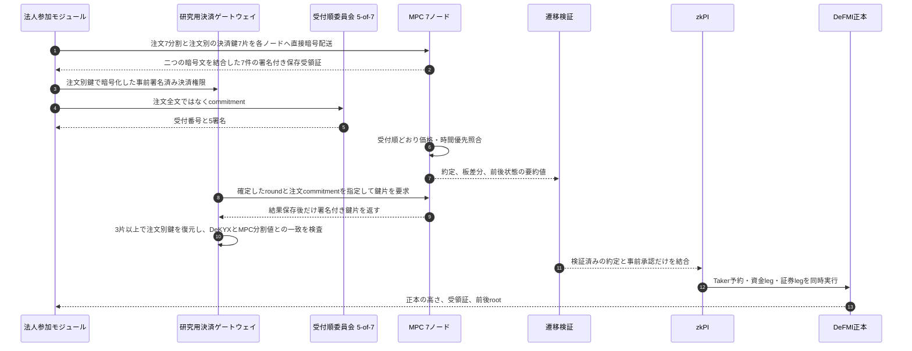
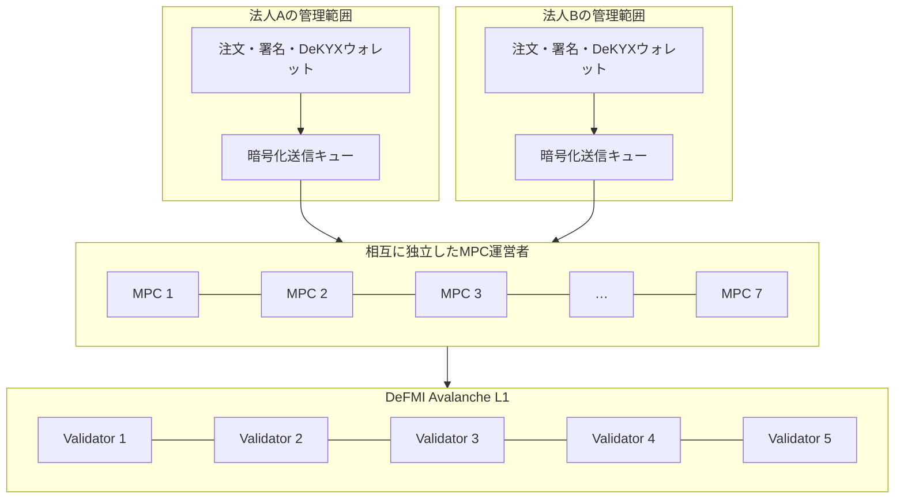

# OCLOBの設計と処理の流れ

## 1. 三つの状態を分ける

OCLOBは、同じ「注文」を一か所に保存しません。用途ごとに四つへ分けます。

1. **法人側の秘密状態**: 注文全文、署名鍵、DeKYX資格、資金・在庫予約の開示情報。
2. **MPC側の秘密状態**: 各ノードが持つ注文の一部分と、板に残った個別注文の一部分。一台だけでは元の値を読めません。
3. **公開状態**: 市場ID、受付番号、注文commitment、価格帯別合計数量、約定結果、検証証拠、DeFMI正本の要約値。
4. **決済権限**: 注文者が事前署名した注文全文とDeKYX提示を固定長暗号文にし、その注文だけに使う暗号鍵を3-of-7でMPCノードへ分ける。各ノードは正しい照合結果を保存した後だけ鍵片を返し、決済担当は三片以上を検証して注文別鍵を復元する。

分散受入経路では1と2を別プロセス・別コンテナへ分離し、法人側から各MPCノードへ注文の一部分と決済鍵の一片を別々に暗号化して直接送ります。各ノードは二つの暗号文の要約値と状態世代を署名して返します。公開要約は注文ごとの使い捨て鍵で署名するため、調整役は注文全文だけでなく法人の長期署名鍵も受け取りません。6つの照合項目は、MPC用分割値と決済権限内の値が同じであることをPedersen VSSで検査します。決済鍵の各片はFeldman commitmentと参加者署名で検査します。ただし、現在の受入は一台のホスト内であり、照合後は一つの研究用決済プロセスが注文全文をメモリへ復元します。別運営者・別ホスト・WAN・共同zkPI生成での受入が必要です。ブラウザ用の単体デモは一つのプロセス内で動く従来経路なので、この中央非開示保証の対象外です。

## 2. 注文受付から決済まで



### 2.1 事前承認

注文者は「結果を見てから決める」のではなく、次の条件内なら自動決済してよいと最初に署名します。

- 指値より不利な価格にならない。
- 注文数量と予約上限を超えない。
- 有効期限内である。
- 指定市場・指定資産・指定DeFMIである。
- 公開された価格・時間優先規則に従う。

この署名があるため、成立後の再署名は不要です。結果を見た後に署名を拒否して相手の注文を探る行為を防ぎます。

実装は二相です。MakerのGTC注文は、MPCが「約定なし・板へ残る」と判定した後、秘密の最大額を示す閾値zkPIと予約状態の前後rootを作り、Avalancheで確定した後にだけ次の照合対象へ加えます。到着したTakerが約定する場合は、Taker予約を中間状態として先に確定せず、その予約・全約定・未使用額の解放を一つのDeFMI compare-and-swapにします。L1が拒否した場合、秘密板、法人枠、残高、DeKYXの一回限り状態はすべて確定前のままです。

現受入では、参加者が注文別の乱数鍵で固定長暗号文を作り、その鍵を署名付き3-of-7分割として各ノードへ暗号配送します。ノードは自分が保存した同じroundの公開結果がその注文を決済または板掲載の対象にした場合だけ、決済専用の相互TLS接続へ鍵片を返します。決済担当はノード署名、round、公開結果、注文commitment、Feldman commitmentを検査し、三片以上で復元した注文別鍵を使います。その後、参加者署名、DeKYX提示、注文commitment、MPC用VSSの6定数項を確認してzkPIを組み立てます。これにより、約定前に全注文を開ける単一鍵はありません。一方、照合後は決済担当が注文全文を知るため、本番候補では同じ公開インターフェースを保ったまま共同zkPI生成へ進める必要があります。

### 2.2 受付順

受付順を決める署名文は次の情報だけを含みます。

```text
(市場ID, 受付番号, 注文commitment, 直前証明の要約値, 有効期限)
```

7台中5台が同じ文へ署名したときだけ確定します。各ノードは署名前に投票文を自分の永続領域へ記録し、同じ有効期間中の同一番号へ異なる注文を再署名しません。MPC実行要求には要約値だけでなく証明本体を含め、各ノードが固定済みの7公開鍵に対して署名数・署名内容・対象注文・直前証明との連続性を再検証し、受理したchain headを永続化します。最大2台が異なる順番へ署名しても、二つの5台集合には正しいノードが重なるため、同じ受付番号を別の注文へ確定できません。

ただし、これは「世界で最初に送った通信」を絶対的に決める保証ではありません。非同期ネットワークでは完全な到着時刻順は定義できないため、論文では、各ノードが観測した順序と証明可能な確定規則を区別します。

### 2.3 秘密照合

板の優先順は、買いでは高い価格から、売りでは低い価格からです。同価格では受付番号が小さい注文から処理します。MPCは固定8枠を一度に評価し、次を公開します。

- 各枠が約定したか。
- 約定価格と数量。
- 到着注文の公開可能な残数量。

注文者、DeKYX無効化値、秘密鍵、reservation openingは公開しません。8枠を超えて一度に約定しうる注文は、現在の固定回路では受付前に拒否します。無言で9件目を飛ばすことはしません。

### 2.4 板の更新

公開板は個別注文一覧ではなく、次の形です。

```text
(売買方向, 価格tick, その価格に残る数量の合計)
```

件数は公開しません。とはいえ、利用者が一人しかいない価格帯では前後差から個別数量を推測できます。これは公開板を持つために残る漏洩であり、匿名性保証とは別に測定します。

### 2.5 zkPIとDeFMI

zkPIは「誰の口座番号を直接書き換えるか」ではなく、事前に正本へ登録した秘密口座参照と、次の条件を満たす移転を指定します。

- 注文commitment、受付証明、照合証明、予約が同じ取引を指す。
- 売り手の証券数量と買い手の資金額が一致する。
- 金額と価格が事前承認範囲内である。
- 一回限りの番号が未使用である。
- 証券legと資金legを同じ正本遷移で適用できる。

どちらか一方でも失敗すれば両方を破棄します。成功時だけ前後root、高さ、受領証を返します。

## 3. crateの責務

| crate | 入力 | 出力 | 秘密を持つか |
|---|---|---|---|
| `oclob-core` | 注文、照合結果 | 基準となる板遷移 | 研究ランナーでは個別注文を保持 |
| `oclob-dekyx` | DeKYX presentation | 匿名資格の検証結果 | issuer秘密は持たない |
| `oclob-edge` | 法人側の秘密注文、7ノード公開鍵 | 公開要約値、ノード別の注文暗号文と決済鍵片暗号文、決済権限暗号文 | 注文全文と注文別鍵を分割完了まで持つ |
| `oclob-node` | 自ノード宛て二つの暗号文、公開ラウンド計画 | 署名付き保存受領証、署名付き公開結果、結果後の署名付き決済鍵片 | 自分の注文1分割と鍵1片だけを必要時に開く |
| `oclob-ordering` | commitment | 5-of-7受付証明 | 各ノード署名鍵 |
| `oclob-mpc` | 秘密入力share | 約定結果 | 各ノードは一つのshareのみが本番形 |
| `oclob-proofs` | 前後root、受付、MPC出力 | 検証可能な遷移証拠 | いいえ |
| `oclob-settlement` | 検証済み決済権限、約定、予約、遷移証拠 | zkPI、DeFMI受領証 | 研究用決済プロセスでは照合後の注文全文と口座openingを保持 |
| `oclob-service` | 認証済み要求 | 原子的な処理結果 | 暗号化キューを管理 |
| `oclob-demo` | 操作用HTTP | 役割別画面 | デモ用状態のみ |

## 4. 失敗時の扱い

- 受付順未確定: 注文は処理せずキューへ残す。
- MPC停止: 平文照合へ切り替えず、同じ要求IDで再試行する。
- 証明不一致: 板、予約、決済をすべて更新しない。
- DeFMI拒否: 公開板も確定扱いにせず、正本受領証を待つ。
- IOC未約定: 予約を解放し、板へ残さない。
- GTC未約定: 残数量と予約残を同じ遷移で維持する。
- 再送: request digest、注文commitment、zkPI nullifierで二重処理を拒否する。

## 5. 本番化時の分離

本番候補では少なくとも次を別の障害領域へ分けます。



同一クラウドアカウント、同一管理者、同一KMSで7台を動かしても、暗号上の7運営者にはなりません。独立性は会社、管理権限、鍵、ネットワーク、監査ログ、障害対応を含めて評価します。
