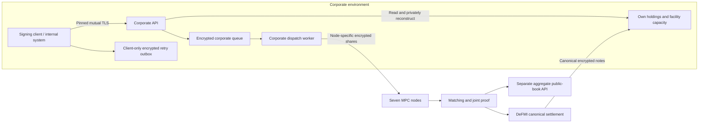

# Corporate service API

This service runs **inside each corporation's environment**, beside its encrypted
outbox and dispatch worker. It is separate from the public-book HTTP API and
the market coordinator. It accepts already-authorized orders, reports the
corporate queue, and reads the corporation's own canonical holdings.



The current transport is a fixed-size JSON RPC record over mutually
authenticated TLS 1.3, using the repository's existing OpenSSL and record
transport. It is not a browser HTTP endpoint. A browser-facing corporate gateway
and user/session authorization remain a separate integration step; do not mount
corporate credentials into the public browser service to bypass that boundary.

## Trust and storage

- Each deployment has its own server certificate and exact client-certificate
  allowlist. A certificate signed by the same CA is not sufficient. The client
  verifies the CA, server name and exact server certificate fingerprint.
- The server's corporate configuration fixes the DeFMI deployment, facility,
  asset, identity and journal. Requests cannot select another corporation,
  arbitrary file paths, node configuration or a different deployment.
- The corporate service does not issue DeKYX credentials and does not possess a
  market, MPC-node, credential-issuer or validator key.
- Order authorizations and queue entries are stored using the existing encrypted
  journal and crash-atomic dispatch queue. The API adds no substitute encryption,
  matching, funding-proof or settlement implementation.
- No ports are published by the corporate Docker override. The public API has
  no mounts from these containers. The acceptance network is still single-host;
  it is not evidence of independent operators or anonymous transport.

## Operations

`enqueue` takes a corporate request ID, an immutable signed intent and reserve
authorization, and an optional selected funding note. These are **private
corporate payloads**, not public HTTP data. The server checks their agreement,
the corporate deployment and the saved request before queueing. The same exact
request can be retried, including after server restart; conflicting content is
rejected. A `queued` response is not node admission, an execution promise, or
settlement. The resident corporate and market workers perform those later steps.

`queue_status` reads only this corporation's dispatch state. It never returns
the saved order wire, private signing key, credential witness or reservation
openings. The current API grants its registered clients whole-corporation access;
department-specific read/write roles and credential rotation are not yet added.

`wallet_snapshot` is read-only: it does not redeem claims, submit transactions or
rewrite funding witnesses. It scans both configured market assets using the
corporate wallet, checks spent serials, distinguishes unlocked and locked notes,
and reconstructs facility capacity against canonical commitments. Locked amounts
come from the current reservation remainders, not the immutable original escrow
note values. Every active reservation must also have a corresponding owned
escrow note; unknown locks are rejected instead of estimated. Every read
must refer to the same state root; a changing or inconsistent view is rejected.
Amounts and sequence numbers are decimal strings. Facility capacity is reported
separately and must not be added to asset balances.

The snapshot includes only materialized ledger notes. Unredeemed settlement
claims are explicitly excluded; they are not spendable cash or securities yet.
The response says `unredeemed_claims_included: false`. Existing wallet recovery
and claim redemption remain explicit corporate actions.

## Running the native scenario

Build and test on Softbank or Omen, never on the developer laptop:

```sh
make remote-native-http-e2e REMOTE_TEST_HOST=softbank-l40s \
  REMOTE_TEST_SSH_OPTIONS='-o BatchMode=yes -o ProxyJump=none' \
  NATIVE_HTTP_MANIFEST=/research/manifests/oclob_native_http_007.json \
  NATIVE_CORPORATE_API=1
```

The optional `deploy/docker-compose.corporate-api.yml` adds `maker-api` and
`taker-api`. Provisioning creates separate server certificates and permits each
corporation's existing signing client, not the other company's certificate.
The CLI is the signing adapter. In the corporate API Docker profile it now uses
a separate encrypted retry outbox with an independently generated storage key.
Its identity mount contains an explicit list of client/configuration files, not
the service's identity directory or its nested queue. Only the API and worker
mount the service journal and dispatch queue. The client still has its own
durable storage: eliminating that storage would lose exact retry information
after a timeout. This is not a browser-owned credential wallet or HSM boundary;
the lab client retains corporate signing/funding configuration.

The isolated-client scenario 007 passed with four API orders, two actual fills
totaling 7,500, both cross-company denials, locked balances of 45 and zero,
exact-request replay after API restart, and validator-restart recovery.
[`oclob_native_corporate_client_sources.json`](../artifacts/oclob_native_corporate_client_sources.json)
binds all 171 executed source files and the result. Remote formatting, Clippy
and 132 Rust tests passed. Read-only checks after settlement confirmed that
both client outboxes were private, with no dispatch file, service queue directory
or API server key in their mounts. The older 006b evidence below describes the
shared-journal predecessor. Neither result establishes browser acceptance.

The scenario routes all four orders through the actual API and existing workers,
checks both cross-corporate access failures, reads before/after wallet snapshots,
restarts the API and resubmits the original request. The original matching,
two-fill settlement, process-failure, public-book and validator-restart checks
remain in force. Private wallet snapshots stay in each corporation's own queue
directory, never the shared handoff or public directories. Do not publish those
raw files or mount them in a public web server.

## Current acceptance boundary

The corrected native scenario completed on Softbank with two actual fills
totaling 7,500, zero post-match participant signatures, four public HTTP
snapshots, six public HTTP failure checks and validator-restart recovery. Both
cross-company queue reads were rejected. After API restart, resubmitting the
original request returned `already_present: true` without another trade.
Rust's 131 tests, formatting and all-target Clippy checks passed remotely.

The first completed scenario exposed an accounting error: the immutable seller
escrow notes still totaled 120 after 75 units had been traded. Those face values
are not the current locked balance. The corrected scenario checks the actual API
for 45 seller units and zero buyer cash still locked, against the reconstructed
canonical facility state. A wallet with an unknown lock is rejected rather than
given a guessed amount.

The final source-bound result is recorded in
[`oclob_native_corporate_api_sources.json`](../artifacts/oclob_native_corporate_api_sources.json):
all 170 source hashes matched the actual remote snapshot, and the exported
result matched the remote artifact. Failed attempts and the incorrect first
wallet result remain recorded in the experiment ledger. Financial evidence
remains single-host functional smoke, not production acceptance. This does not
replace the corporate browser, lifecycle, operation/role policy, journal-free
client, credential provisioning, availability and production-security work.
The API processes connections sequentially; public-internet load handling,
overall request deadlines and high availability are not accepted. Wallet scans
retain the underlying bounded ledger/history assumptions. Health checks return
only readiness, not private queue contents.
