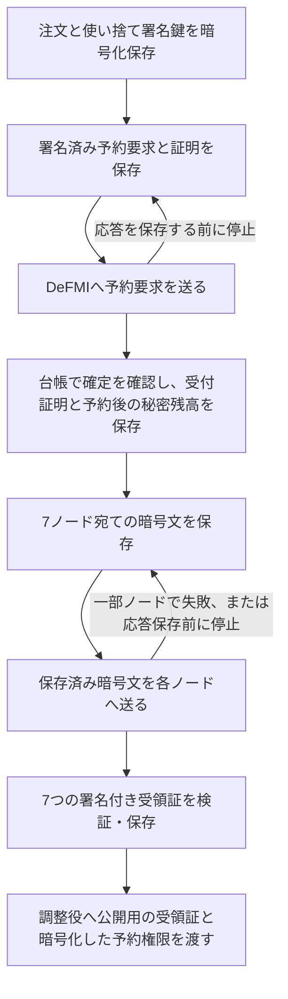

# 法人側の注文保存と、停止後の再開

OCLOBの法人CLIは、注文の作成からMPCへの受付完了までを暗号化して保存します。
予約が確定した直後や、7ノードの一部へ送信した時点で停止しても、
**同じ注文、同じ予約要求、同じ暗号文で再開**します。返事が来なかったことを理由に、
別の注文や新しい資金予約を作り直すことはありません。

この文書は、匿名の保有記録を使う `remote-native-e2e` 経路を対象にしています。
ブラウザ用の中央調整デモや従来の口座差分方式とは別です。

## 保存する順番



各段階は上書きしない記録として残ります。同じ要求を複数プロセスが同時に準備した場合も、
最初に保存された内容を採用します。負けたプロセスが作った別の乱数や証明を送信しません。

保存には、固定したDeFMI SDKの `CorporateOutbox` を使います。暗号化、書込みの排他制御、
一時ファイルからの置換、ファイルとディレクトリの同期を再利用し、暗号処理を独自に作りません。
保存ファイルは所有者だけが読める設定です。暗号鍵は別のファイルに置きます。

## 予約が二重にならない理由

予約要求は、注文、予約番号、資産、保証枠、数量を隠した要約値、有効期限、法人の署名に
結び付いています。要求と証明を保存してからDeFMIへ送信します。

DeFMI側の接続口は、同じ要求が再送されると、まず確定済みの同じ予約を探します。
存在すれば、その予約から受付証明を再取得します。予約前の保有記録をもう一度使ったり、
別の予約を作ったりしません。まだ確定していない場合にも、再検証するのは同じ保存済み要求です。
不明な応答を「予約は存在しない」とみなして別の資金を使う処理はありません。

法人側も、返された署名だけで判断せず、DeFMIの予約状態を読み直します。
予約後の保証枠の秘密残高と乱数も保存し、対応する台帳の更新番号・要約値と照合します。
次の予約で保存済みの秘密情報を使う場合も、現在の台帳と一致しなければ停止します。
**約定や取消によってさらに進んだ残高を、古い保存値から推測して使うことはありません。**

## 一部のMPCノードしか受け付けなかった場合

各ノード向けの暗号文を保存してから配送します。一部だけ成功しても、法人CLIは
「全ノード受付済み」とは返しません。再開時は7ノードへ同じ暗号文を送信します。
既に保存したノードは同じ要求として扱い、未受信だったノードだけが新たに保存します。

7つの受領証は、ノードの署名、注文の要約値、保存した暗号文の要約値に対して検証します。
確認済みの受領証が保存されていれば、その後の同じCLI呼出しは保存済みの結果を返します。
受領証を公開するファイルも、既存の内容が同じ場合だけ再利用し、別の注文の結果を上書きしません。

## 必要な設定

新経路の法人コンテナには、次の設定が必要です。Docker定義には設定済みです。

- `OCLOB_NATIVE_RESERVATION_CONFIG`：自社の鍵・資産・保証枠・接続先の初期設定。
- `OCLOB_CORPORATE_JOURNAL`：暗号化した記録の保存先。コンテナを作り直しても残る、自社専用の領域を指定します。
- `OCLOB_CORPORATE_JOURNAL_KEY`：記録を開くための32バイトの鍵ファイル。環境変数へ鍵そのものを書きません。
- `OCLOB_CORPORATE_REQUEST_ID`：社内の要求番号。再送時は同じ番号を使い、別の指示には別の番号を使います。

同じ要求番号で別の指示を出すと拒否します。新しい注文では、公開用の受領証と予約権限の
出力先も別にします。デモCLIの注文はMaker/Takerの固定例です。任意の企業向け注文入力APIが
完成したという意味ではありません。

初期化は法人の参加設定を作るときに一度だけ行います。Rustの接続部品では
`NativeCorporateJournal::initialize` が初期化、`open` が通常の再開です。
デモでは `oclob-lab-provision` が初期化します。通常のCLIは保存ファイルがなければ停止します。
間違った鍵、壊れたファイル、異なるDeFMIやノード構成の場合も、空の状態を作って続行しません。

デモの配置は次のとおりです。

- 法人ごとの `queue/outbox.enc` を、その法人だけの `/corporate/outbox.enc` へ接続。
- 法人ごとの `outbox-key.raw` は、その法人だけの `/identity/outbox-key.raw` へ読取り専用で接続。
- MPC、調整役、DeFMIのコンテナには、法人の保存ファイルも復号鍵も渡しません。

## 停止・復旧試験の再現

開発用Macではビルド・試験をせず、次でSoftbank上のDockerを使用します。

```sh
make remote-native-recovery-e2e \
  REMOTE_TEST_HOST=softbank-l40s \
  REMOTE_TEST_SSH_OPTIONS='-o BatchMode=yes -o ProxyJump=none'
```

試験は次の順で進みます。

1. Makerの予約を実際に確定し、応答を保存する前に法人プロセスを終了する。
2. MPCノード6を実際に停止し、同じ法人要求を再実行する。全ノード受付には至らないことを確認する。
3. 同じノードを再起動し、保存済み暗号文を再送する。全ノードが受け付けた直後、受領証を保存する前に再び法人プロセスを終了する。
4. 法人プロセスを再実行して受領証を保存し、もう一度同じ呼出しを行って保存済み結果を取得する。
5. Takerを受け付け、7ノードの照合・共同zkPIと、5検証ノードのDeFMI決済まで進む。
6. 約定前の保証枠の更新番号が両法人とも1であること、価格100・数量40で成立すること、二重適用がないこと、検証ノード再起動後も台帳が一致することを確認する。

結果は `artifacts/oclob_native_recovery.json`、条件は
`research/oclob_native_recovery_contract.json`、実行条件の記録は
`research/manifests/oclob_native_recovery_001.json` です。詳細ログは実行時に表示されるリモートの作業領域に残ります。
そこには**デモ用秘密鍵と法人の暗号化保存ファイルもある**ため、領域全体を公開してはいけません。

`OCLOB_NATIVE_RECOVERY_TEST_STOP` はデモCLIの明示的な停止試験用です。
この試験は「応答が来た後、保存前にプロセスが終わる」場合を再現します。
通信パケットだけを途中で捨てる試験とは区別します。

## まだ保証していないこと

- 未解決の先行要求は後続要求を止めます。期限切れだからといって記録を削除せず、DeFMI上の解除・不成立確認へつなぐ必要があります。その自動処理は未接続です。
- 約定後の保証枠・受領権から、次の支出に使えるウォレット状態を復元する処理は未完了です。
- 常駐ワーカーの自動再試行、複数部署による独立した資金更新、鍵交代、バックアップ全体の巻戻し検出は別の確認事項です。
- これは単一ホストの機能確認です。独立運営者、WAN、長期運転、処理能力、経済効果は示していません。

復旧できない場合に、記録を消す・鍵を交換する・初期資金を再設定すると、未解決の予約を
見失うおそれがあります。これらを再送の代わりに行わないでください。
