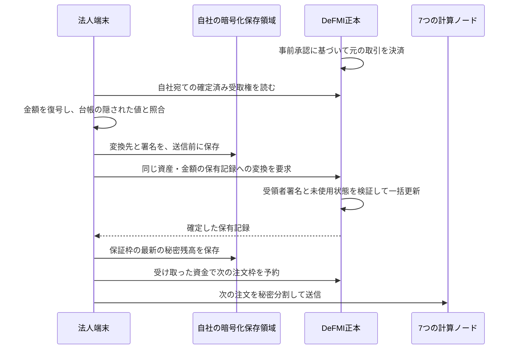

# 決済後の受取り・返金を、次の注文に使う

## 何ができるか

法人の注文端末が、DeFMIで決済済みの受取権と返金を読み取り、自社だけが開ける
保有記録に変換します。さらに、保証枠の「利用可能・予約中・使用済み」を、
自社の保存記録と現在の台帳から復元します。その残高を次の事前予約に使えます。

口座番号を公開して加算する方式ではありません。DeFMIが持つのは、資産の種類、
金額を隠した値、受取先専用の一回限りの公開鍵、暗号化された開示情報などです。
金額と秘密乱数を開いて残高を読めるのは、対応する鍵を持つ法人です。

この説明はCLI/Dockerの新経路についてです。ブラウザ画面の既存経路へ、
この機能がすでにつながっているという意味ではありません。

## 約定への再同意ではない

約定と両側の引落し・受取権の確定は、事前承認に従って既に終わっています。
以下の署名は、その受取権を自社の保有記録へ取り込むための所有権確認です。
署名を遅らせたり拒否したりしても、元の取引を取消したり、相手方の決済を止めたりはできません。



## DeFMIが検証するもの

`issueNoteClaimRedemption` では、受取権に既に登録されている受領者の公開鍵を使い、
次の内容を束ねた署名を各検証ノードが確認します。

- 接続先のチェーン、更新前の台帳、操作番号、受取権の番号。
- 新しく作る保有記録の全項目。
- 元と同じ資産、同じ金額を隠した値、予約ロックのない出力であること。
- 受取権がまだ取り込まれておらず、操作番号も未使用であること。

新しい保有記録の登録、受取権の使用済み化、操作番号の記録は一括で行います。
法人の長期ウォレット鍵や実際の金額・秘密乱数をDeFMIへ渡しません。
旧来の管理者承認だけの変換経路から、この新経路の受取権を取り込むことも拒否します。

ただし、受取権に既にある公開情報との対応は残ります。変換の事実や時刻も公開台帳から
観測できます。「全取引の対応関係や通信情報まで完全に隠れる」とは主張しません。

## 二度取り込まないための保存

法人は、変換先・操作番号・署名を `redemption:<受取権番号>` として、最初の送信より先に
暗号化保存します。別のプロセスが同時に準備しても、最初に保存された内容を使用します。

再起動後、DeFMIですでに変換済みなら、保存した要求と確定した保有記録が同一かを確認します。
まだ変換されていなければ、同じ要求を送ります。別の受取権や別の初期資金を代わりに使いません。
変換済みなのに自社の保存記録がない場合は、勝手に新しい記録を作らず停止します。

## 保証枠を復元する方法

保存した初期残高と、各予約の金額・秘密乱数を出発点にします。
DeFMIから各予約の現在残額と更新番号を読み、残額の暗号文を自社で復号します。
復号結果が台帳の金額を隠した値と一致しなければ停止します。

- まだ有効な予約：使った分は「使用済み」、未使用分は「予約中」。
- 終了・解除済みの予約：使った分だけ「使用済み」、未使用分は「利用可能」に戻す。

計算した3つの残高と秘密乱数が、同じ時点のDeFMIの3つの値・更新番号に一致することを
確認してから保存します。台帳が読み取り途中に変わった場合や、保存履歴にない外部更新が
あった場合は推測で補いません。計算途中のエラーでも、元の秘密残高を部分的に書き換えません。

## 実行する

SoftbankまたはOmenだけで実行します。Macではビルド・テスト・Dockerを起動しません。

```sh
make remote-native-wallet-e2e \
  REMOTE_TEST_HOST=softbank-l40s \
  REMOTE_TEST_SSH_OPTIONS='-o BatchMode=yes -o ProxyJump=none'
```

この試験は、実際の事前予約、7つの常駐計算ノード、5つのAvalanche検証ノードを使います。

1. 売り手60口の注文に対して、買い手40口を価格100で約定・決済する。
2. 売り手の資金受取り、買い手の証券受取り、買い手への余剰資金40の返金を取り込む。
3. 各法人の取込みをもう一度実行し、追加の保有記録を作らないことを確認する。
4. 両法人の保証枠を更新番号2まで復元する。
5. **その返金40の保有記録を明示的に指定**し、次の買い注文1口・指値40の資金にする。
6. 作成した支出証明の使用済み判定値が指定ノートに対応し、DeFMIでも使用済みになったことを法人内で確認する。
7. 買い手の保証枠が更新番号3になり、次の注文が7ノードで受け付けられたことを確認する。
8. 5検証ノードの最終台帳が一致し、1ノードの再起動後も一致することを確認する。

**次の注文は受付までです。この試験では次の注文を約定・決済しません。**
結果の `next_order_matched` も `false` です。新しいノートが一覧に現れただけでは成功にせず、
そのノートを次の予約の支出証明で消費したことまで確認します。

その後の約定までを確認する場合は、別の[継続取引の試験](NATIVE_CYCLE_JA.md)を使います。
こちらは初回2約定の全受取権を復元し、返金330を使った次の注文を、元の売り注文の残りと
実際に照合・決済します。従来試験の `false` を書き換えて済ませず、別の契約・実行結果で検証します。

結果は `artifacts/oclob_native_wallet.json` に保存されます。
`elapsed_ms` と `canonical_height` は最初の照合・決済部分の値です。
取込み、次の注文、検証ノード再起動を含む全所要時間・最終高さではありません。

### 2026年9月5日の確認結果

DeFMI `153fe671e523ec573a6c6261f341423a49371f5d` を固定し、Softbank上で
上記8段階を完了しました。受取権3件、両法人の更新番号2、返金を使った次の予約後の
買い手の更新番号3、7ノードの受付、5ノードの台帳一致と再起動復旧を確認しています。
公開するのは確認用の要約だけであり、法人の秘密残高・鍵・乱数は含みません。

- 実行条件：`research/oclob_native_wallet_contract.json`。SHA-256は `94b1b10c1bc2c9db3336a48cb43556cf428e6ee827af693727346380c0ac4273`。
- 事前登録：`research/manifests/oclob_native_wallet_003.json`。SHA-256は `5636ebae672afb5da7ce89190ad112b9686d68c7547ef8c745b1d4940841166a`。
- 公開結果：`artifacts/oclob_native_wallet.json`。SHA-256は `1e116ad46a9f19bc2b708d8559e45dd49965d30e85b60c6cf703a92c1f5596e5`。
- 最終台帳：`d1e428528a2ec52979c55fefa5338bd87e22b1759c6929320708747230f48c90`。再起動前後とも5ノードで一致。
- OCLOB：79件のRustテスト、整形と警告を許さない静的検査に成功。資金候補4件・8件の証明生成だけでなく、公開順に復元した入力を使う実際の証明検証を含む。
- DeFMIの証明修正：607件の別の検査に成功。詳細と監査上の限界は下記のDeFMIレビューを参照。

判定は `smoke_only`（小規模な機能確認）です。二度目の注文の約定、独立運営者やWANでの
試験、本番の暗号監査に合格したという意味ではありません。途中の失敗も
`research/experiment-ledger.jsonl` に残し、旧形式での成功と区別しています。

## 法人側の設定

通常の[暗号化記録の設定](CORPORATE_RECOVERY_JA.md)に加えて、次を使います。

- `OCLOB_NATIVE_RECOVER_WALLET=1`：受取権と保証枠を復元し、終了する。自動で新しい注文を出さない。
- `OCLOB_CORPORATE_ORDER_FILE`：所有者だけが読める注文指示ファイル。売買方向、指値、数量、注文期限、必要なら資金に使うノートを指定する。
- 新しい注文には、新しい `OCLOB_CORPORATE_REQUEST_ID` と専用の受領証出力先を使う。

`OCLOB_NATIVE_WALLET_ACCEPTANCE=1` は固定シナリオ専用です。残高の期待値検査と、
返金ノートを指定する次の注文ファイルの作成を有効にします。通常の復元機能には不要です。
秘密値は公開結果へ含めません。リモートの作業領域には試験用秘密鍵と自社用保存ファイルが
あるので、**領域全体を公開・アップロードしてはいけません**。

## 途中で見つけた不具合

修正途中の実ネットワーク試験では、復元処理が予約の完了状態を `closed` と
取り違えて停止した。DeFMIが返す実際の状態は `consumed` であり、単体試験にも
同じ誤りがあった。これをW1として記録し、正本の状態名での復元と、未知の状態を
拒否する試験の両方を修正した。失敗した実行記録は削除せず実験台帳へ残す。
決済そのものの巻戻しや、代わりの資金の予約は行わない。

W2として、候補を2件から増やした際、証明に渡す「使用可能な候補」の配列だけが
2件固定のままで、次の予約が拒否される不具合も確認した。配列を実際の候補数に
合わせ、4件・8件で証明の生成と検証まで行う回帰試験を追加した。
上記の成功した実ネットワーク試験は、W1・W2・資金候補の漏洩R6を修正した後の実行である。

## 残る制約

- 他の更新が先に確定して保存済み要求の親台帳が古くなった場合、自動で署名し直さず停止する。
- 複数約定後の復元と次の約定に加え、[残り29単位の取消、返却資産による次の注文、期限切れの回収](NATIVE_LIFECYCLE_JA.md)を実ネットワークで確認した。同時に行われる別部署の資金更新や無人での競合解消は未受入。
- 1回の取得は最大4,096件。大規模な履歴の継続的な照合・保管は別途必要。
- [法人の常駐送信](CORPORATE_WORKER_JA.md)と[未受付注文の期限切れ回収](QUEUED_EXPIRY_JA.md)は接続済み。悪意ある計算ノードが作る復号不能な開示断片への対処、鍵交代、保存領域全体の巻戻し検出、複雑な障害下の無人復旧は未完了。
- 単一ホストの機能確認であり、独立事業者、WAN、処理能力、経済効果、画面の受入れを証明しない。
- 支出証明はDeFMI `153fe67` の新形式を使う。固定した外部実装は実験用であり、独立した暗号監査の合格を意味しない。[DeFMIの安全性レビュー](https://github.com/shukob/defmi/blob/153fe671e523ec573a6c6261f341423a49371f5d/docs/NOTE_PROOF_SECURITY_REVIEW_20260905.md)を必ず確認する。旧証明・旧保存状態を黙って受け入れる自動移行は提供しない。
- 資金の候補を公開ID順へそろえて、使用元だけが先頭に現れる不具合を修正した。ただし、候補が少ない場合や他の候補の使用者が分かる場合の推測は残る。[R6の範囲](RESERVATION_PRIVACY.md)を参照。
