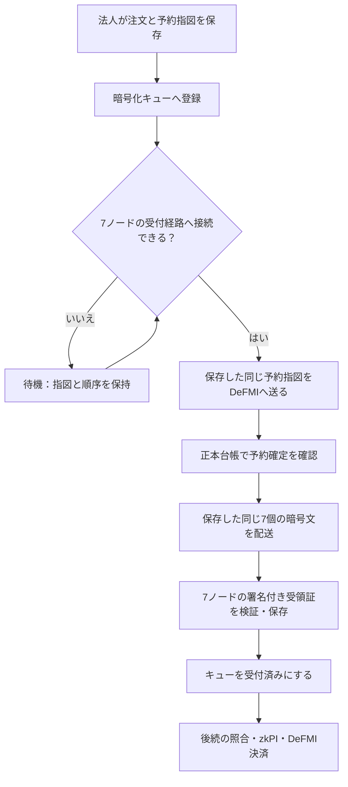

# 法人側の注文送信を常駐処理にする

## この部品が行うこと

`oclob-corporate-worker` は法人の環境で動き、保存済みの注文を7つのMPCノードへ送る。MPCノードが停止していたり、送信途中で法人の処理が終了したりしても、暗号化された処理記録から続ける。

ワーカー自身は注文、本人確認資格、予約の署名を新しく作らない。法人があらかじめ保存した署名済みの予約指図と暗号文だけを扱う。取引所の調整役へ法人の鍵や注文原文を渡す仕組みではない。

この部品の完了は「7ノードが同じ暗号文を受け付けた」までである。実際の約定、共同zkPI、DeFMIでの決済は後続の市場処理で行う。キューの受付済み表示を決済済みとして扱わない。

## 法人に置くもの

- `outbox.enc`：注文専用の鍵、署名済み予約、証明、ノード別暗号文、実際の受領証を保存する暗号化記録。既存の法人ウォレットと同じものを使う。
- `dispatch.enc`：どの保存済み指図を送るか、その順序と送信状態を保存する暗号化キュー。上の処理記録とは別ファイルだが、内容の要約値とデプロイ先に結び付く。同じ法人の元鍵から用途別の鍵を作るため、注文記録とキューのファイルを取り違えても復号できない。
- `dispatch.worker.lock`：同じキューを進める常駐ワーカーを一つに制限するOSのロック。鍵や注文は入らない。
- 法人の接続証明書、暗号化用鍵、保有資産の秘密情報を含む設定。いずれも法人コンテナにだけマウントする。

記録が失われたときに空の財布として再初期化しない。通常起動では既存ファイルを必須とし、異なる鍵・壊れた暗号文・別デプロイの内容はエラーにする。

暗号化・ファイル更新・処理状態の保存には、固定版DeFMIの `CorporateOutbox` を再利用する。二重ワーカーの防止には、[Rust標準のファイルロック](https://doc.rust-lang.org/std/fs/struct.File.html#method.try_lock)を使う。PIDを書くだけのファイルや、処理途中で期限が切れるリースではない。このため `oclob-node` の最低Rust版は1.89とし、Dockerの既存ビルド環境1.97.1で検証する。

## 処理の流れ



ノードの生存確認は、法人用の認証済み接続に対して担当ノード番号だけを返す。板の件数、受付番号、保存状態の要約値は返さない。接続できるという意味であり、その後のMPC計算の成功を保証するものではない。

## 応答が消えた場合

予約が確定した直後に法人プロセスが終了すると、法人の記録には未完了に見えても、DeFMIでは資産が既に予約されている。この場合、新しい予約や署名を作らず、保存済みの同じ指図を送る。予約接続口は同じ予約IDの確定記録を調べ、法人側も正本台帳を読み直す。

7ノードが受け付けた直後に受領証を保存できなかった場合も、同じ暗号文を再送する。新しい乱数で暗号文を作り直さない。受領証が既に法人記録にあれば再送せず、その署名と保存済み配送内容との一致を検証する。

自動再試行は既存キューの上限付き待機を使う。初期待機は2秒で、失敗が続けば最大300秒まで間隔を伸ばす。10回の送信で完了しない要求は要確認となり、ワーカーも `manual_review_required` として返す。単に処理するものがない状態と区別する。MPCノードが接続不能と分かっている間は、送信試行回数を消費しない。

## Dockerでの利用

既存の [分離コンテナ構成](../deploy/docker-compose.distributed.yml) に [DeFMI接続構成](../deploy/docker-compose.native.yml) を重ねる。`maker-worker` は法人側の専用サービスであり、MPCノードやDeFMIの中では動かさない。検証・ビルドはMacではなくSoftbankまたはOmenで実行する。

最初の利用環境は既存の法人設定と暗号化記録を初期化しておく。新しい実験用の環境作成処理は `dispatch.enc` も初期化する。既存環境へキューだけ追加する場合は、正しい法人コンテナと既存鍵を選び、明示的に実行する。

```sh
oclob-corporate-worker --initialize
```

この操作を通常の再起動手順に入れない。記録の欠落を隠すために使わない。

注文をキューへ登録するには、従来の注文送信CLIへ `OCLOB_NATIVE_ENQUEUE=1` を指定する。`OCLOB_CORPORATE_REQUEST_ID` は社内システムで発行した安定した依頼番号とし、再実行でも同じ番号を使う。

```sh
docker compose -f deploy/docker-compose.distributed.yml \
  -f deploy/docker-compose.native.yml run --rm \
  -e OCLOB_NATIVE_ENQUEUE=1 maker

docker compose -f deploy/docker-compose.distributed.yml \
  -f deploy/docker-compose.native.yml up -d maker-worker
```

上記コマンドは、既存デプロイ手順どおり `OCLOB_RUNTIME_DIR`、`OCLOB_SOURCE_DIR`、コンテナイメージなどが設定されたリモート環境で使う。例の `maker` は実験用の売り法人であり、本番の法人名や注文内容を固定する仕様ではない。

同じ法人のコンテナ内では、次のコマンドで状態を読む。

```sh
oclob-corporate-worker --status
oclob-corporate-worker --wait-admitted native-maker-001
```

`--status` は署名済み指図の原文や鍵を出力しない。`--wait-admitted` はキューだけでなく、保存した7ノードの受領証も検証する。`--once` は1回分の処理・動作確認用であり、通常は引数なしで常駐させる。

## 現在の限界

現在の受付CLIは、予約用の証明を準備してからキューへ登録する。この準備にはDeFMIの読み取り接続が必要である。DeFMI自体が停止している間の注文受付や、後から資格・資金を選んで予約を準備する仕組みまでは含まない。

未受付のまま期限切れになった要求は、送信を止め、予約解放の確認待ちにする。既に予約済みかもしれないため、ローカルの期限切れ表示だけで資産を返したことにはしない。この未受付経路の自動解放、複数の社内部署による同時枠更新、市場側の常駐照合・決済は残課題である。受付済み注文の取消・期限切れは [別の経路](NATIVE_LIFECYCLE_JA.md)で検証している。

既存の実験CLIには実験用の資格発行が残る。本番では正式なDeKYX発行者と法人の資格保管へ接続する必要がある。ワーカーに発行者の秘密鍵を渡す設計にはしない。

## 通し試験

```sh
make remote-native-worker-e2e REMOTE_TEST_HOST=softbank-l40s \
  REMOTE_TEST_SSH_OPTIONS='-o BatchMode=yes -o ProxyJump=none'
```

試験は実ノード停止、予約応答保存前とノード受領証保存前の実プロセス終了、常駐ワーカーの再起動を含む。そのワーカーが受け付けた注文を、二回の実約定・決済、残り数量の取消、返却資産による新規注文と実期限切れまで使う。単体テストだけでこの経路の成功を主張しない。実行ごとの判定は `research/experiment-ledger.jsonl` に残す。

2026年9月5日の `oclob-native-worker-repair-003` は、この通し試験をSoftbankで完了した。

- 停止ノードの復帰、予約確定後と7ノード受付後の強制終了を経て、常駐処理が元の1要求を受付完了。新しい注文への置換はない。
- 二重ワーカーは拒否。同じ依頼番号の再登録と再起動後も、受付済みキューの全項目と受領証は変わらない。暗号化ファイルそのもののバイト列が不変という意味ではない。
- 同じ注文を使って2回の決済・合計3約定を行い、残り29単位の取消、返却資産を使う5単位の新規注文、実期限切れによる回収を完了。
- 2回の解放で各7ノードが確定を確認。受取権の取込みは累計9件、両法人の保証枠更新番号は8/5。9件すべてが未使用の残高という意味ではない。
- 7 MPCノードの再起動前後で保存状態の要約が一致。5検証ノードの台帳は、検証ノードの再起動後も一致した。
- 別の回帰検査でRustテスト100件、整形、全対象の警告を許さない静的検査を完了。

[公開した実行結果](../artifacts/oclob_native_worker.json)と[62ファイルのソース対応表](../artifacts/oclob_native_worker_sources.json)を参照。注文原文、秘密鍵、暗号化キューの実ファイルは公開しない。1台のホスト上の機能確認であり、独立運営・WAN・性能比較・本番移行の合格ではない。

最初の試験では実行イメージにワーカーの実行ファイルがなく、二回目では試験側が途中結果を完了扱いしていた。前者は実際のコンテナに使う配置手順、後者は試験契約の種類による継続判定を修正した。失敗した試験を成功の証拠に含めず、記録を残している。
