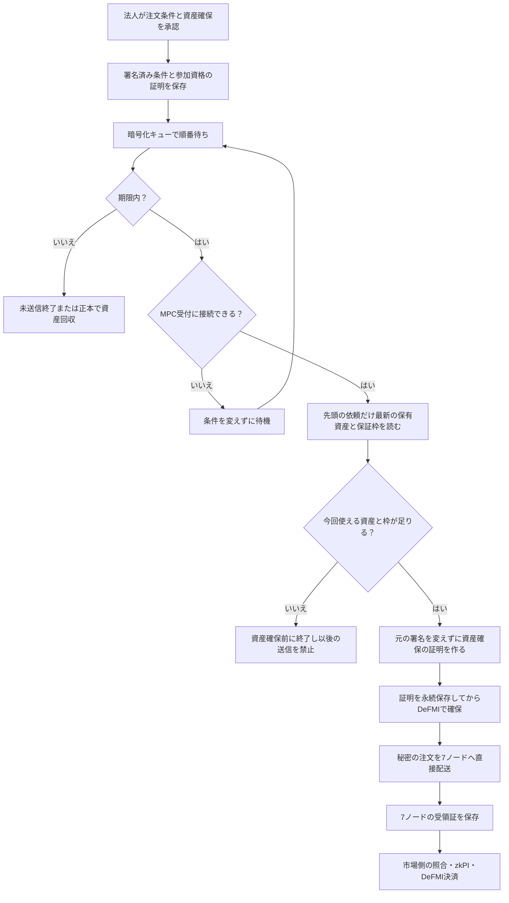

# 接続が止まっていても注文を預かり、共有する保証枠の中で送る

## 何が変わるか

法人は、注文の条件と資産確保の権限を最初に署名して保存する。資金・在庫を実際に確保する証明は、その注文の処理順が来たときに法人側の常駐処理が作る。資格の発行者や利用者へ再度署名を求めることはない。

これにより、事前に接続先の設定を取得しておけば、DeFMIとMPCが停止している間でも社内の依頼を暗号化キューへ保存できる。復旧後は、その時点の正本台帳にある保有資産と保証枠を使う。最初の注文が枠を消費した後に、古い枠の証明を次の注文へ流用しない。

これは「停止中でも約定できる」という意味ではない。順序は次のようになる。



受付を待つ注文の期限と、DeFMI上で確保した資産の解放は別の状態である。まだ資産確保の要求を作っていなければ送信禁止の記録を残して終了する。既に要求を準備・送信していた場合は、[正本台帳を使う期限切れ回収](QUEUED_EXPIRY_JA.md)へ進む。

## 最初に固定するもの、後から作るもの

受付時に保存するものは、売買条件、期限、注文専用の署名鍵、署名済み資産確保指図、その指図に結び付いたDeKYXの参加資格証明、注文と確保額を隠す乱数である。これらは法人だけが管理する暗号化記録に入る。取引所の調整役へ注文原文や法人の鍵を渡さない。

後から選ぶものは、実際に消費する未使用の保有記録と、現在の保証枠の状態である。証明の作成には既存のDeFMIの資金証明処理を使う。別の資格を発行したり、署名済み指図の数量や期限を変更したりする処理ではない。

一度作った資金証明は、最初の送信より前に保存する。その後の応答が不明な場合、勝手に証明や指図を作り直さない。既存の[同じ要求を使う復旧処理](CORPORATE_WORKER_JA.md)が担当する。

## 同時に来る注文と保証枠

対象は、一つの法人参加モジュールが、一つの暗号化記録とキューを共有する構成である。複数の社内プロセスから同時に依頼してよい。

受付用のOSロックを持つプロセスだけが、注文記録・承認・キューを順番に保存する。そのため、注文記録ではA→Bなのに配送キューではB→Aになる競合を防ぐ。別に常駐処理用のOSロックを持たせ、同じキューを二つのワーカーが同時に進めることも防ぐ。

例えば、利用可能枠が120、注文が60・70・60の場合、最初の60を確保した後の利用可能枠は60になる。70の注文は確保前に終了し、次の60は受け付けられる。70と二件目の60の到着順が逆でも、この例では同じ二件が受け付けられる。

「枠不足で終了」は、将来の入金まで待つ状態ではない。資金証明を準備する時点で、現在使える枠または選べる保有記録が不足したという判定である。再注文には別の依頼番号と明示的な新規承認を使う。同じ依頼番号の再送は元の結果を返す。

この処理は資産の二重使用を法人の記録だけで防ぐものではない。最終的にはDeFMIも現在の保証枠と未使用の保有記録に対して検証する。法人側の順序管理は、古い証明による失敗を避け、枠不足の後もキューを進めるためのものだ。

## 実行手順

ビルド、Docker、テストはSoftbankまたはOmenで行う。開発用Macでは実行しない。接続証明書、各法人の秘密設定、既存の暗号化記録、コンテナ配置は[新経路の導入手順](NATIVE_PRETRADE_DEMO.md)と[法人ワーカーの手順](CORPORATE_WORKER_JA.md)に従う。

まず、DeFMIへ認証済みで接続できる間に、アプリケーション、取引所、DeFMI、委員会の版を取得して保存する。次の例はリモートの既存Docker環境内で使う。

```sh
docker compose -f deploy/docker-compose.distributed.yml \
  -f deploy/docker-compose.native.yml run --rm \
  -e OCLOB_NATIVE_CACHE_SCOPE=1 maker
```

続いて、資金証明の作成を後回しにする方式で注文を保存する。

```sh
docker compose -f deploy/docker-compose.distributed.yml \
  -f deploy/docker-compose.native.yml run --rm \
  -e OCLOB_NATIVE_ENQUEUE=authorized \
  -e OCLOB_CORPORATE_REQUEST_ID=department-order-001 \
  -e OCLOB_CORPORATE_ORDER_FILE=/corporate/order.json maker

docker compose -f deploy/docker-compose.distributed.yml \
  -f deploy/docker-compose.native.yml up -d maker-worker
```

注文ファイルは法人だけが読める場所へ置く。売買条件のスキーマは既存の注文送信CLIと同じであり、数量や価格を公開ログの引数に直接書かない。上例のファイル名は例示であり、事前に正しい法人コンテナへマウントする必要がある。

以前の `OCLOB_NATIVE_ENQUEUE=1` は引き続き使える。この方式は資金証明を作ってからキューへ保存するため、受付時にDeFMI接続が必要である。同じ依頼番号を途中で別方式へ切り替えない。

法人コンテナの中で状態を調べる。

```sh
oclob-corporate-worker --preparation-status
oclob-corporate-worker --status
oclob-corporate-worker --wait-admitted department-order-001
oclob-corporate-worker --wait-reconciled department-order-001
```

`--preparation-status` は、承認の要約値、元注文の要約値、資金証明の準備有無、ノード受付有無、確保前終了の有無を返す。注文原文、資格原文、鍵、残高の秘密値は返さない。ただし、社内の依頼番号と活動状況は含むため、公衆や他法人へ公開するAPIとして使わない。

`--wait-reconciled` の `funding_rejected` は枠・保有資産の不足による確保前終了、`never_reserved` は未送信のまま期限切れになったことを表す。いずれも決済受領証ではない。確保前終了後の送信は、同じ記録内で後から上書きできない送信禁止判定で拒否する。終了の保存直後に停止しても、再起動時にその判定からキューの状態を修復する。保存領域全体を古いバックアップへ戻す攻撃への対策は別途必要である。

## 接続先の版が変わった場合

設定の保存は無条件な自動更新ではない。ワーカーは準備時に実際のDeFMIの設定を再取得し、元の署名済み指図と一致するか確認する。委員会や接続先の版が変わっていたら、元の承認を別の版へ移し替えない。

設定の変更を理由に暗号化記録を削除・再初期化してはいけない。未完了の要求を整理した上で、既存の移行・再承認手順が必要になる。鍵の交代や複数版の並行運転は別の受入課題である。

## 検証方法と範囲

```sh
make remote-native-deferred-e2e REMOTE_TEST_HOST=softbank-l40s \
  REMOTE_TEST_SSH_OPTIONS='-o BatchMode=yes -o ProxyJump=none'
```

この通し試験は7つのMPCコンテナを実際に停止し、5検証ノードを持つDeFMIコンテナも一時停止する。その間に三件を保存し、二件は別のCLIプロセスから同時に送る。復旧後は枠不足の一件を止め、残る二件を実際に照合・一括決済する。ワーカーの再起動と、5検証ノードの台帳一致・再起動を含む。

新しい経路の実行結果は `artifacts/oclob_native_deferred.json`、実行ソースとの対応は `artifacts/oclob_native_deferred_sources.json` に残す。実行ごとの成功・失敗は `research/experiment-ledger.jsonl` を確認する。ファイルがあるだけで現在のソースの合格とはせず、対応表のハッシュと版を見る。

2026年9月6日（日本時間）の `oclob-native-deferred-final-source-003` はSoftbankで完了した。

- 接続停止中に、資金証明を準備しないまま三件の署名済み条件を保存した。
- 120の枠に対して60・70・60を送り、60の二件だけを受け付けた。70の要求には資産確保用の証明も金融受領証も作らなかった。
- 受け付けた元の二件を、署名済み受付情報との対応から確認し、60単位・価格100と30単位・価格101の二約定を一取引で決済した。
- 全7ノードによる二約定の確定確認14件、保証枠の更新番号4/3、決済の二重適用拒否を確認した。約定後の利用者署名はゼロ件だった。
- 常駐処理の再起動でキューが変わらず、5検証ノードの台帳は検証ノードの再起動後も一致した。
- Rustテスト109件、整形、警告を許さない静的検査を完了した。実行した71ファイルのハッシュは手元の公開ソースと一致する。

最初の試験では、元の注文要約値と、資産確保の証明を結び付けた後の注文要約値を同一視した検査が失敗した。既存の署名済み受付情報にある元注文との対応を照合するよう修正した。失敗記録は残し、上記の成功結果と混ぜていない。これらは機能確認であり、性能や事業上の優位性の比較ではない。

次はまだ保証しない。

- 独立した複数の法人記録が同じ保証枠へ同時に書き込む構成。
- 既に送信したか不明な資金証明を、新しい枠に合わせて作り直す処理。
- 受付保存の途中、キュー登録前に止まった依頼の完全な無人回収。同じ依頼番号で法人受付を再実行する必要がある。
- 複数の保有記録を集めて大きな一件を賄う資金選択。現在は必要額以上の一件を選び、指定された保有記録があればそれだけを候補にする。
- 独立事業者・広域ネットワーク、長時間運転、負荷や価格の経済実験。
- ブラウザのReact Flow画面と認証済み本番APIの新経路への切替。

実験用の資格発行は受付側に残る。本番資格の保管・失効配布・発行者の管理を、この実験だけで合格としない。資産確保の証明、秘密照合、共同証明の外部監査も引き続き必要である。
