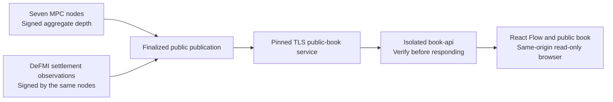

# Native public-book browser

The native browser is a **read-only view of the real MPC public feed**. It does
not call the legacy demonstration server's `/api/state`, receive private
orders, or emulate corporate balances. This is one part of the full native
Maker/Taker/operator application; authenticated corporate actions and balances
remain to be integrated.

## Data path



`GET /` serves the native shell. `/react-flow.js` and `/react-flow.css` are
compiled assets embedded in the Rust binary. The cluster Docker build rebuilds
the assets from the committed TypeScript sources before compiling that binary.
No writable web root is mounted.

`GET /v1/book` remains the complete signed JSON document. The new
`GET /v1/book/view?minimum_sequence=N` verifies exactly the same feed, then
projects public display fields. All u64 values in this projection are decimal
strings, so JavaScript cannot round a large sequence, height, price or quantity.
The display projection is **not itself a signed proof**. The browser trusts the
same-origin API's cryptographic verification; an independent verifier must use
the original signed document and the pinned public cluster configuration.

## What the screen means

- The book shows aggregate remaining quantity at each price, not individual
  orders or any corporation's assets. Values use the market's integer units;
  no unconfigured currency conversion is implied.
- Seven MPC cards mean seven signatures on this specific publication. They do
  **not** mean seven currently healthy nodes, independent operators, or seven
  Avalanche validators.
- A matched publication includes seven signed observations of the same DeFMI
  settlement record. An unmatched update explicitly says no settlement was
  required for that update.
- Graph edges describe evidence relationships, not observed network packets or
  live transfers. No artificial transaction animation is played.
- The browser requests an update every five seconds, with an eight-second
  request timeout, and retains the greatest sequence seen during that page
  session. It rejects a changed market, a regressing sequence, inconsistent
  display fields, missing attestations and expired data.
- A failed request or expired snapshot removes the current price rows. An
  unavailable feed is never represented as an empty market or zero balance.
  A valid, genuinely empty signed book is displayed as an empty book.
- The existing 300-second maximum publication lifetime still applies. There is
  no idle renewal yet; an idle demonstration will eventually become unavailable.

## Remote demonstration and browser checks

Run builds and network acceptance only on Softbank or Omen:

```sh
make remote-native-http-e2e REMOTE_TEST_HOST=softbank-l40s \
  REMOTE_TEST_SSH_OPTIONS='-o BatchMode=yes -o ProxyJump=none' \
  NATIVE_HTTP_MANIFEST=/research/manifests/oclob_native_http_004.json \
  NATIVE_BROWSER=1
```

The optional browser override binds the API **only to remote loopback port
19880**. Only the keyless public API joins both the internal network and an
additional bridge network; MPC, corporate and validator containers remain on
their existing private network. Use an SSH tunnel to that host, then open
`http://127.0.0.1:19880/`.
Do not expose the cleartext listener publicly. Production browser access needs
an appropriately configured same-origin HTTPS gateway.

The runner announces `BROWSER_EMPTY_READY` before orders and waits up to 90
seconds, then `BROWSER_SETTLED_READY` after the actual four-order/two-fill
scenario and waits up to 120 seconds. These are bounded manual observation
windows, not a daemon or a replacement for financial verification. A reviewer
may create `browser-empty-continue` or `browser-settled-continue` in that exact
printed remote run directory to finish an observation window early. The
original crash/recovery, HTTP failure and validator-restart gates still run.
The stack is removed on normal runner exit; private runtime files remain on
the remote host and must not be published.

At both 1440×1000 and 390×844, inspect actual prices against the TLS snapshot,
the unavailable state, graph readability, disclosure controls, manual refresh,
page width, loading/error states and console errors. Real browser acceptance
must use this network, not intercepted or mocked API responses.

Unit checks are distinct from that acceptance:

```sh
make remote-test REMOTE_TEST_HOST=softbank-l40s \
  REMOTE_TEST_SSH_OPTIONS='-o BatchMode=yes -o ProxyJump=none' \
  REMOTE_TEST_REUSE_IMAGE=1 \
  REMOTE_TEST_COMMAND='cargo fmt --all -- --check && cargo clippy --workspace --all-targets -- -D warnings && cargo test --workspace --release && cd oclob_demo/react-flow && npm ci --no-audit --no-fund && npm run build && npm test'
```

The frontend's synthetic fixtures test only parsing and rendering, never
financial execution. The [dated verification record](NATIVE_BROWSER_AUDIT_20260906.md)
contains actual desktop/narrow browser evidence, a real unavailable-feed check,
and the remote test results. This accepts the bounded read-only flow, not the
full corporate application or an always-on demonstration service.
