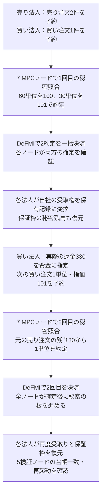

# 決済で受け取った資金を、次の約定まで使う

## この経路の目的

最初の約定だけで終わらず、受取り・返金・保証枠の復元を挟んで、次の注文も実際に照合して決済する。
以前の[ウォレット試験](CORPORATE_WALLET_JA.md)は、返金された保有記録を次の予約に使い、7ノードで注文を受け付けるところまでだった。
この試験では、最初の照合で残った売り注文を各MPCノードが秘密のまま持ち越し、その同じ注文と次の買い注文を照合する。

対象はCLI/Dockerの匿名保有記録の経路である。画面や本番APIがこの経路へ切り替わったという意味ではない。
実行状況は[実装状況](STATUS.md)と[実験台帳](../research/experiment-ledger.jsonl)に分けて記録する。最終の公開結果がない実行は成功扱いにしない。

2026年9月5日、Softbankの実行005と、別の新規ネットワークでの再実行006でこの全経路に成功した。各実行で2回の照合、3約定、8件の取込み、両法人の保証枠更新番号5、5検証ノードの台帳一致と再起動を確認している。判定は小規模な機能確認（`smoke_only`）であり、本番受入ではない。

## 全体の流れ



次の注文は新しい予約・承認を持つが、売り側の残り注文を初期注文から作り直してはいけない。
MPCの保存済み秘密分割、同じ注文要約、正本予約の更新番号を使う。売り側の更新番号は1から2へ、残数量は30から29へ進む。

## 試験例の残高

数量と価格は機能確認用の整数であり、実際の銘柄の取引単位・証拠金規則ではない。
最初の買い注文は90単位、指値104なので9,360を予約する。実際の支払額は `60×100 + 30×101 = 9,030`、返金は330である。
次の予約にこの330の保有記録を指定し、101を予約する。残り229はこの予約の釣銭であって、新たな約定収益ではない。

保証枠の数値は「利用可能／予約中／使用済み」の順である。売り法人は証券の数量、買い法人は資金額なので、左右の数値を加算しない。

| 時点 | 売り法人の枠 | 更新番号 | 買い法人の枠 | 更新番号 |
|---|---|---:|---|---:|
| 初回決済後の復元 | 0／30／90 | 4 | 970／0／9,030 | 3 |
| 次の買い注文の予約後 | 0／30／90 | 4 | 869／101／9,030 | 4 |
| 2回目の決済後の復元 | 0／29／91 | 5 | 869／0／9,131 | 5 |

初回の受取権は売り法人の資金2件、買い法人の証券2件と返金1件、計5件である。
2回目は資金1件・証券1件・残額ゼロの返金1件が加わり、累計8件になる。
**8件は累計の取込み数であり、8件すべてが未使用の資金という意味ではない。** 初回の返金330は既に次の予約で消費されている。
法人側の復元では、取込み済みかだけでなく、同じ受取権・出力・署名であることと、保証枠の値・秘密乱数・更新番号の一致を検証する。

## 成功とする条件

- 初回は2約定を一つの取引で決済し、7ノード×2約定の14件の確定確認がそろう。
- 初回の5件の受取権を法人側で取り込み、各法人で復元処理を繰り返しても二重作成しない。
- 指定した返金ノート自身の使用済み判定値が、次の支出証明とDeFMIの使用済み記録に一致する。候補一覧にIDが載っただけでは不十分。
- 次の注文は受付だけで終わらず、元の売り注文の保存済み残数量と7者で照合し、1単位・価格101の決済を別の正本取引として確定する。
- 2回目も全7ノードが指図全文と確定記録を読み比べ、未確認・すり替え・高さ変更を拒否する。再確認と板更新の再送で状態を増やさない。
- 最終的に8件を一度ずつ取り込み、両法人の秘密残高が上表と一致する。5検証ノードの正本要約がそろい、1検証ノードを実際に再起動しても一致する。

受取権を保有記録へ変換する際の受領者署名は、約定への再同意ではない。元の決済は既に確定しており、署名を出さなくても相手方への決済を取り消せない。

## 通信の修正

継続取引で、MPCノードのDeFMI読取接続が無通信期限を超えて残り、次の確定確認に失敗する問題が現れた。
内部の `PrivateAdmissionClient` は正常応答の後も接続を閉じ、次の明示的な要求だけを新しい相互TLS接続で送る。
失敗した予約や共同署名を自動再送する変更ではない。結果が分からない書き込みは、保存済みの同じ要求に対応する確定結果を、専用の復旧操作で照合する。

回帰テストでは、実TLSと既存の通信形式を使って、正常応答後の切断、クライアントを複製した後の新接続、応答消失時に予約を自動再送しないことを検証する。
これは通信の単体試験であり、正本更新の証拠は別の実ネットワーク試験で得る。
起動時も、ネットワーク管理ツールの正常判定だけで進まず、資産登録より先に5ノードの台帳読み出しと一致を待つ。

## 実行方法と出力

```sh
make remote-native-cycle-e2e \
  REMOTE_TEST_HOST=softbank-l40s \
  REMOTE_TEST_SSH_OPTIONS='-o BatchMode=yes -o ProxyJump=none'
```

ビルド・テスト・DockerはSoftbankまたはOmenだけで実行する。Macでは実行しない。
条件は[契約ファイル](../research/oclob_native_cycle_contract.json)へ固定し、実行ごとの予測・失敗理由・実行記録は変更せず残す。
公開結果の保存先は `artifacts/oclob_native_cycle.json`。出力が存在するだけではなく、契約・実行計画・ソースの対応まで確認する。
`elapsed_ms` は各調整役が行う不正要求・再送の確認を含み、通常の取引応答時間や毎秒の処理数ではない。

### 最終実行006の検証記録

- 契約ID：`oclob-native-cycle-v1`。SHA-256：`b79ab992fb5fd2d5abf1c0cfe9eea6707f3188b57debdd97c555107160ea9d9a`。
- [事前登録した再実行計画](../research/manifests/oclob_native_cycle_006.json)。SHA-256：`aee92f08219066657d889fcd1a4a55e828b139a05902e2e27fc025bbf9a05588`。
- [実ネットワークの結果](../artifacts/oclob_native_cycle.json)。SHA-256：`dcaca99d40e63bae9dc3dfa79163be8fbd5914a0b787a27c055bcd2257420300`。
- [ソースとの対応](../artifacts/oclob_native_cycle_sources.json)：Rust、各crateの設定、依存固定、Docker、契約・計画など56ファイルのSHA-256を実行したリモートの写しと照合し、すべて一致した。
- 91件のRustテスト、整形、全crate・全targetの警告を許さないClippyをSoftbankで実行し、すべて通過した。
- 最終台帳：`3ab87917bfaf9d4f21108d092700f7eaabffa02db457fea44e954e908b05a3eb`。再起動前後とも5検証ノードで一致。

Dockerの一時領域には、試験用でも秘密鍵・法人の暗号化保存領域・秘密分割が残る。**領域全体を公開しない。** 公開してよいのは点検済みの要約とソースだけである。

## 残る条件

二つの連続する取引は、無制限に同時注文を処理できることの証明ではない。取消・期限切れ、競合して古くなった更新前状態からの再開、長時間の常駐ワーカー、鍵交代、保存領域全体の巻戻し検出は別途必要である。
復元結果の `notes` は過去に取り込んだ受取権の一覧であり、未使用残高の一覧ではない。`own_asset_refund` も最後に見つかった自社資産の返金を示す補助値で、使用済み・残額ゼロを除く汎用の資金選択機能ではない。今回の初回には指定対象の返金が一件だけある。長時間運転の自動発注では、利用可能な保有記録を別途選ぶ必要があり、単にこの補助値を繰り返し指定してはいけない。実際の予約作成は使用済み・金額不足を拒否する。
7ノードと5検証ノードは一つのホスト上にある。独立運営者・地域間通信・障害時の可用性、外部鍵保管、本番性能、経済効果、独立した暗号監査は保証しない。
各MPCノードは設定済みDeFMI接続サービスの応答を信頼しており、合意証明を直接検証する軽量クライアントではない。
