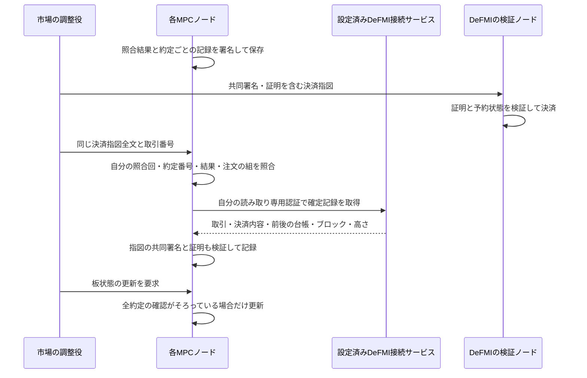

# 決済を確かめてから、秘密の板を進める

## 何を防ぐか

MPCノードが照合を終えても、DeFMIでの決済はまだ終わっていません。
ここで市場の調整役が「決済済み」と通知しただけで板の残数量を変えると、
決済していない注文を消したり、誤った残額を次の照合に使ったりできます。

新しい事前予約の経路では、各ノードが自分で決済を確認するまで、
照合後の秘密状態を保存して待ちます。調整役の通知は確認のきっかけにすぎません。



## 具体的な検査

新しいAPIは `confirm_oclob_native_finality` です。大きな証明全文を扱うため、
固定長の注文受付口ではなく、既存のサイズ制限付き・相互TLSの証明処理口へ置きます。
署名者3台だけでなく、署名を担当しない4台も含めた全7台が確認できます。
このAPIは新しい署名用乱数を予約・消費しません。

各ノードは次を確認します。

1. 自分の署名済み保存記録と、照合回・約定番号・公開結果・保存ファイルが一致する。
2. 決済指図が同じ照合回から作られ、同じ二つの注文、事前予約、匿名参加者を指定している。
3. 市場・アプリケーション・DeFMI・委員会が、ノードの設定とDeFMI側の登録内容に一致する。
4. 設定済みの接続先が、同じ取引番号を確定済みとして返す。決済内容のハッシュと更新前の台帳ハッシュが指図と一致する。更新後の台帳、ブロックの識別子、正の高さも必要となる。
5. 共同署名と金額・残額などの証明全文が正しく、板に残る注文の予約を誤って解除しない。

呼出し側は照合先のURL、信用する公開鍵、確定記録そのものを指定できません。
台帳がその後に進んでいても、過去の正しい決済は確認できます。
逆に、接続失敗や観測のタイムアウトを決済失敗と決めつけて、別の決済を作り直しません。

### 期限を過ぎてからの確認

現在の確定記録APIにはブロック時刻がありません。期限内に成立した取引を後日確認する際、
今日の時刻で期限判定をやり直すと、正しい取引まで拒否してしまいます。
そこで、証明の再検証は署名済みの期限時刻を検証上の基準として行い、
**実際の執行時刻の適法性は、決済時に検証したDeFMIのVMに依存します**。
ブロック時刻を推測したり、その時刻を自力で証明したと主張したりはしません。

## 保存・再送・複数約定

確定記録は、各ノードの既存の原子的な保存処理を使って、照合回と約定番号ごとに保存します。
注文原文、金額の開示値、秘密分割はこの記録に入れません。
同じ記録の再送は状態を変えず、同じ約定番号に異なる記録を入れる要求は拒否します。

例えば同じ到着注文が3件に約定した場合、2件だけ決済済みでも板全体は進めません。
自分の照合結果に含まれる全件の確定記録が必要です。複数件では約定番号順に
取引・決済内容・前後の台帳・ブロック・高さをまとめたハッシュを作り、
調整役が送った値と照合します。高さは全件の最大値です。
この規則は以前の個別取引の集約に適用します。新しい原子的な一括決済では、全件が同じ取引・ブロック・前後の台帳・高さに属することを確認し、署名済み集合全体の要約を使います。全約定の記録が必要であることは変わりません。実際の2約定と14件のノード別確認を行った追加試験は[複数約定の説明](NATIVE_MULTIFILL_JA.md)を参照してください。

保存形式は第8版です。第7版で既に進めた板状態には独立した確定確認の記録がないため、
それを自動的に信用して移行しません。起動を拒否し、元の保存領域は変更しません。
明示的な台帳照合を伴う移行ツールは未実装です。保存領域を削除して回避しないでください。
まだ板状態を進めていない第7版は、既存の注文・使用済み予約記録を保持して移行できます。

## 接続設定と権限

ノード設定の例です。秘密鍵は設定文字列へ埋め込まず、既存のノード用証明書ファイルを使います。

```json
{
  "native_finality_endpoint": {
    "host": "oclob-defmi",
    "port": 9443,
    "server_name": "oclob-defmi"
  }
}
```

DeFMI接続サービスには、各ノードの証明書を読み取り専用の `operator` として登録します。
この役割は決済指図、予約解除、受取権の変換、管理設定の変更を送信できません。
設定を省略したノードは、この新経路の板状態を確定できません。通知だけを信用する代替経路はありません。
設定済みの委員会が交代した後の古い決済の照合は、登録内容の履歴を含む別途の対応が必要です。

## 再現方法

```sh
make remote-native-finality-e2e \
  REMOTE_TEST_HOST=softbank-l40s \
  REMOTE_TEST_SSH_OPTIONS='-o BatchMode=yes -o ProxyJump=none'
```

ビルド・試験はリモートのLinuxコンテナだけで動きます。
試験条件は `research/oclob_native_finality_contract.json`、事前登録は
`research/manifests/oclob_native_finality_001.json`、公開結果は
`artifacts/oclob_native_finality.json`、試行履歴は `research/experiment-ledger.jsonl` です。

実際の7ノードに、未決済の通知、まだ各自で確認していない正しい通知、
取引番号は正しいが更新前の台帳をすり替えた指図を送り、拒否と状態不変を確認します。
正しい確認後は元の40口・価格100の決済、3件の受取り・返金、同じ返金による
次の注文受付まで続け、5検証ノードの台帳一致と実際の再起動も確認します。
次の注文はこの試験では約定しません。

最終版では、観測後の高さのすり替えも全ノードが拒否し、同じ板更新を再送しても
署名付きの状態受領証が変わらないことを確認しました。実行した20関連ファイルは
公開するソースとハッシュが一致し、別途84件のRustテストと静的検査が通っています。
保存記録の再読込みと複数約定の不足検出は単体試験、検証ノードの再起動は実ネットワーク試験です。

最終結果JSONのSHA-256は
`93edfa7cadb64cd90f00c3df9f0e1e54d029b4243cc340a9e2c6b6be2c26a6dc` です。
`elapsed_ms` は異常通知の試験を含む最初の調整処理の時間であり、
取引1件の標準処理時間や、ウォレット復元を含む全体時間ではありません。

生成された一時領域には、試験用の秘密鍵や法人の暗号化保存領域が残ります。
ディレクトリ全体は公開しないでください。公開用に抽出したJSONだけを成果物にします。

## 残る信頼と適用範囲

各ノードは調整役とは別に確認しますが、現在は同じDeFMI接続サービスを読みます。
そのサービスが正しい確定記録を返すという信頼は残り、合意の証明を検証する
ライトクライアントではありません。独立した検証ノードへの直接接続や鍵交代・停止復旧は、
別の運用・実装上の課題です。

単一ホストの試験は、複数の運営会社・地域への分散、全ディスクの巻戻し耐性、
本番の可用性、暗号監査、複数約定・取消・期限切れの全経路の完成を意味しません。
従来の口座差分方式や現在のブラウザ用デモにも、この新しい境界の保証を流用しません。
