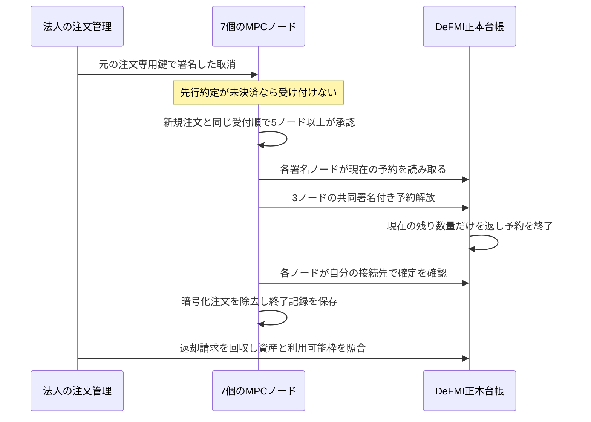

# 残り注文の取消・期限切れと資産の回収

## 確認した範囲

二回の実際の約定・決済を終えたあと、板に残る29単位を取り消す。返却された29単位の資産から5単位を新しい注文に予約し、その注文が期限切れになると元の資産を取り戻す。法人コンテナ、7個の常駐MPCノード、5台のAvalanche検証ノードを通る経路で、この一連の処理を確認した。

一つのホスト上の実験であり、7社による独立運用や本番環境の完成を意味しない。

## 接続前に不足していた点

1. DeFMIには予約を解放する処理があるが、常駐ノードには取消の受付順と署名を結ぶ処理がなかった。
2. 未決済の約定を取消が追い越すと、結果を見てから決済を避ける余地が生じる。新しい署名APIだけでは防げない。
3. 期限切れの暗号化データを台帳の解放確認前に削除すると、その予約を正しく回復できなくなる。
4. 法人ウォレットの返却資産の選択は、過去の返却記録の末尾を使っていた。継続運転ではゼロ額や使用済みの記録が混じるため、実際の残高・使用済み印を確認する必要がある。

## 取消の順序



取消に注文の秘密の乱数は使わず、元の公開マニフェストにある一回限りの署名鍵で利用者の意思を確認する。実名、売買方向、指値、数量を取消APIへ渡す必要はない。ただし取消の発生と対象の注文識別子は受付担当に分かる。問い合わせの存在自体を隠す仕組みではない。

DeFMI側は予約ID、予約の更新回数、直前の受領記録、台帳の親ルートを検証する。部分約定前の古い予約を使って全額を返すことはできない。返却先を取消依頼者が自由に指定することもできず、元の予約・残り資産に結び付いた受取人へ返す。

取消を受け付けてから各ノードが解放を確認するまでは、後続のマッチングを止める。これは安全側の直列化であり、無停止運転や高い同時処理性能の完成ではない。署名済み操作の送信結果が不明になった場合の、無人での再開キューは別の残課題である。

## 期限切れ

期限切れは所有者や委員会の裁量的な署名を要しない。実時刻が予約期限を超えたことをDeFMIが検証する。ノード側にも同じ受付順で終了を記録し、各ノードが正本台帳の確定を読むまで必要な暗号化データを保持する。

一度も約定していない予約は、元の暗号化資産のロックだけを外して返す。部分約定がある予約は、既に生成済みの残り数量の暗号化情報から返却請求を生成する。どちらも過去の約定分を復活させない。

## 永続化と確認範囲

ノード保存形式はV9。V8には終了操作の経路がなかったため空の終了履歴を明示的に追加できるが、V9で履歴が欠落していたら起動しない。終了記録は注文本体を除去しても残す。DeFMIの署名基盤は独立リポジトリの `4b07c2b` に固定した。

再起動の検査では、世代番号、受付順、全保存状態の要約値を含む7ノードの応答を前後で完全に比較する。全量約定済みの最初の売り注文については、既存の設計上、残量ゼロの暗号化状態を保持する。取消・期限切れの対象2件は除去するが、「すべての状態記録がゼロ件になる」ことは条件ではない。実験003ではこの件数の期待値を誤り、最終検査が失敗した。実験004は期待値を正し、状態の完全一致と注文復活の拒否を維持した通し試験に成功した。

2026年9月5日の最終実行 `oclob-native-lifecycle-final-004` では、次を確認した。

- 2回の照合・決済で計3約定。その後の取消1件と実時刻による期限切れ1件をDeFMIで確定。
- 取消で返った同じ29単位の保有記録を次の予約で消費。未約定の5単位は期限切れ後に元の保有記録として回収。
- 受取権の取込みは累計9件、法人の保証枠更新番号は売り側8・買い側5。累計には使用済みやゼロ額の履歴も含むため、「9件すべてが使える残高」という意味ではない。
- 両解放を7ノードがそれぞれ確認。同じ指図・通知・ウォレット回収の再実行で二重適用しない。
- 7台すべてのMPCノードを実再起動し、保存状態が完全一致。別途、検証ノード1台の実再起動後も5台の台帳が一致。
- Softbank上で97件のRustテストと全対象の警告を許さない静的検査を通過。実行した59ファイルと公開ソースのハッシュが一致。

公開結果は [oclob_native_lifecycle.json](../artifacts/oclob_native_lifecycle.json)、実行ソース・依存版・ログのハッシュは [oclob_native_lifecycle_sources.json](../artifacts/oclob_native_lifecycle_sources.json) にある。実験001の取消記録の不具合、003の検査条件の誤りも履歴に残し、成功した実行へ置き換えていない。

現時点の実行記録は `research/experiment-ledger.jsonl` とハッシュ付き実験マニフェストを確認する。実行前の計画を成功結果として扱わない。

```sh
make remote-native-lifecycle-e2e REMOTE_TEST_HOST=softbank-l40s \
  REMOTE_TEST_SSH_OPTIONS='-o BatchMode=yes -o ProxyJump=none'
```

Mac上ではビルド、テスト、Dockerを起動しない。公開するのは検証したJSON結果だけとし、鍵、注文、秘密分散値、法人の復号済み残高、暗号化ジャーナルを含む実行ディレクトリ全体は公開しない。
