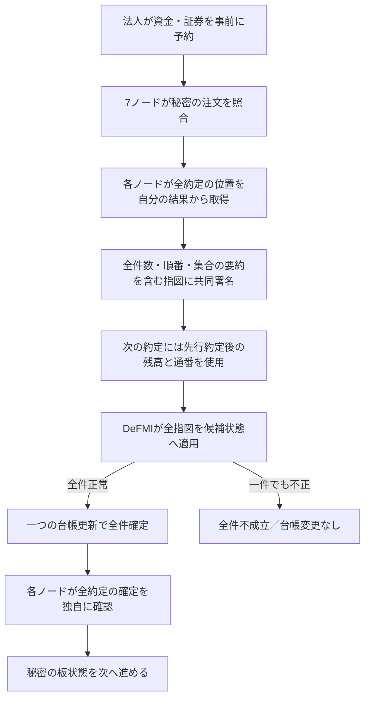

# 複数約定を全件まとめて決済する

売り注文が2件並んでいて、一つの買い注文が両方と約定する場合を扱う。OCLOBは全件の証明と署名を作ってから、一つの取引としてDeFMIに渡す。2件のうち片方だけが決済されることを防ぐため、送信方法だけでなく各指図の署名対象も変更する。

## 処理の流れ

約定の一覧は取りまとめ役から受け取って信用するのではない。各署名ノードは、自分が終えた照合結果にある全約定から、順番と集合の要約を計算する。1件だけ抜き出した署名要求や、全件の一部を省いた要求を拒否する。

DeFMI側も、集合に属する指図を単独の決済口へ送ることを拒否する。集合全体は2〜8件、取引全体はVMのサイズ上限内に収める。個別署名には共通の更新前状態が入るが、予約枠の通番・残高・直前指図の要約は集合内の先行処理を反映する。どこかで不整合になれば、保証枠や受取権も含め全て元の状態のままになる。

## 同じ買い注文の枠を二重に使わない仕組み

例えば買い注文が90単位、上限価格101なら、事前予約は9,090になる。60単位を100で約定した後の枠は3,090であり、2件目はこの残高を使う。30単位を101で約定すると、残る60を返金する受取権が作られる。2件目に最初の9,090の枠や古い通番を再利用した指図は通らない。

この残高計算は秘密分散された値とその証明に基づく。取りまとめ役が持つ次状態は送信準備用の予測であり、台帳確定の証拠ではない。DeFMIが全証明・署名・通番を再検証して初めて確定する。

## 全ノードでの確定確認

各ノードは、設定済みの読取専用接続先から実際の取引確定記録を取得する。一つの取引IDが複数の約定に対応することを許すのは、同じ署名済み集合であり、前後の状態・ブロック・高さも一致する場合だけである。

1件目の記録だけでは板を更新しない。自分の照合結果にある全約定分がそろって初めて更新する。全体の指図要約を記録し、各個別指図の要約も保持する。再確認や同じ確定要求の再送で状態を二重更新しない。

## 接続試験

実行コマンドは `make remote-native-multifill-e2e REMOTE_TEST_HOST=softbank-l40s REMOTE_TEST_SSH_OPTIONS='-o BatchMode=yes -o ProxyJump=none'`。Macではコンパイル・テスト・Dockerを実行しない。

試験条件は [契約ファイル](../research/oclob_native_multifill_contract.json) と [実行計画](../research/manifests/oclob_native_multifill_002.json) に事前登録する。同じ売り法人が60単位ずつ2件を予約し、別の買い法人の90単位の注文に対し、60単位を100、30単位を101で約定させる。共有する保証枠、14件のノード別確定確認、5バリデータの状態一致と再起動を確認する。

2026-09-05のSoftbank実行で、上記2約定、単独抜出しの拒否、14件の確定確認、途中確認時の板更新拒否、全5台の台帳一致と再起動を確認した。記録は [接続試験結果](../artifacts/oclob_native_multifill.json)。別途OCLOB全体の89件のRustテストが通り、DeFMI側の319件のテストでは2件目の不正時の全状態巻戻しも確認した。結果の `elapsed_ms` は不正要求・再送の確認まで含む試験時間であり、通常の一括決済の応答時間や毎秒の処理件数ではない。

この2約定の試験と、従来の1約定後のウォレット受取・返金による次注文の試験は別シナリオである。複数約定後の全受取権の利用、独立した運営者・広域ネットワーク、同時更新競合からの再試行、取消・期限切れ、8件の性能、暗号監査、本番運用を完了したとは扱わない。確定記録の接続先を信用する前提も残る。
