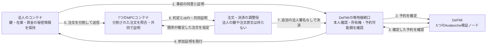

# 法人の事前予約から、秘密計算・DeFMI決済まで

このデモは、注文を送る前に資金・証券を予約し、約定後に利用者へ再署名を求めず決済する経路を動かします。口座番号で残高を更新する経路ではなく、DeFMIの匿名の保有記録を予約・消費する経路です。

## 動作の流れ



DeFMIを先に起動します。法人側は、予約が正本台帳で確定していることを自ら読み直してから、7ノードへ注文を送ります。予約に失敗した場合、旧方式へ自動的に切り替えることはありません。

各MPCノードが受け取るのは、注文の断片と、口座・資産・予約の識別子を除いた参加証明です。決済に必要な予約の識別子は、3ノード以上の協力が必要な暗号文に入っています。照合後にその暗号文を開いても、注文原文や残高の秘密値は含まれていません。

MPCノードは、自分が実際に計算した結果と証明を照合してから、DeFMI向けの決済証明に署名します。任意のデータへ署名させるAPIは設けていません。DeFMIの各検証ノードは、共同署名だけでなく、金額・資産交換・残額の証明と、予約の現在の状態を検証します。

## 起動方法

ビルド、試験、Dockerの実行はSoftbankまたはOmenで行います。開発用Macでは実行しません。

```sh
make remote-native-e2e \
  REMOTE_TEST_HOST=softbank-l40s \
  REMOTE_TEST_SSH_OPTIONS='-o BatchMode=yes -o ProxyJump=none'
```

通常のSSH経路を利用できる場合は、`REMOTE_TEST_SSH_OPTIONS`の指定は不要です。Omenを使う場合は`REMOTE_TEST_HOST=omenx_ubuntu_zerotier`を指定します。

ホストにはSSH、Docker Engine、Docker Composeが必要です。Rust、公式MP-SPDZ、AvalancheGo、Avalanche Network Runnerは、リポジトリに固定した版のDocker定義から組み立てます。別の版への自動置換はしません。

実行順序は、7ノードの起動、共同鍵の生成、DeFMIの起動と初期資金の設定、法人2社の予約・注文送信、照合・決済、検証ノードの再起動確認です。サービス間通信は閉じたDockerネットワークと相互認証付きTLSを使います。接続口が転送する先は、DeFMIコンテナ内のループバックにあるAvalanche RPCだけです。

成功時の結果は`artifacts/oclob_native_notes.json`です。詳細ログと実行領域は、コマンドが表示するリモートの`/tmp/oclob-native.*`に残します。コンテナとネットワークは終了時に停止・撤去します。この実行領域には**デモ用の秘密鍵**も残るため、公開・共有してはいけません。

## 鍵とファイルの配置

- 法人の`native.json`：自社ウォレットの鍵と予約枠の秘密情報。自社コンテナだけに読み取り専用で渡します。
- 各MPCノードのディレクトリ：そのノードだけの鍵、注文の断片、計算状態。
- DeFMIのディレクトリ：参加証明の発行鍵と、初期設定に必要な情報。注文の調整役には渡しません。
- 共有の受け渡し領域：暗号化された予約権限、公開の注文識別子、署名付き受領記録、実行結果。注文原文や法人の鍵は置きません。

依存関係は、本人確認がDeKYX、共同証明と支払指図がzkPI、正本台帳がDeFMI、秘密計算が公式MP-SPDZと既存のRustアダプターです。OCLOBのアプリケーション処理と試験はRustです。

## 確認する内容と限界

売り指値60・価格100と、買い指値40・上限101を送ります。価格100・数量40で約定し、売り側は残りの予約を維持し、買い側は予約を閉じます。同じ決済の再送は既存の結果を返し、二重に適用しません。MPC結果の差し替えが拒否されること、5検証ノードの台帳が一致すること、検証ノードの再起動後も同じ台帳を回復することを確認します。

結果の `native.elapsed_ms` は、法人2社の予約・注文送信が済んだ後に、調整役が起動してから決済の確認と秘密の板の更新を終えるまでの時間です。イメージのビルド、DeFMIの起動、共同鍵の生成、法人の事前予約、検証ノードの再起動は含みません。注文受付から決済までの全所要時間や、1秒あたりの処理件数を示す値ではありません。

これは**単一ホスト上の機能確認**です。7つの独立事業者による運用、地域をまたぐ通信、処理能力、障害時の継続性や事業上の効果を実証したものではありません。初期資金・保証枠はデモ用の発行者が設定し、実在の中央銀行や保管機関とは接続しません。

法人の送信キューと障害復旧、複数約定・取消・期限切れの一貫した運用、受領した権利のウォレットへの取り込み、悪意のある暗号化断片への対処、独立運用者での負荷・障害試験は、製品化の別の確認項目です。単体試験やこの1シナリオの成功だけでは、製品化完了とはしません。
