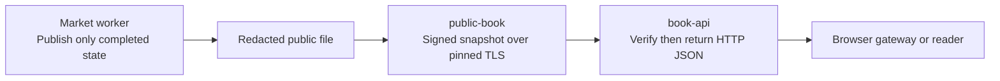

# Public order-book HTTP API

The `book-api` service provides a read-only HTTP view of the finalized OCLOB price-level book. It retrieves the signed snapshot from the public TLS feed and verifies it before returning it. It does not load corporate keys, private orders, settlement authority, the market journal, or the publication directory.

## Request

```http
GET /v1/book?minimum_sequence=4 HTTP/1.1
Host: book-api:9880
```

`minimum_sequence` is optional and defaults to zero. It is an unsigned 64-bit integer written in decimal. Unknown parameters, repeated parameters, negative numbers, fractional numbers, encoded digits and overflow are rejected. A reader should retain its last verified sequence and supply it on later requests. This prevents accepting a lower sequence within that reader's session; it does not prove global freshness on first connection.

Only `GET` is supported. This service cannot submit, cancel, reserve, or settle orders. Request bodies are rejected. No credential-bearing cross-origin access is enabled.

## Successful response

HTTP 200 returns the complete `FinalizedPublicBook` JSON object, without an additional envelope. Its fields are:

- `version`: the public snapshot schema version.
- `market_id`, `sequence`, `round_id`: the market and certified processing step.
- `levels`: aggregate `side`, `price` and remaining `quantity` values at each price. Bid prices descend; ask prices ascend. Individual order quantities and identities are absent.
- `attestations`: all seven configured nodes' signatures binding the aggregate levels to the MPC output, program, private-state commitments and validity period.
- `finality_receipts`: for a matched round, all seven nodes' signed confirmations bound to the same canonical settlement and state transition. An unmatched round does not require a settlement receipt.

HTTP responses set `Content-Type: application/json; charset=utf-8`, `Cache-Control: no-store`, and `X-Content-Type-Options: nosniff`. The adapter has no book cache. Each successful request obtains and verifies the actual upstream snapshot.

The adapter checks the upstream CA, hostname and pinned certificate, then the snapshot signatures, market, program, aggregate ordering, finality bindings, expiry and requested sequence. The consumer can additionally verify the returned signatures using the public cluster configuration. Node signatures attest execution under the MPC trust assumptions; they are not a new zero-knowledge proof of the complete MPC computation. Canonical settlement observation still trusts the configured DeFMI access service.

## Failure responses

| HTTP status | JSON `error` | Meaning |
|---|---|---|
| 400 | `invalid_minimum_sequence` | A malformed or unsupported query parameter |
| 400 | `request_body_not_allowed` | A GET request with a body |
| 404 | `not_found` | A route outside `/v1/book`, `/v1/book/view`, `/`, `/react-flow.js`, and `/react-flow.css` |
| 405 | `method_not_allowed` | A method other than GET; `Allow: GET` is returned |
| 503 | `verified_book_unavailable` | No finalized book, expired or unverifiable snapshot, unavailable upstream, or a sequence below the requested minimum |

A failure never returns a successful empty book or the last cached book. A genuinely empty but correctly signed, unexpired book may return HTTP 200 with an empty `levels` array. Raw upstream errors and configuration paths are not exposed. A 503 does **not** prove that there are no orders.

The current snapshot lifetime is bounded by the MPC plan, at most 300 seconds. No idle heartbeat renews an unchanged book yet: an idle market can therefore return 503 after expiry. Do not bypass expiry checks to keep a display green.

## Deployment

`deploy/docker-compose.native.yml` separates three read-only roles:



`book-api` mounts only `/public` containing cluster configuration, the upstream endpoint and CA certificate. It has no corporate credential, client TLS key or journal mount. Its command is:

```sh
oclob-public-book --http 0.0.0.0:9880
```

Port 9880 is internal to the Docker network and is not published on the host. From that network:

```sh
curl --fail --silent --show-error \
  'http://book-api:9880/v1/book?minimum_sequence=4'
```

The [native browser](NATIVE_BROWSER.md) uses `/v1/book/view`, which verifies the same signed feed before projecting public display fields. Integer values are decimal strings to avoid JavaScript rounding. The projection is not independently signed; independent verification uses `/v1/book`. The three static routes serve embedded assets with a restrictive content security policy.

For production browser deployment, put a separately configured HTTPS gateway on the same origin as the application and proxy only these public routes to `book-api`. Do not expose the cleartext Docker port to the internet. A remote-loopback-only Docker override supports bounded browser checks. Gateway authentication where required, connection limits, request-rate limits, full end-to-end deadlines and public-internet denial-of-service resistance are not yet accepted. The Docker health check tests HTTP liveness, not book availability: a valid 503 response can coexist with a healthy process.

HTTP framing and connection handling use [tiny_http 0.12.0](https://docs.rs/tiny_http/0.12.0/tiny_http/struct.Server.html), under [MIT or Apache-2.0](https://github.com/tiny-http/tiny-http). The exact crate archive checksum and transitive dependencies are retained in `Cargo.lock`; no project-owned HTTP parser is introduced.

## Verification

Run only on Softbank or Omen, never on the developer laptop:

```sh
make remote-native-http-e2e REMOTE_TEST_HOST=softbank-l40s \
  REMOTE_TEST_SSH_OPTIONS='-o BatchMode=yes -o ProxyJump=none'
```

The final browser-source run passed with four HTTP snapshots identical to actual TLS snapshots, two atomic fills totaling 7,500, real post-settlement process termination and recovery, and five-validator restart. Six actual failure responses covered no initial book, unknown route, POST, malformed query, future sequence and an actual upstream shutdown. All 129 Rust tests, formatting and all-target Clippy checks passed on Softbank. The current result is `artifacts/oclob_native_http.json`; `artifacts/oclob_native_browser_sources.json` binds this R17 result to 165 exact source files and separate browser evidence. The older `oclob_native_http_sources.json` records R16 at its stated artifact hash, not this newer result. This is single-host functional evidence, not performance or production acceptance.
