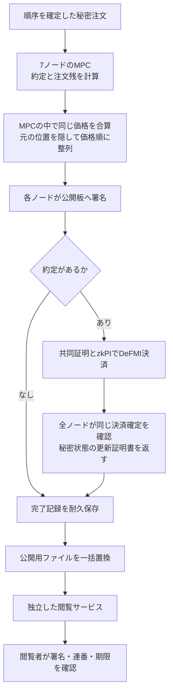

# MPCから価格帯ごとの板を公開する

`oclob-public-book` は、MPCが計算した価格帯ごとの残数量を、読み取り専用の接続で提供する。注文者の鍵や市場の暗号化記録を、閲覧者へ渡す必要はない。

検証状況：最終ソースによる実MPC・実DeFMIの通し試験がSoftbankで合格。4回の公開板の取得、2件・合計7,500の実決済、決済直後の停止と復旧、5台の検証ノードの再起動を確認した。Rustの124テスト、整形検査、全ターゲットのClippy検査も合格。既存の法人ワーカー・取消・期限切れ・資金回収の回帰試験も合格。2回の決済・計3約定、2回の解放、受取権9件、保証枠更新番号8/5と、実プロセス停止・MPCノード再起動・検証ノード再起動後の一致を確認した。画面への接続、本番運用品質は未確認である。

## 公開するもの、しないもの

売り100円・数量30と、売り100円・数量60が残っていれば、「売り100円・合計90」を公開する。30と60という内訳や、元の注文の並び順は公開用データに含めない。買い側は価格の高い順、売り側は安い順に並べる。

公開用データは、価格・合計数量に加え、市場名、連番、照合処理の識別子、ノードの署名を持つ。約定が起きた場合は、各ノードによる決済確定後の状態更新の証明書も含む。証明書に含まれる状態の要約値は、各ノードが保持する秘密分散片への結び付けであり、その分散片そのものではない。

公開用データには、注文者の識別子、注文別の残数量、予約権限の暗号文、資金の証明に使う秘密値、秘密状態の実データ、元の注文位置を入れない。照合の内部受付証明を丸ごと返す方式にはしない。

ただし、これは情報が全く漏れない市場ではない。正確な公開板の差分から、新しい注文の価格や数量を推測できる場合がある。約定情報や注文数が少ない市場との組合せにも注意が必要である。差分プライバシー、通信経路の匿名性、問い合わせの存在秘匿は保証していない。

## 計算と公開の順序



約定を伴う新しい板を、決済前や一部ノードの確認だけで公開しない。約定がない処理には決済証明書を要求せず、MPCの署名付き結果によって公開できる。

市場サービスが正本への決済直後に停止した場合、公開ファイルには前の板が残る。再起動後、保存済みの同じ署名付き決済要求を再送し、同じ正本の結果を確認する。全ノードの確認が終わってから完了記録と公開板を更新する。決済のために注文者へ再署名を求めない。

完了記録の保存と公開ファイルの置換の間で停止した場合も、再起動時に完了記録から公開用ファイルを再作成する。未完了の照合結果を、この復旧の入力に使わない。

## どこが計算するか

価格帯の集計も並べ替えも、`oclob-mpc::matching_program` が出力する公式MP-SPDZ用回路の中で行う。市場サービスや閲覧サービスは、注文の平文を集めて板を再計算しない。

並べ替え本体は、固定版MP-SPDZの `Compiler.library.loopy_odd_even_merge_sort` を使用する。独自の並べ替え暗号を発明するものではない。16行へ埋めた秘密の配列を整列し、現在の最大8件の待機注文と到着注文1件に対応する9行を固定形式で出力する。数量0の埋め草は価格・売買区分も0とし、公開用データでは除く。

参照元：[MP-SPDZの固定版library.py](https://github.com/data61/MP-SPDZ/blob/9d809599ea6ce627216a389ca7d984fbb75d0cb9/Compiler/library.py)。既存の依存先・ライセンス・版指定を維持している。Rustから公式コンパイラを呼ぶ既存方式を使い、プロジェクト独自のPythonプログラムは追加しない。

## 署名で結び付ける範囲

`DepthAttestation` は、市場・連番・照合識別子・公開板の要約値・MPC結果の要約値・実行回路の要約値・秘密状態の要約値・有効期間・決済が必要かを、一つの署名対象にする。

閲覧側は設定された7ノード全ての署名を確認する。署名の不足、重複、別市場、別回路、価格や数量の書換え、期限切れ、保持済み連番より古い板を拒否する。約定ありの板には、同じ照合と状態、同じ正本の決済内容と高さに結び付いた7ノード分の状態更新証明書も必要である。

これはMPC計算全体の新しいZK証明ではない。既存のMPC安全性と設定したノード鍵への信頼の下で、実行・公開・決済確認を結び付ける。接続先の正本照会への信頼や、独立した事業者によるノード運用の評価は、別の確認事項として残る。

## Dockerと閲覧方法

`deploy/docker-compose.native.yml` に次の役割を分ける。

- `market-worker`：暗号化された進行記録を持ち、照合と決済を進める。`/market-public/current.json` の唯一の書き手。
- `public-book`：公開用ディレクトリを読み取り専用で持つ。自身のTLS鍵と公開設定だけを使い、法人の鍵や市場の進行記録は持たない。
- `book-reader`：公開設定とCA証明書だけを持つ。クライアント証明書も、公開板の保存ディレクトリも持たず、ネットワーク経由で取得する。

同じDockerネットワーク内の設定済み接続先に対して、次のコマンドで連番4以降の板を取得する。

```sh
oclob-public-book --get 4
```

入力は1 KiB、応答は128 KiBの固定長JSONレコードで、TLS 1.3・CA検証・ホスト名検証・証明書の固定を使う。HTTPではないため、ブラウザ画面のAPIとしてそのまま使えるわけではない。SDKやHTTP接続層、ReactFlow画面への接続は次の作業である。取引受付側の相互TLSは変更しない。

取得時の連番は、閲覧アプリが最後に確認した連番を保存して指定する。初回接続時に、ネットワーク全体で最新の板であることまで証明する仕組みではない。固定された過去の板を無期限に表示しないよう、現在は照合計画に結び付いた最大300秒の有効期限も確認する。期限後に注文がない場合の継続更新や稼働確認は未実装であり、古い板を「現在の板」として返さず取得失敗にする。

## 実機試験

Macではビルド・テストしない。

```sh
make remote-native-depth-e2e REMOTE_TEST_HOST=softbank-l40s \
  REMOTE_TEST_SSH_OPTIONS='-o BatchMode=yes -o ProxyJump=none' \
  NATIVE_DEPTH_MANIFEST=/research/manifests/oclob_native_depth_002.json
```

契約は `research/oclob_native_depth_contract.json`、最初の試験計画は `research/manifests/oclob_native_depth_001.json`、最終ソースの再検証計画は `research/manifests/oclob_native_depth_002.json`。検証する順序は、売り30@101、売り30@100、売り60@100、買い75@101の即時約定・残取消注文である。

確認対象は4つの実際に取得した板、100円で合計75の2件の決済、決済金額7,500、14回の確定確認、決済直後のプロセス停止、同じ要求による復旧、完了後の再起動、5台の検証ノードの再起動である。単一ホストの機能試験であり、処理速度や広域ネットワーク性能の測定ではない。

## 残る境界

常駐サービスへの取消・失効・資金解放の統合、公開板を用いた実画面、取引API、注文のない時間帯の更新、複数サービスへの分散、過去回路の保存状態からの移行、公開接続の負荷制御、通信の匿名性、独立監査は未完了。既存の全体作業目標を、この機能の試験だけで完了扱いにしない。
