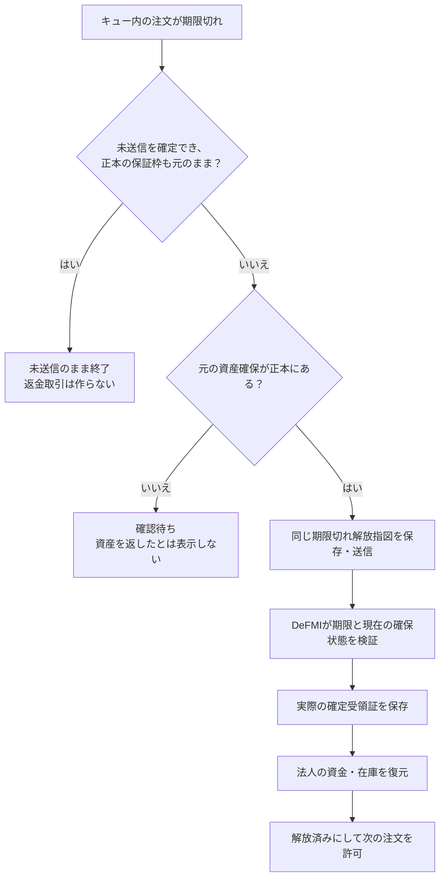

# MPCが停止中の、期限切れ注文と資産回収

## 何ができるか

法人が送信キューへ保存した注文が、7つのMPCノードで受付を完了する前に期限切れになった場合を扱う。法人側の常駐処理が、DeFMIでの資産確保の有無を確かめ、確保済みなら期限切れの解放を送り、使える資金・在庫を復元する。

MPCノードへの接続確認より先にこの処理を行う。そのため、7ノードすべてが停止中でも、法人側の記録とDeFMIへの接続が利用できれば資産回収を進められる。DeFMI自体が停止中なら、回収済みとは表示せず確認待ちにする。

これは「未受付注文」の経路である。7ノードが受付を完了した注文の取消・期限切れは、板との整合を取る[市場側の経路](NATIVE_LIFECYCLE_JA.md)を使う。約定済み取引を利用者の都合で取り消す機能ではない。

## 期限が過ぎただけでは、未送信と判断しない

法人からの送信がタイムアウトしても、DeFMIでは資産確保が完了しているかもしれない。ローカルの時計が進んでいる、古い台帳状態を読んだ、といった場合もある。そのため、「期限切れ」「資産確保の応答がない」「保証枠が以前と同じ」のいずれかだけでは、未送信扱いにしない。

注文ごとに、次のどちらか一方だけを暗号化記録へ確定する。

- **送信開始**：DeFMIへ最初の資産確保要求を送る前に記録する。その後に応答を失っても、未送信へ戻せない。
- **未送信終了**：期限後、送信開始記録がなく、確定・配送の記録もない場合に記録する。この記録が先に確定した注文は、その後CLIからも送信できない。

両者は別々のフラグではなく、同じ記録の最初の書込みを採用する。常駐処理と別の法人CLIが競合しても、両方が勝つことはない。ファイルの更新とディスクへの保存には、既存の `CorporateOutbox` を使う。

未送信終了にできた場合も、DeFMI上の保証枠更新番号と3つの残高の要約値が、元の資産確保指図の更新前状態と一致することを確認する。資産確保を一度も送っていないので、架空の「返金取引」は作らない。

古い形式の記録には、この送信開始の追跡がない。新しいコードで読み込めても、過去に送信していないとは証明できないため、自動で未送信終了にはしない。保存済みの未送信結果を読むときも、対応する送信禁止記録との一致を確かめる。



## 確保済み資産を解放する処理

1. 保存済みの署名済み資産確保指図を読み、デプロイ先、元の注文、確保IDとの一致を調べる。
2. DeFMIの現在の確保状態が、その同じ未使用の確保であることを確認する。
3. 現在の台帳状態、確保ID、更新番号、前の受領証に結び付いた期限切れ解放指図を、送信前に暗号化記録へ保存する。
4. その同じ指図をDeFMIへ送る。法人やMPCノードに追加の裁量的署名を求めない。期限の到来と状態の正しさはDeFMIのRust VMが検証する。
5. 実際の取引ID、ブロックID、高さ、更新後の台帳要約値を確認・保存する。
6. 解放された保有記録と、保証枠の秘密残高を法人側で復元する。この復元が成功してから、注文とキューを終了状態にする。

法人向けの接続口が新たに許可するのは、この期限切れ解放だけである。別デプロイの解放、法人が一方的に送る取消、約定指図、台帳設定の変更は、この権限には含まれない。

確保直後に法人プロセスが落ちた場合は、正本にある元の確保を読み直す。解放直後に落ちた場合は、保存済みの同じ解放指図を再利用して、その確定結果を回復する。別の資金や新しい署名で処理を置き換えない。解放は元の資産を利用可能に戻すもので、約定後の受取権を取り込む処理とは区別する。

## 法人環境での使い方

必要な構成と初期設定は[常駐送信の手順](CORPORATE_WORKER_JA.md)を使う。新しいサーバやMPC用の管理鍵は不要である。法人の暗号化記録と接続資格を持つ `maker-worker` などの法人サービスが処理する。

通常は常駐処理を動かしておけばよい。法人コンテナ内での確認用コマンドは次のとおり。

```sh
oclob-corporate-worker --status
oclob-corporate-worker --wait-reconciled 社内の依頼番号
```

`--wait-reconciled` は最大180秒の確認用コマンドであり、資産解放を実行するワーカーそのものではない。ワーカーとは別プロセスで、処理記録とキュー状態が一致するまで待つ。

- `never_reserved`：送信禁止記録と未送信終了状態を確認した。資産解放取引は存在しない。
- `released`：実際の解放取引と、法人側の復元・終了記録を確認した。取引IDなどを社内照合に使える。
- `release_reconciliation_required`：常駐処理が確認待ちとして保持している。タイムアウトや不明な状態を成功へ置き換えていない。

出力は法人用の運用情報であり、公開板へそのまま配信しない。注文者、依頼番号、台帳上の確保を結び付ける情報は、法人の権限の下で扱う。

確認待ちになっても、暗号化ファイルの削除、空の状態への再初期化、依頼番号を変えての再送は行わない。元の要求がDeFMIで確定している可能性を先に確認する。状態が壊れている場合も、最後の正常状態を推測で作り直さない。

## 再現する通し試験

Macで実行・ビルドしない。次の入口からSoftbankまたはOmenのDockerへ転送する。

```sh
make remote-native-expiry-e2e REMOTE_TEST_HOST=softbank-l40s \
  REMOTE_TEST_SSH_OPTIONS='-o BatchMode=yes -o ProxyJump=none'
```

試験は、7つのMPCコンテナ、2つの法人環境、5つのAvalanche検証ノードを同じリモートホストに用意する。MPCが全停止した状態での未送信終了と、確保確定直後のプロセス終了、期限到来後の実解放、解放確定直後のプロセス終了、常駐処理の再開を通す。返却された同じ5単位の保有記録を新規注文に使い、全7ノードの署名付き受付を確認する。

この新規注文は、この試験では約定させない。既存の照合・共同zkPI・取消・期限切れまでの回帰確認は、別に次を実行する。

```sh
make remote-native-worker-e2e REMOTE_TEST_HOST=softbank-l40s \
  REMOTE_TEST_SSH_OPTIONS='-o BatchMode=yes -o ProxyJump=none'
```

試験条件は `research/oclob_native_expiry_fenced_contract.json`、実行前の予測は `research/manifests/oclob_native_expiry_002.json` に固定している。[実行結果](../artifacts/oclob_native_expiry.json)と[実行ソース66ファイルの対応表](../artifacts/oclob_native_expiry_sources.json)を公開し、個別の実行判定は `research/experiment-ledger.jsonl` に記録する。

2026年9月6日（日本時間）の `oclob-native-expiry-fenced-002` は、Softbankで次を確認した。

- 7ノードを実際に停止した二つの境界で、未送信終了1件と正本での資産解放1件を完了。
- 確保直後・解放直後の2か所で法人プロセスを実際に終了し、同じ要求から復旧。
- 解放された5単位の保有記録を次の予約で実際に消費し、全7ノードの署名付き受付を検証。
- 法人ワーカーの再起動で終了状態が変わらず、5つの検証ノードの台帳が検証ノード再起動後も一致。
- 別のコード検査でRustテスト103件、整形、全対象の警告を許さない静的検査に合格。送信と未送信終了の競合、旧記録、再起動、法人が送る不正な解放指図の拒否を含む。

同じソースと依存版による `oclob-native-worker-expiry-regression-004` も、2回の決済・3約定、2回の解放、累計9受取権、保証枠更新番号8/5、7 MPCノードと5検証ノードの再起動確認まで完了した。結果は[常駐送信の実行証拠](../artifacts/oclob_native_worker.json)に分けている。

最初の粗い試験も正常系は通ったが、未送信判定の競合条件が不十分だったため、公開版の合格証拠には使わない。古い条件と実行記録は履歴として保ち、送信禁止記録を必須にした新しい条件で全経路を再実行している。

## 自動解決しないケース

- 送信開始記録はあるが、DeFMIに対応する確保が見つからない。通信中・応答喪失・拒否を区別できる追加の証拠が必要で、未送信扱いにはしない。
- 別部署や別要求が同じ保証枠を更新している。古い残高から新しい予約証明を自動生成しない。
- 保存した解放指図の更新前状態が、別の取引で古くなった。元の確定結果を回復できなければ確認待ちにする。
- 他のプロセスが先に解放し、法人記録にその指図や取引受領証がない。台帳の解放済み表示だけから受領証を作らない。
- 一部のMPCノードに既に配送された暗号文の除去。今回の通し試験は、資産確保後・ノード配送前に止めるケースであり、部分配送の清掃まで確認したとはしない。

独立運営者間のWAN、総接続期限、長時間運転、鍵交代、HSM、保存領域全体の巻戻し防止、悪意ある法人管理者への耐性は別の受入条件である。法人の処理記録と設定済みのDeFMI読み取り接続への信頼も残る。単一ホストの機能試験を、本番の性能・可用性・暗号安全性の保証には使わない。
