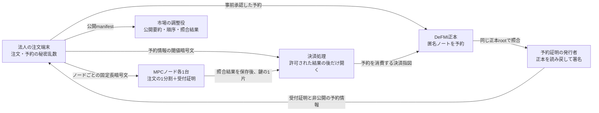

# 注文受付の予約証明と、決済時にだけ開く情報

## この文書の対象

OCLOBの注文受付では、資金・在庫がDeFMI正本で予約済みであることを確認しつつ、
照合前の売買方向を各MPCノードにも知らせない必要があります。
そのため、**受付時に各ノードへ渡す証明**と、**決済処理だけが開く予約情報**を分けます。

この分離は `oclob-edge` と `oclob-node` に実装されています。
ただし、現在のDocker統合デモは従来の決済権限経路を使っています。
以下の仕組みが実Avalanche上の予約作成から匿名ノートの決済まで一続きに接続済み、
という意味ではありません。

## 確認した不具合と修正対象

| 番号 | 原因と影響 | 実装上の対処 |
|---|---|---|
| R1 | 各ノードが開く予約証明に資産ID、枠ID、予約ID、ノートIDが入っていた。公開台帳を引けば、資金と証券のどちらを予約したか分かる。`buy` / `sell` という文字がなくても売買方向は漏れる。 | 各ノードへ渡す `ReservationAdmission` から台帳参照を除く。詳細な `ReservationPermit` は注文別の3-of-7鍵で暗号化する。 |
| R2 | IDを除いても、台帳と同じ金額の要約値や注文の要約値を載せると、値の一致で予約を検索できる。 | 受付用の金額の要約値には新しい秘密乱数を加える。台帳上の注文承認も秘密のsaltを含むハッシュにする。 |
| R3 | 署名済み証明のハッシュだけで重複を数えると、同じ予約を別の正本高さ・署名で再発行した際に別枠として扱える。記録の期限切れ削除でも再利用できる。 | 発行者だけが計算できる予約固有のHMAC値で重複を数える。この使用記録は暗号化注文を削除しても残す。 |
| R4 | 署名者とDeFMIだけを固定し、市場を照合しないと、別市場向けに発行された予約証明を受け付けられる。 | 運用設定の市場IDも受付時と決済情報の復号時に照合する。 |
| R5 | 再起動で予約使用記録が欠けていても注文暗号文だけを復旧すると、重複検出が不完全なまま運転できる。 | 起動時に保存済み受付証明を元の受付時刻で再検証し、対応する使用記録がなければ起動を拒否する。 |

R1とR2の対処は、単にJSONの項目名を隠すことではありません。
各ノードが受け取る平文と公開台帳を組み合わせても、直接のID参照や値の一致で
その注文の予約を特定できない形にすることが目的です。
通信時刻や単独参加者しかいない市場からの推測まで防ぐとは主張しません。

## 誰に何を渡すか

### 各ノードが読める受付証明

`zkpi-defmi-sdk::ReservationAdmission` には、アプリ・市場・DeFMIの識別子、
注文の要約値、匿名ハンドルの要約値、金額と売買方向の隠された値、
予約の重複検出値、非公開予約情報のハッシュ、有効期限、発行者署名を含めます。

資産、口座、法人、枠、予約ノート、正本高さ、Maker/Takerの役割は含めません。
発行者の鍵はノードの運用設定から固定し、注文に書かれた公開鍵をそのまま信用しません。
これは発行者の署名を検証する方式であり、発行者への信頼を取り除いたZK証明ではありません。

### 決済時だけ開く予約情報

`oclob_edge::SealedReservationAuthority` の暗号化前の内容は、次の三つだけです。

- 署名付き受付証明。
- 正本の予約・資産・匿名ノート・権限を示す署名付き予約情報。
- 受付用の金額の要約値に加えた秘密乱数。

注文全文、指値、注文数量、元の予約金額の開示値、元の秘密乱数は入れません。
暗号化前の領域を64 KiBにそろえ、注文ごとの鍵を検証可能な3-of-7分割にします。
鍵の二片だけでは開けず、正しい照合結果を保存していないノードは鍵片を返しません。
未約定IOCは解放対象にしません。板へ残るGTCは、確定した照合結果に従って
板への登録を進めるため、約定がなくても解放対象になります。

## 金額を変えずに台帳との直接照合を防ぐ

金額 `v` と元の秘密乱数 `r` に対する正本の要約値を `C = g v + h r` とします。
法人側は新しいゼロでない秘密乱数 `d` を選び、受付には
`C_admission = C + h d = g v + h (r + d)` を使います。
MPCへ分ける予約金額は同じ `v` のままで、秘密乱数だけが `r + d` に変わります。

正本上の `C` と受付時の `C_admission` は一致しません。
`d` は各ノードや調整役へ渡さず、決済権限と一緒に暗号化します。
決済時には、開いた予約情報と `d` から両者が同じ金額を表すことを再検証します。
共同DvPの予約残も正本側の乱数へ正しく戻す処理が必要であり、
この照合だけで匿名ノートの決済が完了したことにはなりません。

また、正本の注文承認には `H(用途識別子, 注文commitment, 秘密salt)` を使います。
公開の注文commitmentをそのまま正本へ保存しないことで、もう一つの直接照合経路を防ぎます。
saltも個々のMPCノードへ渡しません。

## 二重利用と再起動

予約の重複検出値は、発行者の秘密鍵を用いたHMACで、DeFMI識別子と予約IDから作ります。
同じ予約なら、正本rootや署名が変わっても同じ値になります。
ノードはこの値と注文要約値の対応を注文受付と同時に永続化します。
同じ内容の再送は許しますが、同じ予約で別の注文を受け付けることは拒否します。

予約の使用記録は、注文暗号文の保存期限を過ぎても消しません。
この記録と発行者鍵を失ったまま再起動・鍵交代してはいけません。
発行者鍵を変えるとHMAC値も変わるため、鍵交代には旧予約の終了または
世代をまたぐ使用記録の移行が必要です。自動鍵交代はまだ提供していません。
最終的な二重決済拒否は、DeFMI正本側の一回限りの予約消費でも行う必要があります。

## 残る接続作業

DeFMI `2b85c64` に、役割を固定しない予約指示、DeKYX の検証、
正本ノートと保証枠の一括予約、正本読戻しによる予約証明の発行を追加しました。
各 Rust VM は所有権・残高不足防止・保証枠の証明全文を検証します。
RFQ の受付票や架空の Maker 方針は使いません。予約署名と DeKYX 証明が
循環しない生成順序と、非公開の承認処理の信頼範囲は
[DeFMI の接続資料](https://github.com/shukob/defmi/blob/2b85c64957adef341037ae5ee2005a1b411f75c7/docs/APPLICATION_NOTE_RESERVATIONS_JA.md)
に記載しています。

この依存更新だけで、以下の Docker 送信・約定時消費・解除まで接続済みにはなりません。

1. 法人端末で匿名ノートの予約を実際に確定し、正本読戻しを使って証明を取得する。
2. Docker/CLIの注文送信をこの受付証明と暗号化予約情報へ切り替える。
3. MPCの共同DvP証明を、予約金額の乱数差分を検証して正本ノート消費へ接続する。
4. 独立したDeFMI承認者またはVMが証明全文を検証し、予約の消費と両資産の移転を同時に確定する。
5. 実ネットワークで再送、部分約定、取消、期限切れ、同時注文、再起動を確認する。

単体テストで使用する署名者や正本読戻しのfixtureは、この実ネットワーク受入の代わりにはしません。
