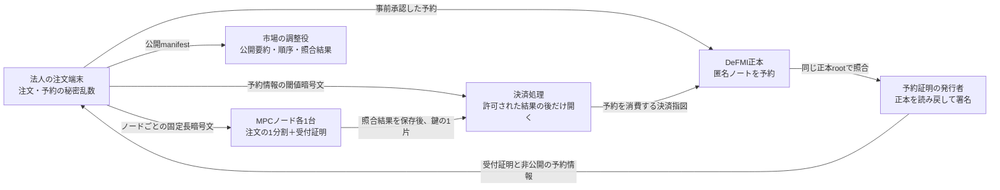

# 注文受付の予約証明と、決済時にだけ開く情報

## この文書の対象

OCLOBの注文受付では、資金・在庫がDeFMI正本で予約済みであることを確認しつつ、
照合前の売買方向を各MPCノードにも知らせない必要があります。
そのため、**受付時に各ノードへ渡す証明**と、**決済処理だけが開く予約情報**を分けます。

この分離は `oclob-edge` と `oclob-node` に実装されています。
`make remote-native-e2e` では、法人による実際の事前予約から、7つの常駐MPCノード、
5つのAvalanche検証ノードによる匿名ノート決済までを接続しています。
単一ホストでの機能確認と、未完了の製品化条件は[実行手順](NATIVE_PRETRADE_DEMO.md)を参照してください。
従来の `remote-integrated-e2e` とブラウザの中央調整経路は、この新経路とは別です。

## 確認した不具合と修正対象

| 番号 | 原因と影響 | 実装上の対処 |
|---|---|---|
| R1 | 各ノードが開く予約証明に資産ID、枠ID、予約ID、ノートIDが入っていた。公開台帳を引けば、資金と証券のどちらを予約したか分かる。`buy` / `sell` という文字がなくても売買方向は漏れる。 | 各ノードへ渡す `ReservationAdmission` から台帳参照を除く。詳細な `ReservationPermit` は注文別の3-of-7鍵で暗号化する。 |
| R2 | IDを除いても、台帳と同じ金額の要約値や注文の要約値を載せると、値の一致で予約を検索できる。 | 受付用の金額の要約値には新しい秘密乱数を加える。台帳上の注文承認も秘密のsaltを含むハッシュにする。 |
| R3 | 署名済み証明のハッシュだけで重複を数えると、同じ予約を別の正本高さ・署名で再発行した際に別枠として扱える。記録の期限切れ削除でも再利用できる。 | 発行者だけが計算できる予約固有のHMAC値で重複を数える。この使用記録は暗号化注文を削除しても残す。 |
| R4 | 署名者とDeFMIだけを固定し、市場を照合しないと、別市場向けに発行された予約証明を受け付けられる。 | 運用設定の市場IDも受付時と決済情報の復号時に照合する。 |
| R5 | 再起動で予約使用記録が欠けていても注文暗号文だけを復旧すると、重複検出が不完全なまま運転できる。 | 起動時に保存済み受付証明を元の受付時刻で再検証し、対応する使用記録がなければ起動を拒否する。 |
| R6 | 法人の資金選択が実際の保有記録を常に候補一覧の先頭へ置き、それ以外の候補も常に最初の未ロック記録から選んでいた。証明の秘密性とは無関係に、一覧の順序と選択規則から使用元を特定できる。 | 同じ資産の未ロック記録から既存の暗号用乱数で候補を選ぶ。最大64件の2のべき乗個とし、証明を作る前に公開ID順へそろえる。呼出し元が使用元を先頭に渡しても、証明作成側で同じ公開順へ直す。 |
| R7 | MPCノードが秘密の板状態を進める際、調整役から渡された決済要約値と高さが空でないことは調べるが、実際にDeFMIで確定した取引かを自分では確認しない。認証済みの調整役が虚偽の通知を送ると、未決済の結果へ状態を進められる。 | 各ノードが自分の署名済み照合記録、決済指図全文、設定済みDeFMI接続先の確定記録を照合。全約定の記録を原子的に保存してから板状態を進める。7ノードすべてで虚偽・未確認・すり替え通知の拒否を実試験。[確認の方法と残る信頼](NATIVE_FINALITY_JA.md)。 |
| R8 | 新しい匿名保有記録の決済口は1約定ずつであり、複数約定を順番に送信すると途中まで確定し得る。単に一括送信用の外箱を追加しても、個別の指図を取り出して送れるなら全件確定の条件を回避できる。 | 実装し、2約定を7 MPCノード・5バリデータで一括決済。各指図の署名に順番・全件数・集合の要約を含め、個別送信・欠落・並替えを拒否する。DeFMIは一つの候補状態へ全件を適用し、どれか一件でも不正なら一切確定しない。[処理と接続試験](NATIVE_MULTIFILL_JA.md)。 |

R1とR2の対処は、単にJSONの項目名を隠すことではありません。
各ノードが受け取る平文と公開台帳を組み合わせても、直接のID参照や値の一致で
その注文の予約を特定できない形にすることが目的です。
通信時刻や単独参加者しかいない市場からの推測まで防ぐとは主張しません。

R6の修正は、一覧の先頭や固定の囮から使用元を直接割り出す不具合への対処です。
候補が2件しかない場合、他の候補の持主が自分のものではないと分かる場合、
複数回の候補集合や時刻を突き合わせる場合の推測まで消すものではありません。
大きな候補母集団と実際の利用履歴での漏洩評価は、本番受入に残ります。

## 継続取引の接続と、見つかった不具合

R9: 従来は複数約定の一括決済と、返金による次注文の受付が別々の試験であり、その後の約定を確認していなかった。[継続取引の経路](NATIVE_CYCLE_JA.md)を追加し、初回2約定の全受取権を復元、返金を使った次の注文を元の板の残りと実際に約定・決済した。秘密の残数量、予約の残高・更新番号、法人の保証枠を照合し、累計8件の取込みと両法人の更新番号5を確認した。

R9の試験で、2回目の確定確認が `Broken pipe` で失敗した。調整役からMPCノードへの接続を新しくしても再現したため、その回避策は撤去した。MPCノードからDeFMIへ接続する内部クライアントが、接続先の30秒の無通信期限を超えて成功済み接続を保持していた。各要求の終了時に必ず閉じる修正後、005の継続取引が通った。実TLSで正常応答後の切断と、応答消失時の非再送も回帰試験した。決済や署名の自動再送は加えず、拒否試験の条件も変えていない。

別途、004の実行は取引開始前のDeFMI起動時にHTTP 503で終了した。ネットワーク管理ツールの起動判定だけでは、個別VMの台帳読み出しが使えることを確認できない。資産登録を始める前に、5検証ノードの読み出しと正本要約の一致を期限付きで待つ。書き込みの自動再送で回避しない。

R10: [残り注文の取消・期限切れ](NATIVE_LIFECYCLE_JA.md)を常駐ノードへ接続した。元の注文専用鍵による取消、新規注文と同じ5ノード以上の受付順、未決済の約定を追い越さない停止条件、現在の予約に結び付いた3ノード署名、7ノードそれぞれの台帳確認を用いる。期限切れはDeFMIが実時刻で判定し、裁量的な署名を要しない。終了記録を保持し、正本確認前の秘密データ削除や元注文の再受付を拒否する。取消の存在・対象は調整役に分かるが、秘密の注文乱数や注文原文は渡さない。

最初の通し試験では法人記録の種別が取消を拒否したため、元の法人依頼・受付済み注文に結び付く専用の保存処理を追加した。汎用の記録APIから受付完了を偽装できるようにはしていない。返金の選択も、履歴の末尾ではなく、実際に使える正の残高と使用済み印を確認する。

## 誰に何を渡すか

### 各ノードが読める受付証明

`zkpi-defmi-sdk::ReservationAdmission` には、アプリ・市場・DeFMIの識別子、
注文の要約値、匿名ハンドルの要約値、金額と売買方向の隠された値、
予約の重複検出値、非公開予約情報のハッシュ、有効期限、発行者署名を含めます。

資産、口座、法人、枠、予約ノート、正本高さ、Maker/Takerの役割は含めません。
発行者の鍵はノードの運用設定から固定し、注文に書かれた公開鍵をそのまま信用しません。
これは発行者の署名を検証する方式であり、発行者への信頼を取り除いたZK証明ではありません。

### 決済時だけ開く予約情報

`oclob_edge::SealedReservationAuthority` の暗号化前の内容は、次の三つだけです。

- 署名付き受付証明。
- 正本の予約・資産・匿名ノート・権限を示す署名付き予約情報。
- 受付用の金額の要約値に加えた秘密乱数。

注文全文、指値、注文数量、元の予約金額の開示値、元の秘密乱数は入れません。
暗号化前の領域を64 KiBにそろえ、注文ごとの鍵を検証可能な3-of-7分割にします。
鍵の二片だけでは開けず、正しい照合結果を保存していないノードは鍵片を返しません。
未約定IOCは解放対象にしません。板へ残るGTCは、確定した照合結果に従って
板への登録を進めるため、約定がなくても解放対象になります。

## 金額を変えずに台帳との直接照合を防ぐ

金額 `v` と元の秘密乱数 `r` に対する正本の要約値を `C = g v + h r` とします。
法人側は新しいゼロでない秘密乱数 `d` を選び、受付には
`C_admission = C + h d = g v + h (r + d)` を使います。
MPCへ分ける予約金額は同じ `v` のままで、秘密乱数だけが `r + d` に変わります。

正本上の `C` と受付時の `C_admission` は一致しません。
`d` は各ノードや調整役へ渡さず、決済権限と一緒に暗号化します。
決済時には、開いた予約情報と `d` から両者が同じ金額を表すことを再検証します。
共同DvPの予約残も正本側の乱数へ正しく戻す処理が必要であり、
この照合だけで匿名ノートの決済が完了したことにはなりません。

また、正本の注文承認には `H(用途識別子, 注文commitment, 秘密salt)` を使います。
公開の注文commitmentをそのまま正本へ保存しないことで、もう一つの直接照合経路を防ぎます。
saltも個々のMPCノードへ渡しません。

## 二重利用と再起動

予約の重複検出値は、発行者の秘密鍵を用いたHMACで、DeFMI識別子と予約IDから作ります。
同じ予約なら、正本rootや署名が変わっても同じ値になります。
ノードはこの値と注文要約値の対応を注文受付と同時に永続化します。
同じ内容の再送は許しますが、同じ予約で別の注文を受け付けることは拒否します。

予約の使用記録は、注文暗号文の保存期限を過ぎても消しません。
この記録と発行者鍵を失ったまま再起動・鍵交代してはいけません。
発行者鍵を変えるとHMAC値も変わるため、鍵交代には旧予約の終了または
世代をまたぐ使用記録の移行が必要です。自動鍵交代はまだ提供していません。
最終的な二重決済拒否は、DeFMI正本側の一回限りの予約消費でも行う必要があります。

## DeFMIとの接続と残る条件

現在固定するDeFMI `5dd1f68` では、役割を固定しない予約指示、DeKYX の検証、
正本ノートと保証枠の一括予約、正本を読み直してからの予約証明発行を提供します。
各 Rust VM は所有権・残高不足防止・保証枠の証明全文を検証します。
RFQ の受付票や架空の Maker 方針は使いません。予約署名と DeKYX 証明が
循環しない生成順序と、非公開の承認処理の信頼範囲は
[DeFMI の接続資料](https://github.com/zkFMI/defmi/blob/153fe671e523ec573a6c6261f341423a49371f5d/docs/APPLICATION_NOTE_RESERVATIONS_JA.md)
に記載しています。

支出証明は、所有権と金額を別々に拘束する新形式へ変更しています。
旧方式で見つけた金額改ざん、使用元の直接特定、残差検証、出力先差替えの問題は
[DeFMIの安全性レビュー](https://github.com/zkFMI/defmi/blob/153fe671e523ec573a6c6261f341423a49371f5d/docs/NOTE_PROOF_SECURITY_REVIEW_20260905.md)
を参照してください。旧版の正常系の実行記録は、新形式の安全性の証拠にしません。
固定したTriptych実装は実験用であり、独立した暗号監査と旧状態の移行審査は未完了です。

同じ DeFMI に、共同署名した zkPI と証明全文による部分約定、
現在残額・更新番号の管理、取消、署名なしの期限切れ解除を実装しました。
各 VM は、数量×価格、残額の範囲、資産の対応、両予約の現在状態を検証します。
乱数差分を正本の残額と受領者向け暗号文の両方へ反映するため、
部分約定後も受領者が正しい残額を復号できます。

ただし、市場規則に従って選んだ約定であることと、暗号文の中身の正しさは
委員会の実行に依存します。OCLOB の新しい署名受付
`authorize_oclob_native_fill` は、各ノードが実際に実行した MPC 計算と
予約条件に結び付けてから、専用の決済文だけを承認します。

各ノードは、照合に使った二つの注文の承認情報と、枠を解放してよい条件を、
照合後の保存ファイルへ署名付きで記録します。調整役が送った情報で置き換えません。
決済文の検査では、この記録に加えて、自分が既に証明した zkPI・両予約の残額・
暗号化した受取情報を照合し、金額の証明全文も再検証します。
実際の約定がない枠や、旧方式の注文からは、この新しい承認を発行できません。

現在の解放規則では、板に残る注文の枠は維持し、到着した注文の残りがゼロになった
最後の約定でのみ、その到着注文の枠を解放できます。板側の枠は残額ゼロでも
期限切れ・取消の処理へ引き継ぎます。これは誤解放を避ける保守的な規則であり、
すべての終了処理が既に接続済みという意味ではありません。

署名を担当する三ノードは、それぞれ自分の暗号文が差し替えられていないことを
確認します。これだけで悪意あるノードが作った暗号文の正しさや、停止時の
受領可能性まで保証するとは主張しません。悪意ある寄与の検出・復旧は別の検証対象です。

新しいDocker/CLI経路では、法人が匿名ノートを実際に予約し、確定した予約に対して
受付証明を取得します。調整役は共同証明の完了を各ノードへ保存させ、
`prepare_native_fill` → `certify_native_fill` → `issueApplicationNoteFill` を呼びます。
注文全文を開く処理は使いません。1取引の部分約定、同一決済の再送、
5検証ノードの台帳一致、1検証ノードの再起動は実際のコンテナで確認済みです。

残る条件:

1. 法人CLIの予約・暗号文・受領証の保存と、停止後の再送は接続済みです。決済後の秘密残高と受取権の復元は[ウォレット経路](CORPORATE_WALLET_JA.md)、常駐送信は[法人ワーカー](CORPORATE_WORKER_JA.md)、未受付注文の回収は[期限切れ処理](QUEUED_EXPIRY_JA.md)を参照してください。依頼番号と確保IDを結ぶ運用情報は法人内で保持し、公開板へ配信しません。旧記録・応答不明・部分配送後の清掃は未解決のまま残します。
2. 複数約定と `issueApplicationNoteRelease` による取消・期限切れは実経路で確認済みです。同時枠更新、複雑な停止下の継続回復を追加確認する必要があります。
3. MPC側の確定確認は、各ノード自身の読み取りとして接続済み。現在は設定済みDeFMI接続サービスを信頼する。独立した検証ノードへの直接接続、合意証明、鍵交代、複雑な停止・再起動時の世代整合は残る。[保存形式第8版の移行制約](NATIVE_FINALITY_JA.md)も適用する。
4. 新しい受取権は、受領者の署名と同一資産・同一金額の拘束をVMが検証して保有記録へ変換する。管理者承認だけの旧変換経路は、新しい予約から生じた受取権には使えない。変換後の支出証明、旧形式からの移行、独立した暗号監査は、正常系の機能確認とは分けて扱う。
5. 独立した運営者、地域をまたぐ通信、悪意ある暗号化断片、鍵交代、障害時の受領可能性を試験する。

単体テストで使用する署名者や正本読戻しのfixtureは、この実ネットワーク受入の代わりにはしません。

## 資金証明の作成を後回しにする場合

[法人側の新しい受付方式](DEFERRED_FUNDING_JA.md)では、注文原文、署名済み予約指図、
その指図用のDeKYX証明、秘密乱数を暗号化して法人内に保存します。ワーカーへ
資格発行者の秘密鍵や資格保有者の秘密証人を渡しません。準備時に変わるのは、
使用元の保有記録と現在の保証枠に対する資金証明です。売買条件と元の署名は変えません。

資産確保後の注文要約値は、元注文に受付証明を結び付けるため、元注文の要約値とは
異なります。署名済み受付情報の `source_order_commitment` が両者を結びます。
元の承認をそのまま照合したことの検査では、この対応を確認します。

法人用の準備状況表示は注文原文を出しませんが、依頼番号と活動状況は含みます。
市場運営者や公衆へそのまま公開してよい統計ではありません。枠不足による終了も
法人内だけで管理し、金融処理を行っていないのに架空の決済受領証を作りません。
